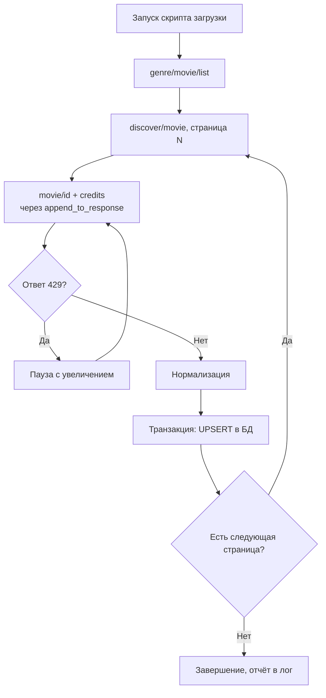
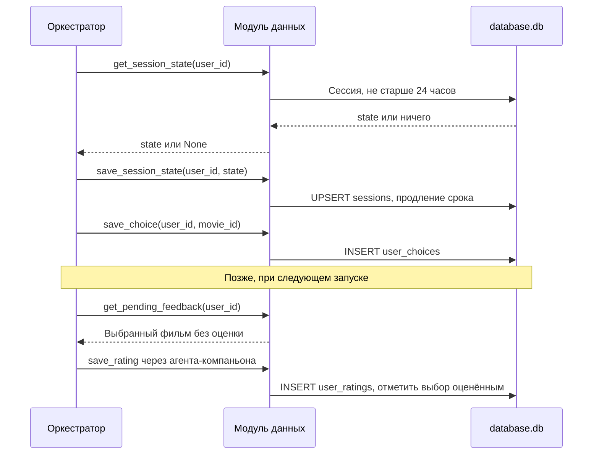
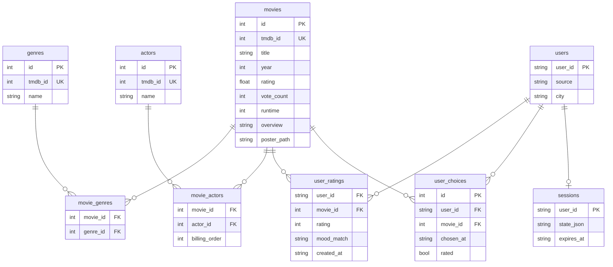

# CineMatch — Vision модуля данных

> Общие контракты и термины — в `vision_project.md`.

---

## 1. Общее описание

Модуль данных — единственная часть системы, которая работает с хранилищем и внешними источниками данных. Остальные модули не пишут SQL и не обращаются к TMDB или сервису погоды напрямую: они вызывают функции модуля данных.

Модуль отвечает за:

- **загрузку каталога фильмов** из TMDB API: жанры, рейтинг, число голосов, длительность, год, описание, постер, актёры;
- **хранение** каталога, пользователей, истории оценок, выбранных фильмов и состояния диалоговых сессий в одном файле SQLite `database.db`;
- **получение погоды** из Open-Meteo по названию города;
- **функции-инструменты**, которые языковая модель вызывает через function calling (реализация здесь, описание для модели — в модуле агентов);
- **служебные функции** для оркестратора модуля агентов (сессии, пользователи, выбранные фильмы).

Вне границ модуля: логика рекомендаций, работа с языковой моделью, отображение данных пользователю.

Загрузка каталога — детерминированный скрипт, а не ИИ-агент: в нём нет решений, принимаемых моделью.

---

## 2. Краткое содержание

Скрипт загрузки заранее наполняет локальную БД фильмами из TMDB (на русском языке, с ограничением частоты запросов). Во время диалога агенты получают данные только из локальной БД и сервиса погоды, поэтому скорость подбора не зависит от TMDB.

Профиль предпочтений отдельно не хранится: `get_user_profile` каждый раз рассчитывает веса жанров и актёров из истории оценок. Это исключает рассинхронизацию профиля и истории.

Состояние диалога (этап, ответы пользователя, найденные кандидаты, уже показанные фильмы) хранится в таблице `sessions` и нужно потому, что у языковой модели нет памяти между запросами.

---

## 3. Функциональные и нефункциональные требования

### Функциональные требования

| ID | Требование |
|---|---|
| F-01 | Подключение к TMDB API по ключу (регистрация бесплатная); ключ хранится в `.env` |
| F-02 | Загрузка фильмов через `discover/movie` с пагинацией, `language=ru-RU` для русских названий и описаний |
| F-03 | Загрузка деталей (`movie/{id}`) и актёров (`movie/{id}/credits`, первые 10 по порядку в титрах), объединённых через `append_to_response` |
| F-04 | Загрузка справочника жанров (`genre/movie/list`) |
| F-05 | Повторный запуск загрузки обновляет существующие записи (UPSERT по `tmdb_id`), не создавая дубликатов |
| F-06 | Обработка ошибок TMDB: 429 — экспоненциальная пауза и повтор; 401 — остановка с понятным сообщением; 404 — пропуск записи с записью в лог |
| F-07 | `get_weather(city)`: геокодинг города и текущая погода через Open-Meteo; при ошибке или таймауте возвращает `None` |
| F-08 | `find_movies(...)`: поиск по жанрам, диапазону лет, минимальному рейтингу, максимальной длительности, с исключением переданных ID и уже оценённых пользователем фильмов; сортировка по рейтингу; порог минимального числа голосов |
| F-09 | `get_movie_with_credits(movie_id)`: карточка фильма с жанрами и актёрами |
| F-10 | `get_user_ratings(user_id, limit)`: последние оценки пользователя с названиями и жанрами фильмов |
| F-11 | `get_user_profile(user_id)`: веса жанров и актёров, рассчитанные из истории оценок |
| F-12 | `save_rating(user_id, movie_id, rating, mood_match)`: сохранение оценки и закрытие соответствующего выбранного фильма |
| F-13 | Сессии: `get_session_state`, `save_session_state`, `clear_session_state`; сессия удаляется после 24 часов без активности |
| F-14 | Пользователи: `get_user`, `save_user` (источник — консоль или Telegram, город) |
| F-15 | Выбранные фильмы: `save_choice`, `get_pending_feedback` |

### Нефункциональные требования

| ID | Требование | Значение |
|---|---|---|
| NF-01 | Скорость `find_movies` | менее 50 мс на каталоге до 100 000 фильмов |
| NF-02 | Скорость пакетной записи при загрузке | более 500 записей в секунду в одной транзакции |
| NF-03 | Частота запросов к TMDB | не более ~40 запросов в секунду, интервал между запросами не менее 25 мс |
| NF-04 | Таймаут запроса к Open-Meteo | не более 3 секунд |
| NF-05 | Целостность | `PRAGMA foreign_keys = ON` при каждом подключении, транзакции на запись, уникальность `tmdb_id` |
| NF-06 | Параллельный доступ | WAL-режим: консоль, бот и скрипт загрузки могут работать с одним файлом БД одновременно |
| NF-07 | Индексы | обязательны индексы по году и по жанру; состав составных индексов — в практической части |
| NF-08 | Возвращаемые данные | функции возвращают структуры (dict / dataclass), а не строки БД; формат фиксируется в ТЗ |

---

## 4. Требования на взаимодействия

### Инструменты (вызывает модель через агентов)

| Функция | Потребитель | Возвращает |
|---|---|---|
| `get_user_ratings(user_id, limit)` | Агент-распознаватель состояния | Список оценок: фильм, жанры, оценка, `mood_match`, дата |
| `get_weather(city)` | Агент-распознаватель состояния | `{city, condition, temp_c, is_day}` или `None` |
| `get_user_profile(user_id)` | Агент-рекомендатель | `{genre_weights: {...}, actor_weights: {...}, ratings_count}` |
| `find_movies(genres, year_range, min_rating, max_runtime, exclude_ids, limit)` | Агент-рекомендатель | Список фильмов, отсортированный по рейтингу |
| `get_movie_with_credits(movie_id)` | Агент-рекомендатель | Карточка фильма с жанрами и актёрами |
| `save_rating(user_id, movie_id, rating, mood_match)` | Агент-компаньон | `True` / ошибка валидации |

Правила:

- `exclude_ids` — обязательный параметр (может быть пустым списком). Дополнительно `find_movies` всегда исключает фильмы, уже оценённые пользователем.
- Все параметры проверяются на стороне модуля данных (типы, диапазоны): вызов исходит от модели и может содержать некорректные значения. Некорректный вызов возвращает понятную ошибку, которую модель может исправить.
- Инструменты чтения каталога не изменяют данные.

### Служебные функции (вызывает оркестратор модуля агентов)

| Функция | Назначение |
|---|---|
| `get_session_state(user_id)` / `save_session_state(user_id, state)` / `clear_session_state(user_id)` | Состояние диалога в формате JSON; сохранение продлевает срок жизни сессии |
| `get_user(user_id)` / `save_user(user_id, source, city)` | Данные пользователя; город сохраняется, чтобы не спрашивать его каждый раз |
| `save_choice(user_id, movie_id)` | Фильм, выбранный пользователем из подборки |
| `get_pending_feedback(user_id)` | Последний выбранный, но не оценённый фильм или `None` |

### Скрипт загрузки каталога

| Функция | Назначение |
|---|---|
| `ingest_movies(filters, max_pages)` | Загрузка и нормализация фильмов из TMDB |
| `update_movie(tmdb_id)` | Обновление данных одного фильма |

Запускается вручную или по расписанию, не во время диалога.

### Внешние системы

| Система | Назначение | Ограничения |
|---|---|---|
| TMDB API | Каталог фильмов | Бесплатный ключ; ~40 запросов/с на IP; 20 записей на страницу |
| Open-Meteo Geocoding API | Координаты по названию города | Без ключа, некоммерческое использование |
| Open-Meteo Forecast API | Текущая погода по координатам | Без ключа, некоммерческое использование |

---

## 5. Описание процессов

### 5.1 Загрузка каталога

1. Загрузить справочник жанров.
2. Для каждой страницы `discover/movie` (сортировка по популярности) получить список фильмов.
3. Для каждого фильма запросить детали и актёров одним запросом через `append_to_response`.
4. Нормализовать данные: год из даты выхода, жанры — во внутренние ID, первые 10 актёров.
5. Записать порцию в БД одной транзакцией (UPSERT фильма, жанров, актёров, связей).
6. Между запросами соблюдать интервал; при ответе 429 — пауза с увеличением и повтор.

### 5.2 Поиск кандидатов

1. Проверить параметры (жанры существуют, годы и рейтинг в допустимых диапазонах).
2. Объединить `exclude_ids` с ID фильмов, уже оценённых пользователем.
3. Выбрать фильмы по фильтрам с порогом минимального числа голосов (чтобы в выдачу не попадали фильмы с высоким рейтингом, но единицами голосов).
4. Отсортировать по рейтингу, вернуть не более `limit` записей (по умолчанию 15).

### 5.3 Расчёт профиля предпочтений

`get_user_profile` для каждого жанра и актёра рассчитывает вес по оценкам фильмов, в которых он встречается: оценки выше средней увеличивают вес, ниже — уменьшают. Точная формула фиксируется в ТЗ. Если оценок нет, возвращается пустой профиль, и рекомендатель опирается только на вектор состояния.

### 5.4 Жизненный цикл сессии и выбранного фильма

Просроченные сессии удаляются при запуске модуля. Выбранный фильм хранится отдельно от сессии, поэтому оценку можно получить и через несколько дней.

### 5.5 Логическая модель данных

| Таблица | Хранение | Примечание |
|---|---|---|
| `movies`, `genres`, `movie_genres`, `actors`, `movie_actors` | постоянное | Каталог, пишет только скрипт загрузки |
| `users` | постоянное | `user_id` — Telegram ID или локальный ID консоли |
| `user_ratings` | постоянное | Оценка 1–5, `mood_match`: `yes` / `partly` / `no` |
| `user_choices` | постоянное | Выбранные фильмы, ожидающие оценки |
| `sessions` | кратковременное | Удаляется после 24 часов без активности |

DDL, составные индексы и конкретные SQL-запросы — в практической части отчёта.

---

## Открытые вопросы модуля

1. Срок жизни сессии: предложено 24 часа без активности вместо 30 дней, так как долгосрочная информация (оценки, выбранные фильмы) хранится в отдельных таблицах.
2. Объём каталога для MVP (предложение — несколько тысяч популярных фильмов) и порог минимального числа голосов.
3. Формула весов профиля предпочтений.
4. Нужна ли функция статистики по жанрам (`get_genre_stats`) — в текущем сценарии не используется.
