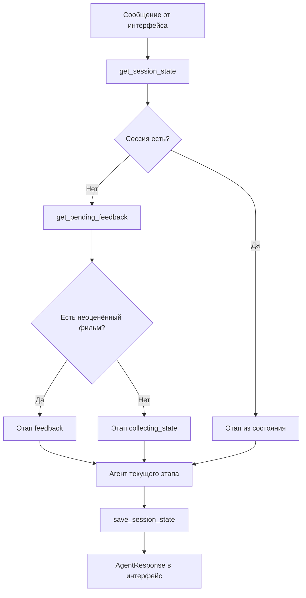
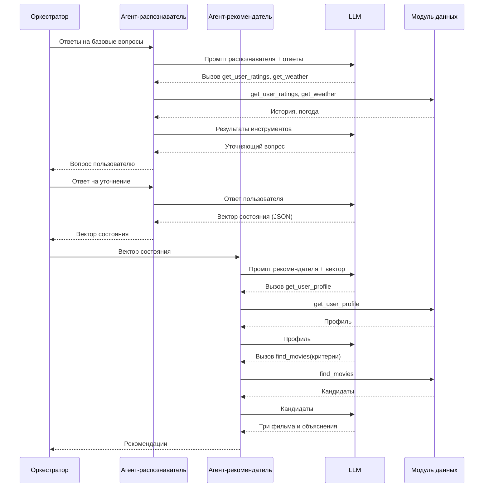
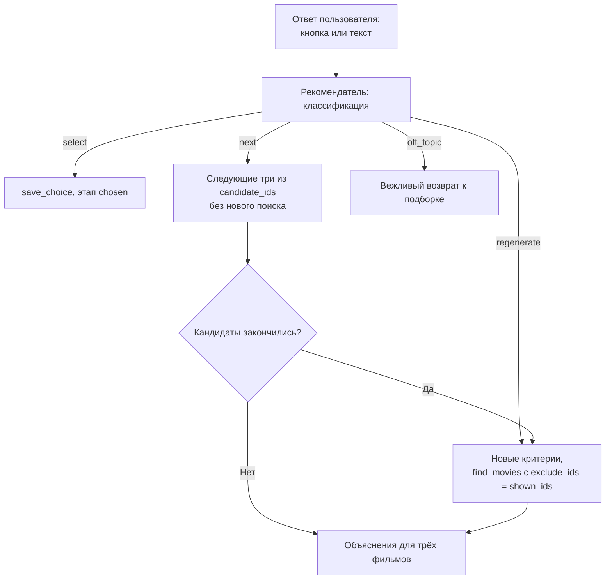

# CineMatch — Vision модуля ИИ-агентов

> Общие контракты и термины — в `vision_project.md`.

---

## 1. Общее описание

Модуль ИИ-агентов — интеллектуальное ядро CineMatch. Он принимает сообщения пользователя от модуля интерфейса, ведёт диалог, обращается к модулю данных через инструменты и возвращает интерфейсу структурированный ответ.

Модуль состоит из:

- **Оркестратора** — детерминированного кода, который принимает сообщение (`handle_user_turn`), читает состояние сессии, по текущему этапу диалога передаёт сообщение нужному агенту и сохраняет обновлённое состояние. Оркестратор не является агентом: он не принимает решений о содержании диалога, только маршрутизирует.
- **Трёх ИИ-агентов:**
  - **Агент-распознаватель состояния** — задаёт базовые вопросы, получает погоду и историю оценок, формулирует уточняющие вопросы, формирует вектор состояния.
  - **Агент-рекомендатель** — по вектору состояния и профилю предпочтений выбирает критерии поиска, получает кандидатов из БД, объясняет выбор, интерпретирует реакцию пользователя на подборку.
  - **Агент-компаньон** — после просмотра проводит фиксированный опрос, переводит ответы в значения и сохраняет оценку.
- **Клиента LLM** — общей обёртки над моделью с двумя режимами: внешний API (MVP) и локальная LLM/SLM (этап 3).
- **Слоя защиты** — ограничения тематики, классификации управляющего ввода, проверки ответов модели по схеме.

### Почему это агенты, а не скрипты

У каждого агента есть свой системный промпт, свой набор инструментов и своя точка принятия решения, которую делает модель:

| Агент | Что решает модель |
|---|---|
| Распознаватель состояния | Какой уточняющий вопрос задать; как перевести свободные ответы в вектор состояния; вызвать ли погоду |
| Рекомендатель | С какими критериями вызвать поиск; менять ли критерии после отказа; как понять реакцию пользователя |
| Компаньон | Как перевести свободный ответ («ну, нормально, но затянуто») в оценку и признак попадания в настроение |

Цикл каждого агента: получить данные → решить, какое действие выполнить → вызвать инструмент → получить результат → решить, достаточно ли его или нужно ещё одно действие. Вызов инструмента технически устроен так: модель возвращает не текст, а запрос «вызови функцию X с параметрами Y», код модуля выполняет функцию модуля данных и отправляет результат обратно модели следующим запросом.

### Память

У языковой модели нет памяти между запросами к API: каждый запрос обрабатывается независимо. Непрерывность диалога обеспечивает модуль:

- **внутри одного хода** агента история сообщений и результатов инструментов хранится в памяти процесса;
- **между ходами** оркестратор сохраняет состояние сессии через служебные функции модуля данных (этап диалога, ответы пользователя, вектор состояния, найденные кандидаты, уже показанные фильмы) и перед каждым вызовом агента собирает из него контекст.

В промпт попадает только то, что нужно конкретному агенту на конкретном этапе, а не вся история. Это важно и для стоимости запросов, и для локальных моделей с небольшим окном контекста.

---

## 2. Краткое содержание

Модуль реализует диалог «состояние → подборка → реакция → оценка после просмотра». На этапе MVP используется внешний LLM API; поддержка локальных моделей и автоматический выбор модели под характеристики устройства — этап 3.

Модуль не хранит данные сам (всё хранение — в модуле данных) и не занимается отображением (это модуль интерфейса). Его результат — структура `AgentResponse`, которую интерфейс показывает пользователю.

---

## 3. Функциональные и нефункциональные требования

### Функциональные требования

| ID | Требование |
|---|---|
| F-01 | Оркестратор принимает сообщение через `handle_user_turn(user_id, source, message)` и возвращает `AgentResponse` |
| F-02 | Оркестратор определяет этап диалога по состоянию сессии и передаёт сообщение соответствующему агенту |
| F-03 | При запуске оркестратор проверяет наличие выбранного, но не оценённого фильма; если он есть — диалог начинается с агента-компаньона |
| F-04 | Агент-распознаватель задаёт базовые вопросы: настроение, свободное время, пожелания по жанру, город (если город ещё не известен) |
| F-05 | Агент-распознаватель вызывает `get_user_ratings` и `get_weather`; при недоступности погоды продолжает без неё |
| F-06 | Агент-распознаватель задаёт минимум один и максимум два уточняющих вопроса, сформулированных моделью (в MVP один уточняющий вопрос обязателен всегда) |
| F-07 | Агент-распознаватель формирует вектор состояния по фиксированной схеме |
| F-08 | Агент-рекомендатель вызывает `get_user_profile` и `find_movies`, самостоятельно выбирая параметры поиска; в `exclude_ids` передаются все уже показанные в сессии фильмы |
| F-09 | Агент-рекомендатель показывает три фильма из найденных кандидатов с объяснением для каждого, используя `get_movie_with_credits` |
| F-10 | Агент-рекомендатель относит реакцию пользователя к одному из вариантов `select`, `next`, `regenerate`, `off_topic` и действует согласно разделу 5.2 |
| F-11 | Агент-компаньон задаёт фиксированные вопросы после просмотра, переводит ответы в оценку (1–5) и признак `mood_match`, вызывает `save_rating` |
| F-12 | Любое сообщение не по теме выбора фильмов получает вежливый ответ с возвратом к текущему шагу сценария |
| F-13 | Режим работы с моделью (внешний API / локальная модель) выбирается конфигурацией |

### Нефункциональные требования

| ID | Требование | Значение |
|---|---|---|
| NF-01 | Длительность диалога распознавания состояния | не более 15–20 секунд собственного времени системы (без учёта времени ответа пользователя) |
| NF-02 | Ответ модели в режиме API | таймаут и повторная попытка; при повторной ошибке — `AgentResponse(type = error)` с понятным текстом |
| NF-03 | Формат ответов модели | вектор состояния, классификация реакции и результат опроса проверяются по JSON-схеме; невалидный ответ — повторный запрос к модели, затем ошибка |
| NF-04 | Защита от некорректного использования | системный промпт ограничивает тему; инструкции внутри пользовательского текста не выполняются; управляющий ввод классифицируется только в заданный набор вариантов; системный промпт не раскрывается пользователю |
| NF-05 | Ограничение ввода | длина пользовательского сообщения ограничена (значение уточняется в ТЗ) |
| NF-06 | Логирование | каждый вызов модели и инструмента с параметрами и результатом записывается в лог |
| NF-07 | Независимость от интерфейса | модуль не содержит кода, специфичного для консоли или Telegram |
| NF-08 | Замена поставщика модели | смена режима или поставщика LLM не требует изменения кода агентов |

---

## 4. Требования на взаимодействия

### С модулем интерфейса

- Вход: `handle_user_turn(user_id: str, source: "cli" | "telegram", message: str)`.
- Выход: `AgentResponse` в формате из `vision_project.md`, раздел 4.
- Кнопки интерфейса — это заранее заданный текст; модуль агентов обрабатывает его так же, как свободный ввод.
- Варианты быстрых ответов модуль агентов передаёт в поле `options`; как их отображать, решает интерфейс.

### С модулем данных

Инструменты, доступные модели (реализация — модуль данных, схема для function calling — модуль агентов):

| Агент | Инструмент |
|---|---|
| Распознаватель состояния | `get_user_ratings(user_id, limit)`, `get_weather(city)` |
| Рекомендатель | `get_user_profile(user_id)`, `find_movies(genres, year_range, min_rating, max_runtime, exclude_ids, limit)`, `get_movie_with_credits(movie_id)` |
| Компаньон | `save_rating(user_id, movie_id, rating, mood_match)` |

Служебные функции, которые вызывает только оркестратор (модели недоступны): `get_session_state`, `save_session_state`, `clear_session_state`, `get_user`, `save_user`, `save_choice`, `get_pending_feedback`.

Агент получает только свои инструменты: например, рекомендатель не может вызвать `save_rating`. Это ограничивает последствия ошибки или попытки манипуляции моделью.

### Черновые структуры данных модуля

Вектор состояния (результат распознавателя):

```json
{
  "mood": "calm | cheerful | sad | tired | tense | other",
  "energy": "low | medium | high",
  "available_minutes": 120,
  "genre_wishes": ["комедия"],
  "genre_avoid": ["ужасы"],
  "company": "alone | partner | friends | family",
  "weather": {"condition": "rain", "temp_c": 9},
  "notes": "хочется чего-то уютного"
}
```

Состояние сессии (хранится через `save_session_state`):

```json
{
  "stage": "awaiting_reaction",
  "answers": {},
  "state_vector": {},
  "search_criteria": {},
  "candidate_ids": [101, 205, 318, 412, 550, 603],
  "cursor": 3,
  "shown_ids": [101, 205, 318]
}
```

Оба формата уточняются в ТЗ.

---

## 5. Описание процессов

### 5.1 Ход оркестратора

1. Получить сообщение от интерфейса.
2. Прочитать состояние сессии (`get_session_state`); если сессии нет — проверить `get_pending_feedback` и определить начальный этап.
3. Передать сообщение агенту текущего этапа вместе с нужной частью состояния.
4. Получить от агента результат и новый этап.
5. Сохранить состояние (`save_session_state`), вернуть `AgentResponse`.



### 5.2 Распознавание состояния и подбор



Если кандидатов меньше трёх, модель может ослабить критерии и вызвать `find_movies` повторно — это и есть шаг коррекции в цикле агента. Число повторных вызовов ограничено (значение уточняется в ТЗ).

### 5.3 Реакция на подборку



### 5.4 Оценка после просмотра

1. Оркестратор находит неоценённый фильм и передаёт диалог компаньону.
2. Компаньон задаёт фиксированные вопросы: оценка от 1 до 5; подошёл ли фильм под настроение; хочется ли ещё похожего.
3. Модель переводит ответы в значения `rating` и `mood_match`; если ответ не удаётся интерпретировать, вопрос задаётся повторно.
4. Компаньон вызывает `save_rating`; профиль предпочтений при следующем запросе будет рассчитан с учётом новой оценки.

### 5.5 Обработка сообщений не по теме

1. Системный промпт каждого агента ограничивает тематику выбором фильмов и прямо запрещает выполнять инструкции из пользовательского текста.
2. Управляющий ввод классифицируется только в заданный набор вариантов; свободная генерация на этом шаге не используется.
3. Ответ модели проверяется по JSON-схеме; невалидный ответ не передаётся пользователю.
4. Для `off_topic` пользователь получает короткий ответ с возвратом к текущему шагу.

---

## Открытые вопросы модуля

1. Точные JSON-схемы вектора состояния, классификации и `AgentResponse` — фиксируются в ТЗ.
2. Лимиты: максимальное число повторных вызовов `find_movies`, длина пользовательского сообщения, таймаут API.
3. Конкретный поставщик LLM API для MVP и модель для локального режима.
