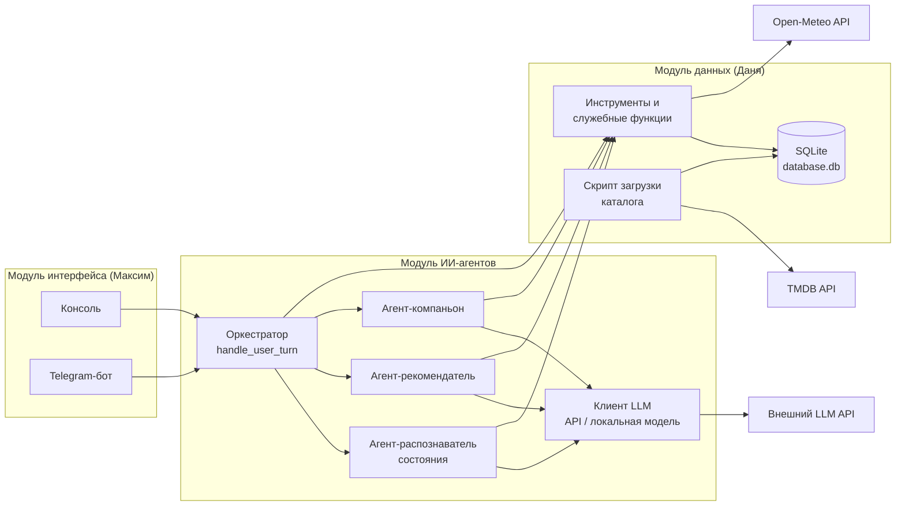
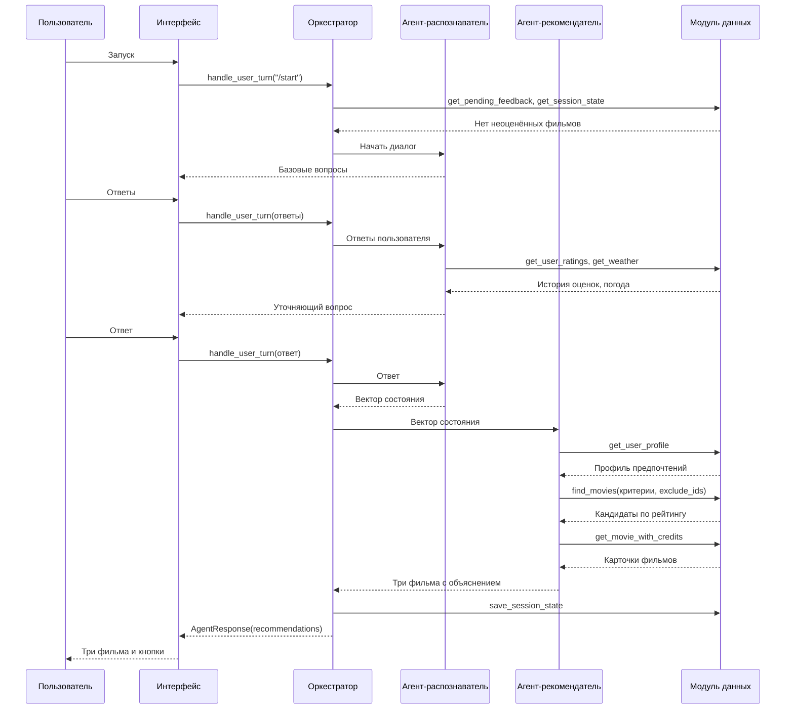
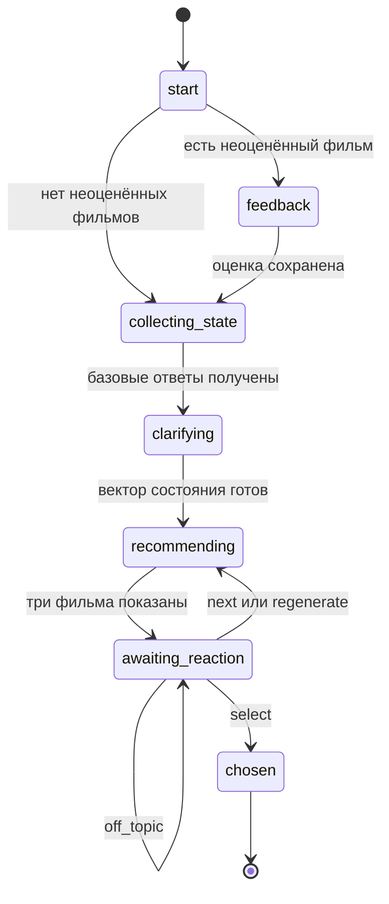

# CineMatch — Vision-документ проекта

> Общий документ проекта. Описывает систему целиком, границы модулей и общие контракты между ними. Подробности каждого модуля — в `vision_llm.md` (ИИ-агенты), `vision_db.md` (данные), `vision_ui.md` (интерфейс). При расхождении между документами источником истины по контрактам считается этот документ.

---

## 1. Общее описание

### Проблема

Выбор фильма на вечер часто занимает больше времени, чем хотелось бы: каталоги огромные, фильтры приходится настраивать вручную, а сам выбор зависит от обстоятельств, которые обычные сервисы не учитывают, — настроения, усталости, свободного времени, погоды за окном.

### Решение

CineMatch — ИИ-ассистент, который превращает поиск по каталогу в короткий диалог. Пользователь рассказывает о своём состоянии, система учитывает историю его оценок и погоду, подбирает три фильма с объяснением выбора, а после просмотра собирает оценку, чтобы следующие рекомендации были точнее.

Цель — сократить время выбора фильма до порядка одной минуты.

### Ключевые принципы

1. **Агентный подход.** Решения о следующем действии (какой уточняющий вопрос задать, с какими критериями искать фильмы, как понять ответ пользователя) принимает языковая модель через вызов инструментов (tool use / function calling), а не заранее прописанный алгоритм.
2. **Фильмы выбирает база данных, а не модель.** Модель формирует только критерии поиска; конкретные фильмы возвращает локальная БД. Это исключает выдуманные фильмы и ошибочные факты о реальных.
3. **Немонолитная архитектура.** Три независимых модуля (данные, ИИ-агенты, интерфейс) взаимодействуют только через описанные контракты.
4. **Открытые источники данных.** Каталог — TMDB API (бесплатный ключ), погода — Open-Meteo (без ключа).
5. **Один сценарий — два интерфейса.** Консольное приложение и Telegram-бот обращаются к одному и тому же ядру.

### Терминология

| Термин | Значение в проекте |
|---|---|
| **ИИ-агент** | Компонент, в котором языковая модель сама решает, какое действие выполнить (задать вопрос, вызвать инструмент, завершить), получает результат и при необходимости корректирует действие. В проекте три агента. |
| **Инструмент (tool)** | Функция модуля данных, которую модель может вызвать через function calling. Реализацию пишет модуль данных, описание для модели (схему) — модуль агентов. |
| **Служебная функция** | Функция модуля данных, которую вызывает обычный код (оркестратор, скрипт загрузки), а не модель. |
| **Оркестратор** | Детерминированный код модуля агентов: принимает сообщение от интерфейса, по этапу диалога передаёт его нужному агенту, хранит состояние сессии. Агентом не является. |
| **Скрипт загрузки каталога** | Детерминированный скрипт модуля данных, загружающий фильмы из TMDB. Агентом не является. |
| **Вектор состояния** | Структурированное описание текущего состояния пользователя (настроение, время, пожелания, погода), которое формирует агент-распознаватель. |

---

## 2. Краткое содержание

### Основной сценарий

1. Пользователь запускает CineMatch (консоль или Telegram).
2. Если у пользователя есть выбранный, но не оценённый фильм, агент-компаньон сначала спрашивает, как он прошёл.
3. Агент-распознаватель состояния задаёт базовые вопросы (настроение, свободное время, пожелания, город), получает погоду и историю оценок, задаёт один-два уточняющих вопроса и формирует вектор состояния.
4. Агент-рекомендатель по вектору состояния и профилю предпочтений формирует критерии поиска, получает кандидатов из БД и показывает три фильма с объяснением.
5. Пользователь выбирает фильм, просит ещё варианты или просит пересобрать подборку — агент сам определяет, что имелось в виду.
6. После просмотра агент-компаньон задаёт фиксированные вопросы и сохраняет оценку; профиль предпочтений пересчитывается из истории оценок.

### Состав системы

| Модуль | Содержание |
|---|---|---|
| Модуль данных | SQLite `database.db`, скрипт загрузки каталога из TMDB, клиент погоды Open-Meteo, функции-инструменты и служебные функции |
| Модуль ИИ-агентов | Оркестратор диалога, три агента, схемы инструментов, клиент LLM (API / локальная модель), защита от некорректного использования |
| Модуль интерфейса | Консольное приложение, Telegram-бот, отображение ответов, кнопки быстрых ответов; позднее — напоминания |

### Этапы разработки

| Этап | Содержание |
|---|---|
| 0. Vision и ТЗ | Vision проекта и модулей, согласование с руководителем, техническое задание |
| 1. MVP | Консольный интерфейс, LLM через внешний API, фильмы, погода (при доступности сервиса), полный цикл «подбор → выбор → оценка» |
| 2. Telegram-бот | Тот же сценарий в Telegram с кнопками быстрых ответов |
| 3. Локальные модели | Режим локальной LLM/SLM, автоматический выбор модели под характеристики устройства |
| 4. Сериалы и напоминания | Сериалы в каталоге, отслеживание прогресса просмотра, напоминания о новых сериях в Telegram |

Отчёт по практике (ПЗ) пишется параллельно со всеми этапами.

### Организация разработки

Проект ведётся в общем репозитории GitHub. У каждого модуля своя папка и своя ветка разработки; изменения попадают в основную ветку через pull request с просмотром хотя бы одним другим участником. Ключи API хранятся в файле `.env`, который не попадает в репозиторий.

---

## 3. Функциональные и нефункциональные требования

### Функциональные требования

| ID | Требование | Модуль |
|---|---|---|
| F-01 | Система загружает каталог фильмов (жанры, рейтинг, длительность, год, актёры) из TMDB и хранит его локально с индексами по жанру и году | Данные |
| F-02 | Система определяет состояние пользователя через короткий диалог: базовые вопросы + 1–2 уточняющих вопроса, сформулированных моделью | Агенты |
| F-03 | Система учитывает погоду в городе пользователя; при недоступности сервиса погоды подбор продолжается без неё | Агенты, Данные |
| F-04 | Система учитывает историю оценок пользователя и профиль предпочтений (веса жанров и актёров) | Агенты, Данные |
| F-05 | Модель формирует критерии поиска; конкретные фильмы возвращает БД, отсортированными по рейтингу | Агенты, Данные |
| F-06 | Пользователь получает три фильма с кратким объяснением выбора для каждого | Агенты, Интерфейс |
| F-07 | Пользователь может выбрать фильм, попросить ещё варианты (следующие из той же подборки) или пересобрать подборку (новые критерии, без повторов) — кнопкой или своими словами | Все |
| F-08 | В рекомендации не попадают фильмы, уже показанные в текущей подборке и уже оценённые пользователем | Агенты, Данные |
| F-09 | После просмотра выбранного фильма система задаёт фиксированный набор вопросов и сохраняет оценку | Агенты, Данные |
| F-10 | Система отвечает только на темы, связанные с выбором фильмов; посторонние запросы вежливо возвращаются к сценарию | Агенты |
| F-11 | Сценарий одинаково доступен из консоли и из Telegram-бота | Интерфейс |
| F-12 | Режим работы с моделью (внешний API или локальная модель) выбирается конфигурацией | Агенты |

### Нефункциональные требования

| ID | Требование | Значение |
|---|---|---|
| NF-01 | Время полного подбора (от запуска до трёх фильмов) | порядка 1 минуты, включая ответы пользователя |
| NF-02 | Модульность | модули общаются только через контракты раздела 4; ни один модуль не обращается к внутреннему устройству другого |
| NF-03 | Устойчивость к отказам внешних сервисов | недоступность погоды — подбор продолжается; недоступность LLM или TMDB — понятное сообщение пользователю, без аварийного завершения |
| NF-04 | Безопасность диалога | пользовательский ввод, управляющий сценарием, интерпретируется в ограниченный набор вариантов; ответы модели проверяются по схеме |
| NF-05 | Прослеживаемость | вызовы инструментов, их параметры и решения агентов логируются |
| NF-06 | Хранение секретов | ключи API — только в `.env`, не в репозитории |
| NF-07 | Расширяемость | добавление интерфейса или поставщика LLM не требует изменения других модулей |

---

## 4. Требования на взаимодействия

### Архитектура



### Контракт «Интерфейс → Агенты»

Интерфейс вызывает одну функцию:

```
handle_user_turn(user_id: str, source: "cli" | "telegram", message: str) -> AgentResponse
```

- Любой ввод пользователя, включая нажатие кнопки и команду запуска `/start`, передаётся как текст `message`. Кнопка — это заранее заданный текст, а не отдельная ветка логики в интерфейсе.
- Интерфейс не решает, что делать с ответом пользователя, — это задача агентов.

Черновой формат ответа (уточняется в ТЗ):

```json
{
  "type": "question | recommendations | feedback_question | message | error",
  "text": "Текст для пользователя",
  "options": ["Ещё варианты", "Пересобрать подборку"],
  "movies": [
    {
      "movie_id": 101,
      "title": "Название",
      "year": 2014,
      "rating": 8.4,
      "runtime": 118,
      "genres": ["Драма", "Фантастика"],
      "reason": "Почему фильм попал в подборку"
    }
  ],
  "stage": "awaiting_reaction"
}
```

`options` — варианты быстрого ответа: в Telegram отображаются кнопками, в консоли — нумерованным списком. `movies` заполняется только для `type = recommendations`.

### Контракт «Агенты → Данные»

**Инструменты** (модель вызывает через function calling; реализация — модуль данных, схема для модели — модуль агентов):

| Функция | Кто вызывает | Назначение |
|---|---|---|
| `get_user_ratings(user_id, limit)` | Агент-распознаватель | Последние оценки пользователя |
| `get_weather(city)` | Агент-распознаватель | Погода в городе или `None`, если сервис недоступен |
| `get_user_profile(user_id)` | Агент-рекомендатель | Веса жанров и актёров, рассчитанные из истории оценок |
| `find_movies(genres, year_range, min_rating, max_runtime, exclude_ids, limit)` | Агент-рекомендатель | Кандидаты, отсортированные по рейтингу |
| `get_movie_with_credits(movie_id)` | Агент-рекомендатель | Полная карточка фильма для объяснения выбора |
| `save_rating(user_id, movie_id, rating, mood_match)` | Агент-компаньон | Сохранение оценки после просмотра |

**Служебные функции** (вызывает код оркестратора, модели недоступны):

| Функция | Назначение |
|---|---|
| `get_session_state(user_id)` / `save_session_state(user_id, state)` / `clear_session_state(user_id)` | Состояние текущего диалога |
| `get_user(user_id)` / `save_user(user_id, source, city)` | Пользователь и его город |
| `save_choice(user_id, movie_id)` / `get_pending_feedback(user_id)` | Выбранный фильм, ожидающий оценки |

### Внешние системы

| Система | Использует | Назначение | Доступ |
|---|---|---|---|
| TMDB API | Скрипт загрузки каталога | Метаданные фильмов | Бесплатный ключ, регистрация |
| Open-Meteo API | `get_weather` | Геокодинг города и текущая погода | Без ключа, некоммерческое использование |
| Внешний LLM API | Клиент LLM | Работа агентов на этапе MVP | Ключ в `.env` |
| Локальная LLM/SLM | Клиент LLM | Этап 3 | Локальный запуск |

---

## 5. Описание процессов

### 5.1 Основной сценарий подбора



### 5.2 Реакция на подборку

Ответ пользователя (кнопка или свободный текст) агент-рекомендатель относит к одному из вариантов:

| Вариант | Действие |
|---|---|
| `select` | Фильм сохраняется как выбранный (`save_choice`), диалог завершается пожеланием приятного просмотра |
| `next` | Показываются следующие три фильма из уже найденных кандидатов, без нового поиска |
| `regenerate` | Модель меняет критерии, новый вызов `find_movies`, в `exclude_ids` — все уже показанные фильмы |
| `off_topic` | Вежливое возвращение к сценарию без выполнения постороннего запроса |

### 5.3 Этапы диалога

Оркестратор хранит текущий этап в состоянии сессии и по нему решает, какому агенту передать сообщение.



### 5.4 Оценка после просмотра

При следующем запуске оркестратор видит выбранный, но не оценённый фильм (`get_pending_feedback`) и передаёт диалог агенту-компаньону. Агент задаёт фиксированные вопросы (оценка от 1 до 5, подошёл ли фильм под настроение, хочется ли ещё похожего), переводит ответы в значения и вызывает `save_rating`. Отдельно профиль не обновляется: `get_user_profile` каждый раз рассчитывает веса из истории оценок.

### 5.5 Загрузка каталога

Скрипт загрузки запускается вручную или по расписанию, не во время диалога: запрашивает TMDB с ограничением частоты запросов, нормализует данные и сохраняет их в БД одной транзакцией на порцию.

---

## Решения, требующие подтверждения на созвоне

1. Погода входит в MVP как необязательный источник (подбор работает и без неё); источник — Open-Meteo, клиент пишет модуль данных.
2. Короткое состояние диалога живёт в `sessions` 24 часа без активности; выбранный, но не оценённый фильм хранится отдельно и не пропадает вместе с сессией.
3. Уже оценённые фильмы исключаются из рекомендаций всегда.
4. Сериалы и напоминания — только на этапе 4, в MVP каталог состоит из фильмов.
