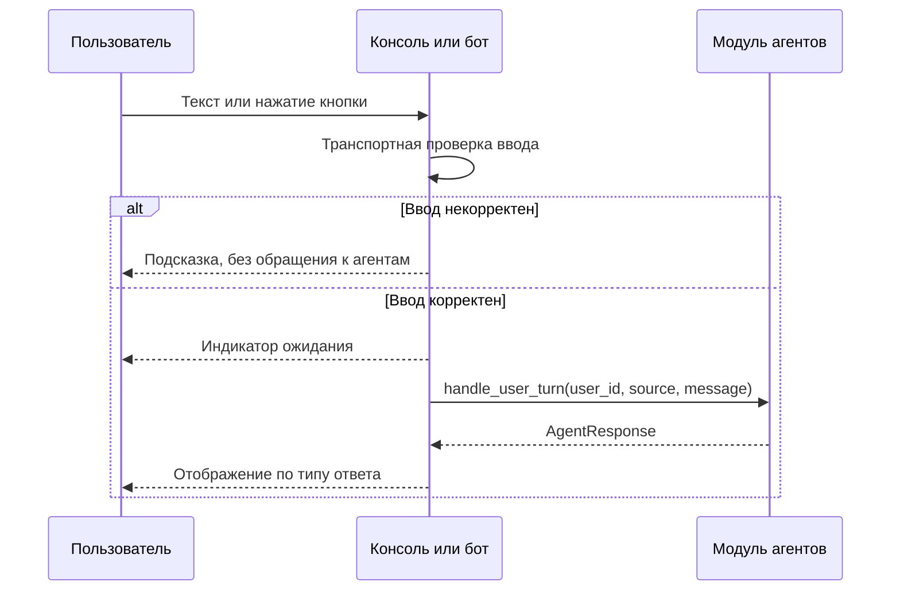
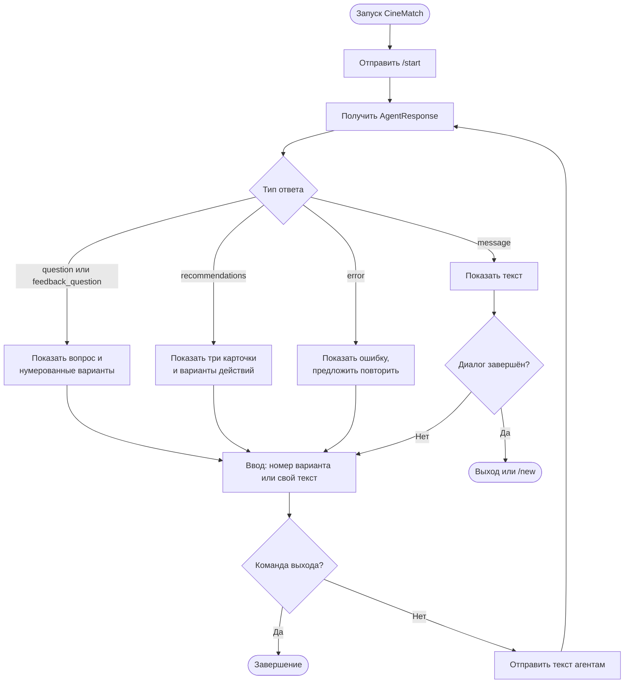
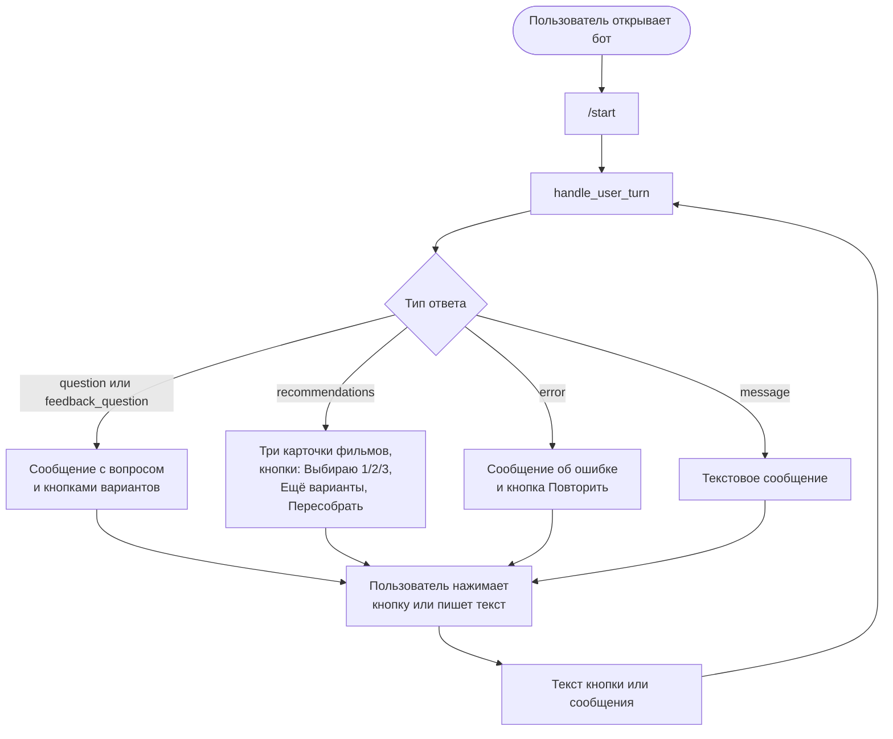

# CineMatch — Vision модуля интерфейса

> Общие контракты и термины — в `vision_project.md`.

---

## 1. Общее описание

Модуль интерфейса — то, с чем непосредственно работает пользователь. Он доставляет сообщения пользователя в модуль ИИ-агентов и показывает ответы агентов в удобном виде.

Модуль включает два интерфейса к одному и тому же ядру CineMatch:

- **Консольное приложение** — первая точка входа и основной инструмент проверки на этапе MVP. Позволяет быстро пройти сценарий целиком и в отладочном режиме увидеть, какой ответ вернули агенты.
- **Telegram-бот** — основной формат для пользователя (этап 2). Повторяет тот же сценарий в чате, показывает варианты ответа кнопками.

Консоль и бот не конкурируют и не содержат собственной логики подбора. Оба вызывают одну функцию модуля агентов и отображают её результат.

Граница ответственности:

| Интерфейс делает | Интерфейс не делает |
|---|---|
| Принимает ввод пользователя и передаёт его агентам | Не решает, какой вопрос задать следующим — вопросы формируют агенты |
| Показывает текст, фильмы и варианты ответа | Не интерпретирует ответы пользователя (например, «хочу другое») — это делают агенты |
| Проверяет ввод на уровне транспорта: пустое сообщение, слишком длинный текст, стикер вместо текста | Не обращается к БД, TMDB или сервису погоды |
| Показывает индикатор ожидания и понятные сообщения об ошибках | Не хранит состояние диалога — его хранит оркестратор модуля агентов |

---

## 2. Краткое содержание

Пользователь запускает CineMatch и ведёт короткий диалог. Все вопросы (о настроении, времени, пожеланиях, городе и уточняющие) приходят от агентов в виде `AgentResponse`; интерфейс их показывает и отправляет ответы обратно. После подборки из трёх фильмов пользователь выбирает фильм, просит ещё варианты или пересобрать подборку — кнопкой или своими словами. При следующем запуске, если выбранный фильм ещё не оценён, агенты сначала спрашивают, как он прошёл.

На этапе 4 в бот добавляются напоминания о новых сериях сериалов.

---

## 3. Функциональные и нефункциональные требования

### Функциональные требования

| ID | Требование |
|---|---|
| F-01 | Консоль и бот передают любой ввод пользователя в `handle_user_turn(user_id, source, message)` |
| F-02 | Нажатие кнопки передаётся как текст варианта ответа, так же как ввод с клавиатуры |
| F-03 | Отображение `AgentResponse` по типу: `question` — вопрос и варианты; `recommendations` — три карточки фильмов и варианты; `feedback_question` — вопрос об оценке; `message` — текст; `error` — сообщение об ошибке с предложением повторить |
| F-04 | Карточка фильма: название, год, рейтинг, длительность, жанры, объяснение выбора |
| F-05 | Варианты ответа из `options`: в Telegram — встроенные кнопки, в консоли — нумерованный список (можно ввести номер или свой текст) |
| F-06 | Команды: `/start` — начать, `/new` — начать подбор заново, `/help` — справка; в консоли — аналоги и команда выхода |
| F-07 | Идентификация пользователя: в Telegram — ID пользователя Telegram, в консоли — локальный ID из конфигурации |
| F-08 | Транспортная проверка ввода: пустые сообщения, превышение длины, нетекстовые сообщения в Telegram получают подсказку без обращения к агентам |
| F-09 | Во время ожидания ответа агентов пользователь видит индикатор (в Telegram — статус «печатает», в консоли — строка ожидания) |
| F-10 | Отладочный режим консоли (`--debug`): вывод полного `AgentResponse` для проверки работы агентов |
| F-11 | Этап 4: напоминания о новых сериях отслеживаемых сериалов в Telegram |

### Нефункциональные требования

| ID | Требование | Значение |
|---|---|---|
| NF-01 | Независимость от логики подбора | в модуле нет ветвлений по смыслу ответа пользователя; вся логика — в модуле агентов |
| NF-02 | Единый контракт | консоль и бот используют одну и ту же функцию и один формат ответа |
| NF-03 | Отзывчивость бота | обращение к агентам не блокирует обработку сообщений других пользователей (асинхронный вызов) |
| NF-04 | Устойчивость | ошибка агентов или внешнего сервиса не приводит к аварийному завершению консоли или бота |
| NF-05 | Хранение секретов | токен бота — только в `.env` |
| NF-06 | Расширяемость | новый тип `AgentResponse` или новый интерфейс добавляется без изменения модуля агентов |

---

## 4. Требования на взаимодействия

### С модулем ИИ-агентов

```
handle_user_turn(user_id: str, source: "cli" | "telegram", message: str) -> AgentResponse
```

- Первое сообщение при запуске — `/start`.
- Формат `AgentResponse` — в `vision_project.md`, раздел 4. Поля, которые интерфейс обязан обработать: `type`, `text`, `options`, `movies`.
- Интерфейс не читает и не меняет состояние сессии; поле `stage` используется только для отладки.

### С модулем данных

Прямого взаимодействия нет. Погоду, фильмы и историю пользователя интерфейс получает только в составе ответов агентов.

### С внешними системами

| Система | Назначение |
|---|---|
| Telegram Bot API | Получение и отправка сообщений, встроенные кнопки (библиотека — aiogram) |

---

## 5. Описание процессов

### 5.1 Обработка одного сообщения



### 5.2 Сценарий в консоли



### 5.3 Сценарий в Telegram-боте



### 5.4 Реакция на подборку глазами интерфейса

После показа трёх фильмов интерфейс выводит варианты, которые прислали агенты (например: «Выбираю 1», «Выбираю 2», «Выбираю 3», «Ещё варианты», «Пересобрать подборку»). Пользователь может нажать кнопку или написать своими словами («давай что-нибудь посмешнее»). В обоих случаях интерфейс просто отправляет текст агентам — различать «ещё варианты», «пересобрать» и посторонние сообщения будет агент-рекомендатель.

### 5.5 Оценка после просмотра

Отдельной кнопки «Я посмотрел» не требуется: при следующем запуске (`/start`) агенты сами начнут с вопросов об оценке, если выбранный фильм ещё не оценён. Интерфейс показывает эти вопросы как обычные `feedback_question` с вариантами ответа (например, оценка от 1 до 5 кнопками).

---

## Открытые вопросы модуля

1. Показывать ли постеры в Telegram — для этого в `AgentResponse` нужно добавить ссылку на постер (`poster_path` из каталога).
2. Оформление карточек фильмов в консоли (библиотека форматирования, например `rich`, или простой текст).
3. Механика напоминаний о сериях (этап 4) — описывается отдельно, когда в каталоге появятся сериалы.
