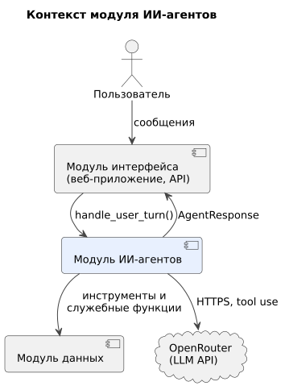

# 020 — System Context

*CineMatch. Модуль ИИ-агентов* | [оглавление модуля](README.md)

| Внешняя система | Роль | Тип интеграции |
|---|---|---|
| Модуль интерфейса (API-слой) | Передаёт сообщения пользователя, отображает ответы | Вызов функции `handle_user_turn` в процессе backend |
| Модуль данных | Каталог, оценки, сессии, настройки, погода | Вызовы функций (инструменты и служебные функции) |
| OpenRouter | Языковая модель | HTTPS, API, совместимый с OpenAI Chat Completions, с вызовом инструментов |

**Входит в модуль:** оркестратор, классификатор намерений, агенты, системные промпты, схемы инструментов, проверка ответов модели, трасса решений, клиент LLM.

**Не входит:** отображение ответов (модуль интерфейса), хранение данных и обращения к TMDB и Open-Meteo (модуль данных).

### Будущий функционал

Telegram-бот подключается к тому же `handle_user_turn`; модулю агентов он не требует изменений. Режим локальной модели меняет только клиент LLM.

---

[← 010 Глоссарий](010.glossary.md) | [Оглавление](README.md) | [030 Actors →](030.actors.md)
