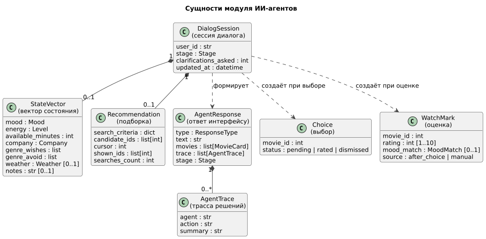
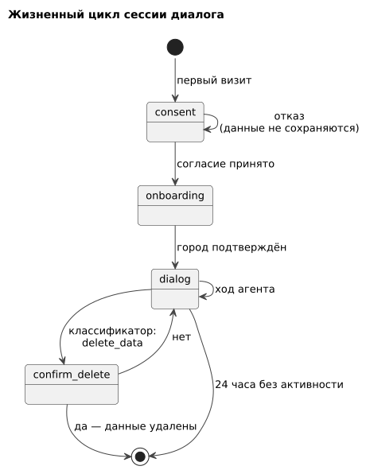

# 050 — Entities + Lifecycle

*CineMatch. Модуль ИИ-агентов* | [оглавление модуля](README.md)

Модуль агентов создаёт и использует эти сущности; хранит их модуль данных ([120 Data Model модуля данных](../data/120.data-model.md)).

| Сущность | Атрибуты | Ограничения |
|---|---|---|
| DialogSession | `stage`, `clarifications_asked`, `updated_at` | Одна на пользователя; удаляется через 24 часа без активности |
| StateVector | `mood`, `energy`, `available_minutes`, `company`, `genre_wishes`, `genre_avoid`, `weather`, `notes` | Значения из перечней ([120](120.data-model.md)) |
| Recommendation | `search_criteria`, `candidate_ids`, `cursor`, `shown_ids`, `searches_count` | `shown_ids` ⊆ `candidate_ids`; не более 3 поисков на подбор |
| AgentTrace | `agent`, `action`, `summary` | Без персональных данных, кроме сведений, показанных самому пользователю |
| AgentResponse | `type`, `text`, `movies`, `trace`, `stage` | Проверяется по JSON Schema перед отдачей |
| Choice | `movie_id`, `status` | Не более одного выбора со статусом `pending` |
| WatchMark (оценка) | `movie_id`, `rating` 1–10, `mood_match`, `source` | Одна оценка на фильм; повторная заменяет прежнюю |

**Жизненный цикл сессии диалога**

| Этап | Описание | Переход |
|---|---|---|
| `consent` | Показ правил хранения данных | Согласие → `onboarding`; отказ — этап сохраняется, данные не записываются |
| `onboarding` | Пользователь называет город | Город найден и подтверждён → `idle` |
| `idle` | Ожидание запроса | По намерению: `collecting_state` или `feedback`; при входе с неоценённым выбором → `feedback` |
| `collecting_state` | Вопросы о настроении, времени, компании, пожеланиях | Получены ответы → `clarifying` |
| `clarifying` | 1–2 уточняющих вопроса | Вектор состояния готов → `recommending` |
| `recommending` | Поиск и формирование подборки | Показано три фильма → `awaiting_reaction` |
| `awaiting_reaction` | Ожидание реакции | `another` → `recommending`; `select`, `stop` → `idle`; `off_topic` — этап сохраняется |
| `feedback` | Вопросы об оценке | Оценка сохранена или пользователь не смотрел фильм → `idle` |

### Будущий функционал

Сущности `Reminder` и `Subscription` и этап `planning` для агента-планировщика.

---

[← 040 Event Storming](040.event-storming.md) | [Оглавление](README.md) | [060 Use Cases →](060.use-cases.md)
