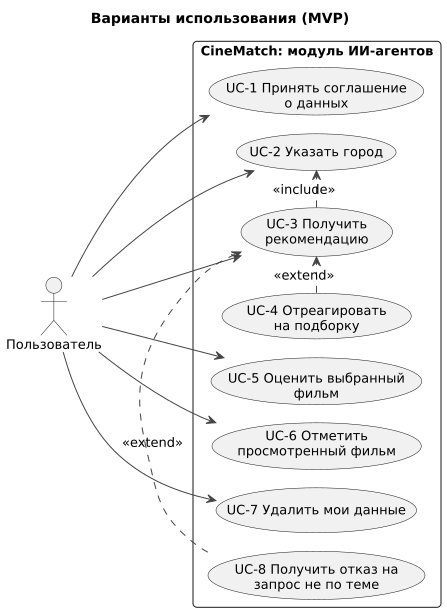
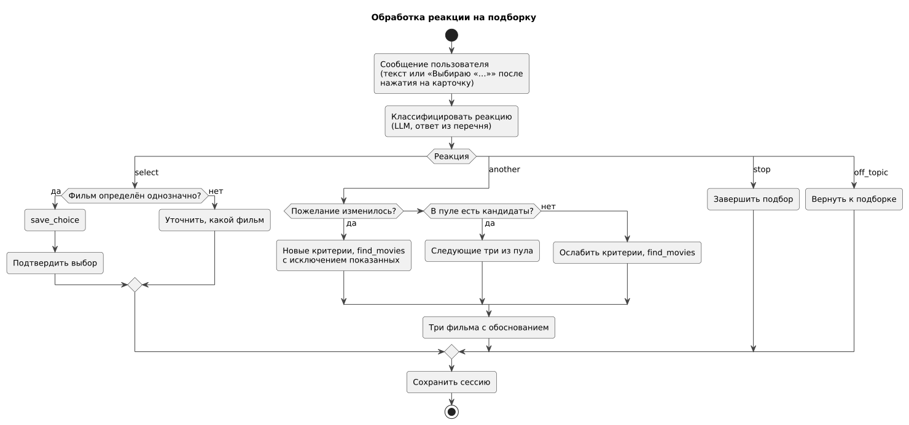

# 060 — Use Cases

*CineMatch. Модуль ИИ-агентов* | [оглавление модуля](README.md)

Нумерация вариантов использования сквозная по проекту: UC-1…UC-8 — модуль агентов, UC-9 — [модуль данных](../data/060.use-cases.md), UC-10…UC-12 — [модуль интерфейса](../ui/060.use-cases.md).

| ID | Вариант использования | Актор |
|---|---|---|
| UC-1 | Принять соглашение о данных | Пользователь |
| UC-2 | Указать город | Пользователь |
| UC-3 | Получить рекомендацию | Пользователь |
| UC-4 | Отреагировать на подборку | Пользователь |
| UC-5 | Оценить выбранный фильм | Пользователь |
| UC-6 | Отметить просмотренный фильм | Пользователь |
| UC-7 | Удалить мои данные | Пользователь |
| UC-8 | Получить отказ на запрос не по теме | Пользователь |

#### UC-3. Получить рекомендацию

| | |
|---|---|
| Предусловия | Согласие принято, город указан, этап `idle` |
| Постусловия | Показаны три фильма с объяснением и трассой решений; подборка сохранена в сессии |
| Основной поток | 1. Пользователь пишет запрос в свободной форме. 2. Классификатор определяет намерение `recommend`. 3. Распознаватель извлекает из сообщения всё, что уже сказано, и спрашивает недостающее: настроение, время, компанию, пожелания. 4. Распознаватель получает историю оценок и погоду, задаёт уточняющий вопрос. 5. Формируется вектор состояния. 6. Рекомендатель получает профиль, выбирает критерии, вызывает `find_movies`. 7. Показываются три фильма с объяснением, постером и возрастной маркировкой |
| Альтернативы | 4а. Погода недоступна — продолжение без неё. 6а. Меньше трёх кандидатов — критерии ослабляются (не более двух раз); если фильмов нет — агент сообщает об этом и предлагает изменить пожелания. 6б. Ошибка модели — один повтор, затем сообщение об ошибке, этап сохраняется |
| Истории | US-03, US-04, US-05 |

#### UC-4. Отреагировать на подборку

| | |
|---|---|
| Предусловия | Этап `awaiting_reaction` |
| Постусловия | Фильм выбран, показаны другие варианты или подбор завершён |
| Основной поток | 1. Пользователь пишет ответ или нажимает на карточку (интерфейс отправляет «Выбираю «…»»). 2. Рекомендатель относит ответ к `select`, `another`, `stop`, `off_topic`. 3а. `select` — выбор сохраняется. 3б. `another` — если пожелание изменилось, новый поиск с исключением показанных; иначе следующие три из пула. 3в. `stop` — подбор завершается |
| Альтернативы | 3а-1. Выбор неоднозначен — уточняющий вопрос. 3б-1. Пул исчерпан — поиск с ослабленными критериями. 3г. `off_topic` — возврат к подборке |
| Истории | US-06, US-07, US-08 |

#### UC-5. Оценить выбранный фильм

| | |
|---|---|
| Предусловия | Есть выбор со статусом `pending`; пользователь открыл приложение |
| Постусловия | Оценка сохранена, выбор закрыт |
| Основной поток | 1. Оркестратор видит неоценённый выбор и передаёт диалог компаньону. 2. Компаньон спрашивает оценку от 1 до 10 и подошёл ли фильм под настроение. 3. Модель переводит ответы в значения. 4. Оценка сохраняется |
| Альтернативы | 2а. «Не смотрел» — выбор закрывается без оценки. 3а. Ответ не удалось понять — вопрос повторяется один раз, затем оценка пропускается. 2б. Пользователь сразу пишет о другом — оценка откладывается до следующего визита |
| Истории | US-09 |

#### UC-6. Отметить просмотренный фильм

| | |
|---|---|
| Предусловия | Этап `idle` |
| Постусловия | Оценка сохранена с источником `manual`; фильм больше не рекомендуется |
| Основной поток | 1. Пользователь пишет «посмотрел X, на 7». 2. Классификатор определяет `watched`. 3. Компаньон ищет фильм по названию. 4. Компаньон сохраняет оценку и подтверждает с названием и годом |
| Альтернативы | 3а. Несколько совпадений — уточнение. 3б. Не найдено — просьба уточнить название. 1а. Оценка не указана — компаньон спрашивает её |
| Истории | US-10 |

**UC-1, UC-2, UC-7, UC-8** описаны историями US-01, US-02, US-11, US-12 ([080](080.user-stories.md)).

### Будущий функционал

| ID | Вариант использования |
|---|---|
| UC-F1 | Создать напоминание фразой («в пятницу в 20:00 выбрать кино») |
| UC-F2 | Подписаться на сериал или премьеру |
| UC-F3 | Получить подборку новинок по вкусу |
| UC-F4 | Выбрать фильм для компании |

---

[← 050 Entities + Lifecycle](050.entities.md) | [Оглавление](README.md) | [070 RBAC →](070.role-matrix.md)
