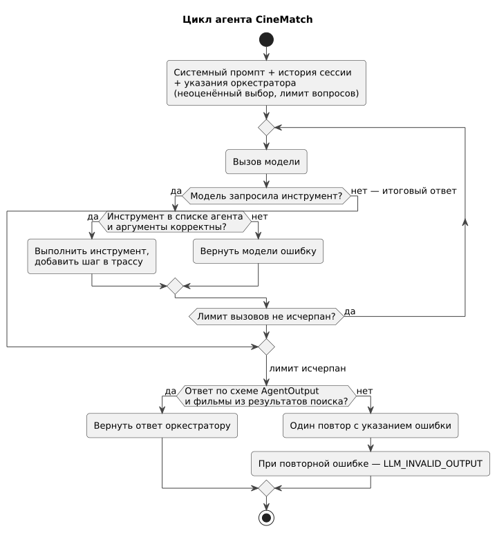

# 060 — Use Cases

*CineMatch. Модуль ИИ-агентов* | [оглавление модуля](README.md)

Нумерация вариантов использования сквозная по проекту: UC-1…UC-8 — модуль агентов, UC-9 — [модуль данных](../data/060.use-cases.md), UC-10…UC-12 — [модуль интерфейса](../ui/060.use-cases.md).

| ID | Вариант использования | Актор | Исполнитель |
|---|---|---|---|
| UC-1 | Принять соглашение о данных | Пользователь | Оркестратор |
| UC-2 | Указать город | Пользователь | Оркестратор |
| UC-3 | Получить рекомендацию | Пользователь | Агент |
| UC-4 | Отреагировать на подборку | Пользователь | Агент |
| UC-5 | Оценить выбранный фильм | Пользователь | Агент |
| UC-6 | Отметить просмотренный фильм | Пользователь | Агент |
| UC-7 | Удалить мои данные | Пользователь | Классификатор, оркестратор |
| UC-8 | Получить отказ на запрос не по теме | Пользователь | Классификатор, оркестратор |

#### UC-3. Получить рекомендацию

| | |
|---|---|
| Предусловия | Согласие принято, город указан, этап `dialog` |
| Постусловия | Показаны три фильма с объяснением и трассой решений; показанные фильмы записаны в сессию |
| Основной поток | 1. Пользователь пишет запрос в свободной форме. 2. Классификатор относит его к `cinema`. 3. Агент вызывает `extract_context` и получает контекст вечера. 4. Если не хватает времени или компании, агент задаёт вопрос (не более двух за подбор). 5. Агент запрашивает погоду, профиль и последние оценки. 6. Агент выбирает критерии и вызывает `find_movies`. 7. Агент выбирает три фильма из найденных и объясняет выбор. 8. Оркестратор проверяет, что фильмы есть в результатах поиска, и показывает подборку с постерами и возрастной маркировкой |
| Альтернативы | 5а. Погода недоступна — подбор без неё. 6а. Найдено меньше трёх фильмов — агент ослабляет критерии (не более двух повторов); если фильмов нет, сообщает об этом и предлагает изменить пожелания. 8а. Фильм не из результатов поиска — один повтор, затем сообщение об ошибке. 8б. Ошибка модели — один повтор, затем сообщение об ошибке |
| Истории | US-03, US-04, US-05 |

#### UC-4. Отреагировать на подборку

| | |
|---|---|
| Предусловия | Подборка показана |
| Постусловия | Фильм выбран, показаны другие варианты или подбор завершён |
| Основной поток | 1. Пользователь пишет ответ или нажимает на карточку (интерфейс отправляет «Выбираю «…»» с подсказкой `movie_id`). 2. Агент определяет реакцию. 3а. Выбор — агент вызывает `save_choice`. 3б. Другие варианты — агент вызывает `find_movies` с прежними или изменёнными критериями; показанные фильмы исключаются кодом. 3в. Отказ — агент завершает подбор |
| Альтернативы | 2а. Реакция неоднозначна — уточняющий вопрос. 3а-1. `save_choice` с фильмом не из последней подборки — инструмент возвращает ошибку, агент уточняет выбор |
| Истории | US-06, US-07, US-08 |

#### UC-5. Оценить выбранный фильм

| | |
|---|---|
| Предусловия | Есть выбор со статусом `pending`; пользователь открыл приложение |
| Постусловия | Оценка сохранена, выбор закрыт |
| Основной поток | 1. Оркестратор находит неоценённый выбор и передаёт агенту указание спросить о нём. 2. Агент спрашивает оценку от 1 до 10 и подошёл ли фильм под настроение. 3. Агент вызывает `save_rating` |
| Альтернативы | 2а. «Не смотрел» — агент вызывает `close_choice`. 2б. Пользователь сразу пишет о другом — оценка откладывается до следующего визита |
| Истории | US-09 |

#### UC-6. Отметить просмотренный фильм

| | |
|---|---|
| Предусловия | Этап `dialog` |
| Постусловия | Оценка сохранена с источником `manual`; фильм больше не рекомендуется |
| Основной поток | 1. Пользователь пишет «посмотрел X, на 7». 2. Агент вызывает `search_movie`. 3. Агент вызывает `save_rating` и подтверждает названием и годом |
| Альтернативы | 2а. Несколько совпадений — уточнение. 2б. Не найдено — просьба уточнить название. 1а. Оценка не указана — агент спрашивает её |
| Истории | US-10 |

**UC-1, UC-2, UC-7, UC-8** выполняет оркестратор без агента; они описаны историями US-01, US-02, US-11, US-12 ([080](080.user-stories.md)) и схемой хода ([146](146.logic-scheme.md)).

### Будущий функционал

| ID | Вариант использования |
|---|---|
| UC-F1 | Создать напоминание фразой («в пятницу в 20:00 выбрать кино») |
| UC-F2 | Подписаться на сериал или премьеру |
| UC-F3 | Получить подборку новинок по вкусу |
| UC-F4 | Выбрать фильм для компании |

---

[← 050 Entities + Lifecycle](050.entities.md) | [Оглавление](README.md) | [070 RBAC →](070.role-matrix.md)
