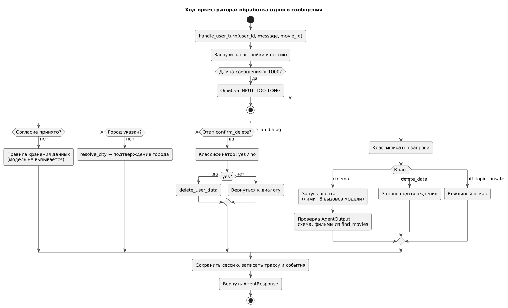

# 146 — Logic Scheme

*CineMatch. Модуль ИИ-агентов* | [оглавление модуля](README.md)

Обработка реакции на подборку — диаграмма в [060](060.use-cases.md) (UC-4).

**Потоки данных.** Одно сообщение — один синхронный ход оркестратора; внутри агент может сделать несколько вызовов модели и инструментов. Промежуточные шаги передаются API-слою для показа хода работы.

**Границы.** Вход — `handle_user_turn`; выходы — функции модуля данных и HTTPS-запросы к OpenRouter.

### Будущий функционал

Асинхронная ветка для напоминаний: агент-планировщик создаёт запись, доставку выполняет бот.

---

[← 145 ADR](145.architecture-decisions.md) | [Оглавление](README.md) | [150 Component Diagram →](150.component-diagram.md)
