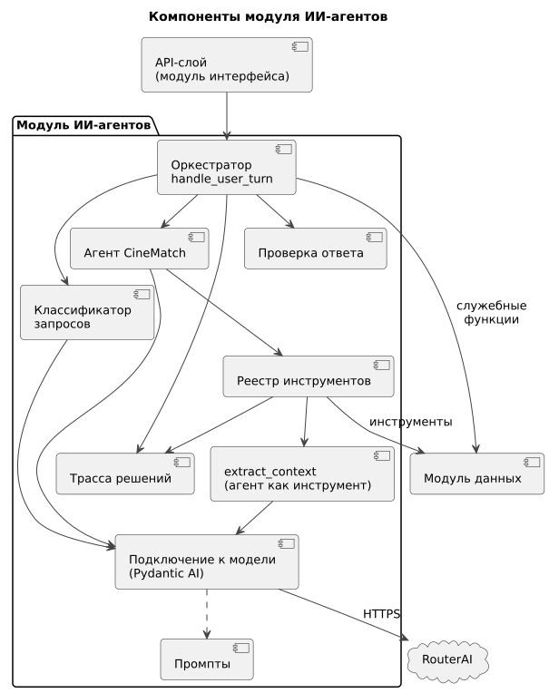

# 150 — Component Diagram

*CineMatch. Модуль ИИ-агентов* | [оглавление модуля](README.md)

| Компонент | Технология | Ответственность |
|---|---|---|
| Оркестратор | Python | Этапы сессии, согласие, город, подтверждение удаления, лимиты, сборка `AgentResponse` |
| Классификатор запросов | Pydantic AI, structured output | Класс запроса из закрытого перечня |
| Агент CineMatch | Pydantic AI, tool use | Ведение диалога, выбор инструментов, ответ по схеме `AgentOutput` |
| Инструмент `extract_context` | Pydantic AI, structured output | Контекст вечера из текста пользователя |
| Реестр инструментов | Python | Список инструментов агента, подстановка `user_id` и исключений, проверка аргументов записи |
| Проверка ответа | Python, Pydantic | Схема, фильмы из результатов поиска, длина текста |
| Подключение к модели | Pydantic AI, OpenAI SDK | Запросы к RouterAI, повтор, учёт токенов, лимиты |
| Промпты | Текстовые файлы | Системные промпты, версионируются в Git |
| Трасса решений | Python | Сбор шагов агента для ответа и журнала |

### Будущий функционал

Компонент «Агент-планировщик» с собственным набором инструментов.

---

[← 146 Logic Scheme](146.logic-scheme.md) | [Оглавление](README.md) | [155 Sequence-диаграммы →](155.sequence-diagrams.md)
