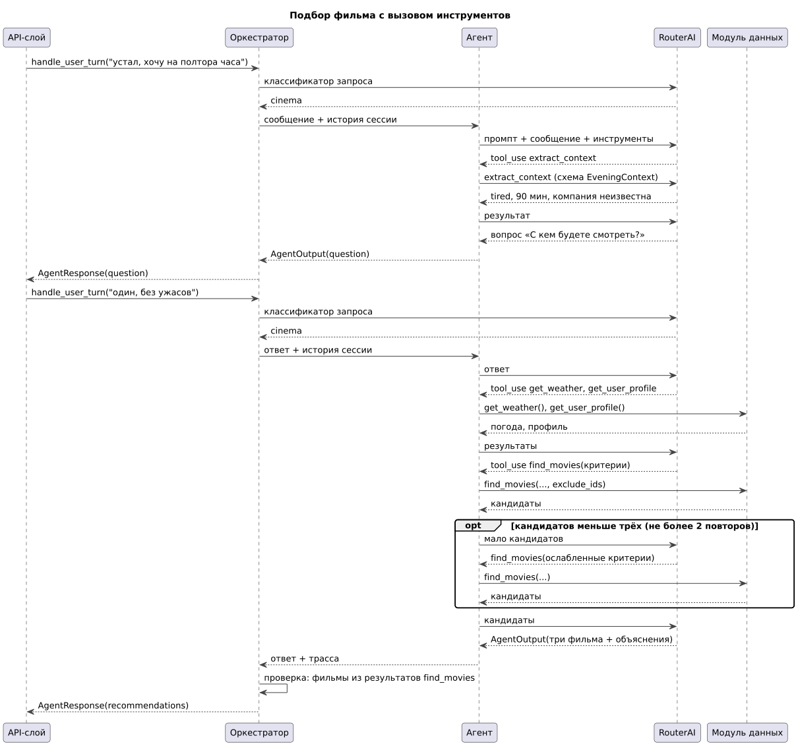
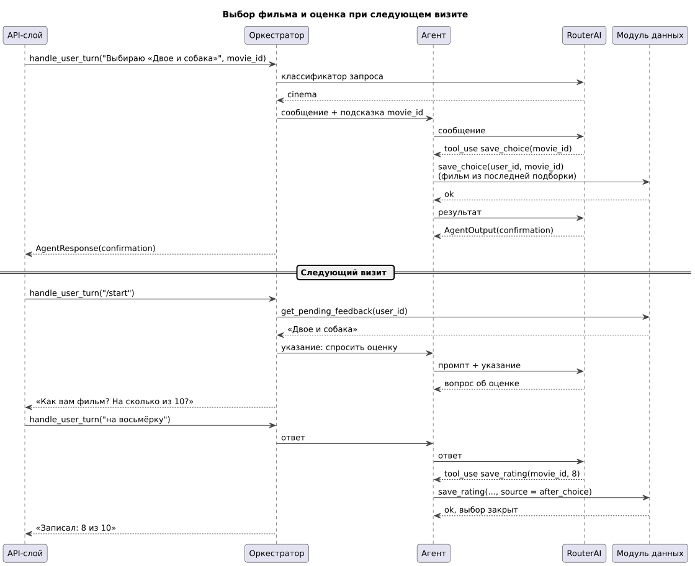
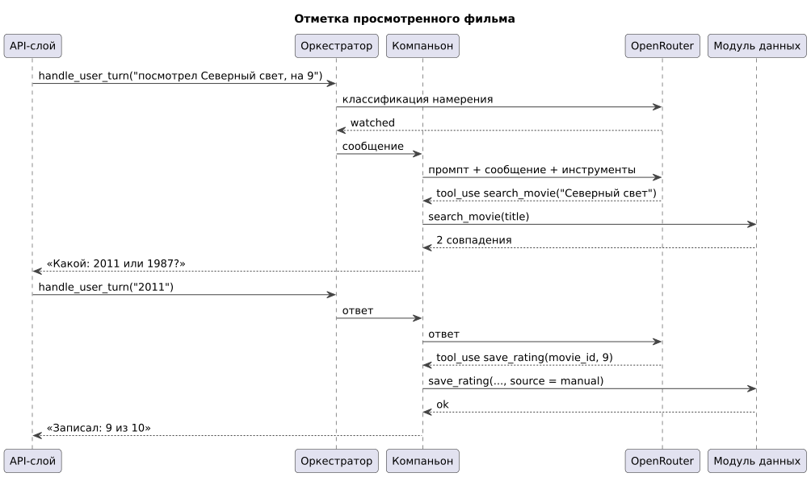

# 155 — Sequence-диаграммы

*CineMatch. Модуль ИИ-агентов* | [оглавление модуля](README.md)

**Подбор фильма с вызовом инструментов** (UC-3). Таймаут запроса к RouterAI — 20 с, один повтор.

**Выбор фильма и оценка при следующем визите** (UC-4, UC-5).

**Отметка просмотренного фильма** (UC-6).

### Будущий функционал

Диаграмма создания напоминания агентом-планировщиком.

---

[← 150 Component Diagram](150.component-diagram.md) | [Оглавление](README.md) | [160 Integration Plan →](160.integration-plan.md)
