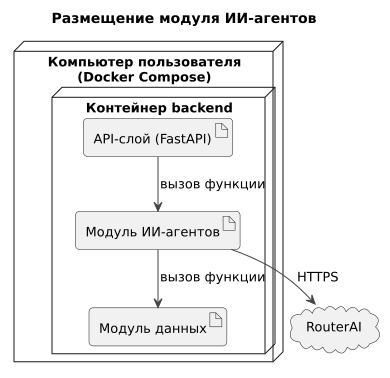

# 165 — Deployment Diagram

*CineMatch. Модуль ИИ-агентов* | [оглавление модуля](README.md)

Модуль агентов не развёртывается отдельно: он работает в контейнере backend вместе с API-слоем и модулем данных. Общая схема развёртывания — в [165 модуля интерфейса](../ui/165.deployment-diagram.md).

| Параметр | Значение |
|---|---|
| Конфигурация | `OPENROUTER_API_KEY`, `LLM_MODEL` в `.env` |
| Сеть | Исходящий HTTPS к `openrouter.ai` |
| Ресурсы | Минимальные: модель работает во внешнем сервисе |

### Будущий функционал

Режим локальной модели: отдельный контейнер с Ollama в той же конфигурации Docker Compose.

---

[← 160 Integration Plan](160.integration-plan.md) | [Оглавление](README.md)
