# CineMatch — проектная документация модуля данных

| | |
|---|---|
| Модуль | Данные: база данных SQLite, загрузка каталога из TMDB, сервис погоды Open-Meteo, функции-инструменты и служебные функции |
| Ответственный | Участник проекта, реализующий модуль данных |
| Версия документа | 0.1 (на согласовании) |
| Дата | 03.10.2026 |
| Связанные документы | [Состав документации](documents-composition.md), [vision проекта](../docs/vision/vision_project.md), [vision модуля](../docs/vision/vision_db.md), [модуль ИИ-агентов](agents.md), [модуль интерфейса](ui.md) |
| Нотация диаграмм | UML 2.x, исходники PlantUML в [`diagrams/data/`](diagrams/data/) |

Документ выполнен в соответствии с [составом проектной документации](documents-composition.md): блоки A–I, разделы 010–165. Разделы, неприменимые к модулю в типовом виде, сохранены с указанием, чем они заменены.

### Назначение и ключевые возможности модуля

Модуль данных — единственная часть системы, которая работает с хранилищем и внешними источниками данных. Остальные модули не выполняют SQL-запросов и не обращаются к TMDB и Open-Meteo напрямую, а вызывают функции модуля данных.

1. **Каталог фильмов** — загрузка из TMDB на русском языке: жанры, рейтинг, число голосов, длительность, год, актёры, возрастная маркировка; повторная загрузка обновляет данные без дубликатов.
2. **Поиск кандидатов** — выборка по критериям агента с исключением показанных и уже оценённых фильмов, сортировка по рейтингу.
3. **Пользовательские данные** — согласие, город, часовой пояс, оценки, выборы, напоминания, подписки, состояние диалога.
4. **Профиль предпочтений** — расчёт весов жанров и актёров из истории оценок при каждом запросе.
5. **Погода** — поиск города и текущая погода через Open-Meteo с кэшированием.
6. **Напоминания и новинки** — выдача напоминаний, срок которых наступил, и проверка новых серий и премьер по подпискам.
7. **Удаление данных** — полное удаление данных пользователя одной транзакцией.

---

## Блок A. Контекст и границы системы

### 010 — Глоссарий

| Термин | English | Определение | Где используется |
|---|---|---|---|
| Каталог | Catalog | Локальная копия метаданных фильмов, загруженная из TMDB | Таблицы `movies`, `genres`, `people` и связи |
| Загрузка каталога | Catalog ingestion | Процесс получения фильмов из TMDB, нормализации и записи в БД; выполняется скриптом вне диалога | Скрипт загрузки |
| Нормализация | Normalization | Приведение ответа TMDB к схеме БД: год из даты выхода, жанры во внутренние ID, первые 10 актёров, возрастная маркировка | Скрипт загрузки |
| UPSERT | Upsert | Вставка записи или обновление существующей с тем же `tmdb_id` | Загрузка каталога |
| Порог голосов | Vote threshold | Минимальное `vote_count`, ниже которого фильм не попадает в выдачу | `find_movies` |
| Возрастная маркировка | Age rating | Возрастное ограничение фильма для России (например, 18+), получаемое из TMDB `release_dates` | Карточка фильма |
| Профиль предпочтений | Preference profile | Веса жанров и актёров пользователя, рассчитанные из его оценок при запросе; отдельно не хранится | `get_user_profile` |
| Холодный старт | Cold start | Ситуация, когда у пользователя нет оценок и профиль пуст | `get_user_profile` |
| Инструмент | Tool | Функция модуля, которую модель агента вызывает через tool use; параметры проверяются модулем данных | Модуль агентов |
| Служебная функция | Service function | Функция модуля, которую вызывает код (оркестратор, бот, скрипт), а не модель | Оркестратор, бот |
| Сессия хранения | Session record | Запись с состоянием диалога пользователя; удаляется после 24 часов без активности | Таблица `sessions` |
| Ожидающий выбор | Pending choice | Выбранный фильм, по которому ещё нет оценки | Таблица `user_choices` |
| Новинка | Release | Новая серия отслеживаемого сериала или выход отслеживаемого фильма в прокат | Проверка подписок |
| Режим WAL | Write-Ahead Logging | Режим журналирования SQLite, позволяющий читать БД во время записи | Подключение к БД |
| Каскадное удаление | Cascade delete | Автоматическое удаление зависимых записей при удалении записи пользователя | Удаление данных |
| Геокодинг | Geocoding | Поиск координат и страны по названию города | `resolve_city` |

Термины агентного слоя (агент, намерение, вектор состояния) — в [глоссарии модуля агентов](agents.md#010--глоссарий).

### 020 — System Context

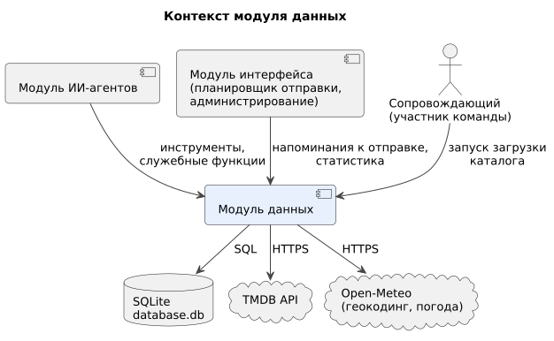

| Внешняя система | Роль по отношению к модулю | Тип интеграции |
|---|---|---|
| Модуль ИИ-агентов | Основной потребитель: инструменты для моделей и служебные функции для оркестратора | Синхронный вызов функций Python в одном процессе |
| Модуль интерфейса | Планировщик отправки получает напоминания к отправке и запускает проверку новинок; администрирование получает статистику | Синхронный вызов функций Python |
| Сопровождающий | Запускает загрузку и обновление каталога | Командная строка (скрипт) |
| SQLite (`database.db`) | Хранилище всех данных | Файл БД, модуль `sqlite3` |
| TMDB API | Источник каталога фильмов, сериалов, дат выхода | HTTPS, REST, ключ API |
| Open-Meteo | Геокодинг городов и текущая погода | HTTPS, REST, без ключа |

**Входит в модуль:** схема БД и миграции, функции чтения и записи, скрипт загрузки каталога, клиенты TMDB и Open-Meteo, расчёт профиля, проверка новинок, очистка устаревших данных.
**Не входит:** логика диалога и рекомендаций, работа с LLM, отображение данных, отправка сообщений пользователю.

### 030 — Actors

Системные акторы определены в [документе модуля агентов](agents.md#030--actors). Для модуля данных дополнительно:

| Актор | Тип | Описание | Цели |
|---|---|---|---|
| Модуль ИИ-агентов | Внутренняя система | Модели агентов (через инструменты) и оркестратор (через служебные функции) | Найти фильмы, сохранить и прочитать данные пользователя |
| Планировщик отправки | Внутренняя система (часть бота) | Работает по расписанию | Получить напоминания к отправке, запустить проверку новинок |
| Администрирование бота | Внутренняя система (часть бота) | Выполняет команды администратора | Получить агрегированную статистику |
| Сопровождающий | Человек (участник команды) | Запускает скрипт загрузки на компьютере разработчика или на сервере | Заполнить и обновить каталог |
| TMDB API | Внешняя система | REST API, ключ в переменной окружения `TMDB_API_KEY` | Отдать метаданные фильмов и сериалов |
| Open-Meteo | Внешняя система | REST API без ключа | Отдать координаты города и погоду |

---

## Блок B. Анализ предметной области

### 040 — Event Storming

| № | Команда (инициатор) | Доменное событие | Агрегат | Обработчик |
|---|---|---|---|---|
| 1 | Запустить загрузку (сопровождающий) | Загрузка каталога начата `CatalogLoadStarted` | Загрузка каталога | Скрипт загрузки |
| 2 | — | Порция фильмов сохранена `MoviesUpserted` | Фильм | Репозиторий каталога |
| 3 | — | Загрузка каталога завершена `CatalogLoadFinished` (completed, partial, failed) | Загрузка каталога | Скрипт загрузки |
| 4 | Сохранить согласие (оркестратор) | Согласие записано `ConsentRecorded` | Пользователь | Репозиторий пользователей |
| 5 | Сохранить настройки (оркестратор) | Настройки сохранены `SettingsSaved` | Пользователь | Репозиторий пользователей |
| 6 | Сохранить выбор (оркестратор) | Выбор сохранён `ChoiceSaved` | Выбор | Репозиторий пользователей |
| 7 | Создать напоминание (оркестратор, агент-планировщик, проверка новинок) | Напоминание создано `ReminderCreated` | Напоминание | Репозиторий напоминаний |
| 8 | Сохранить оценку (агент-компаньон) | Оценка сохранена `RatingSaved`; ожидающий выбор закрыт | Оценка, выбор | Репозиторий пользователей |
| 9 | Отметить отправку (планировщик отправки) | Напоминание отправлено `ReminderSent` | Напоминание | Репозиторий напоминаний |
| 10 | — (7 дней без ответа) | Напоминание просрочено `ReminderExpired` | Напоминание | Очистка устаревших данных |
| 11 | Оформить подписку (агент-планировщик) | Подписка создана `SubscriptionCreated` | Подписка | Репозиторий пользователей |
| 12 | Проверить новинки (планировщик отправки) | Обнаружена новинка `ReleaseDetected` | Подписка | Проверка новинок |
| 13 | — (24 часа без активности) | Сессия истекла `SessionExpired` | Сессия | Очистка устаревших данных |
| 14 | Удалить данные (оркестратор) | Данные пользователя удалены `UserDataDeleted` | Пользователь | Репозиторий пользователей |

### 050 — Entities + Lifecycle

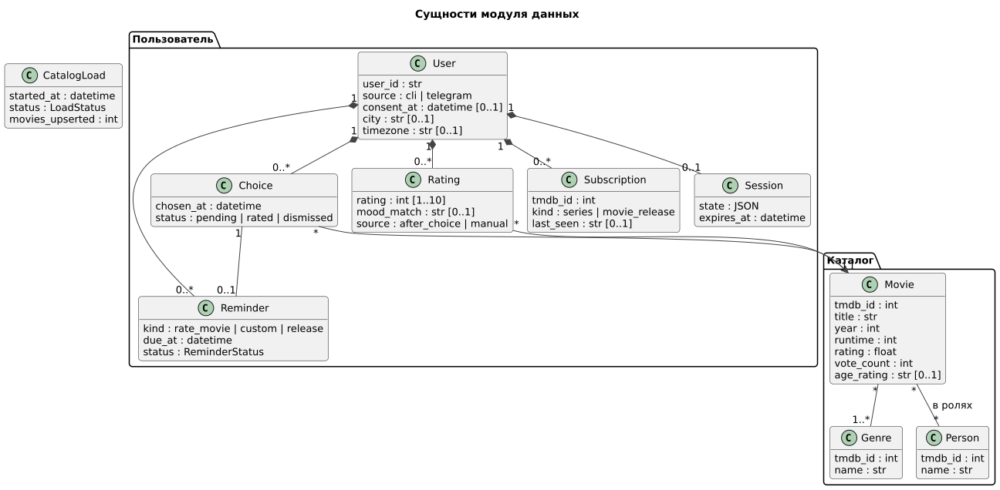

| Сущность | Ключевые атрибуты | Связи | Ограничения |
|---|---|---|---|
| Movie | `tmdb_id`, `title`, `year`, `runtime`, `rating`, `vote_count`, `age_rating` | * — 1..* Genre; * — * Person | `tmdb_id` уникален; записывается только скриптом загрузки |
| Genre | `tmdb_id`, `name` | * — * Movie | Справочник из TMDB на русском языке |
| Person | `tmdb_id`, `name` | * — * Movie (порядок в титрах) | Сохраняются первые 10 актёров фильма |
| User | `user_id`, `source`, `consent_at`, `city`, `timezone` | Владеет всеми пользовательскими сущностями | `user_id` с префиксом источника: `tg:123456789`, `cli:local` |
| Rating | `rating` 1–10, `mood_match`, `source` | User — Movie | Одна оценка на пару «пользователь — фильм»; повторная заменяет прежнюю |
| Choice | `chosen_at`, `status` | User — Movie; 0..1 Reminder | Не более одного выбора со статусом `pending` на пользователя |
| Reminder | `kind`, `due_at`, `status` | User; 0..1 Choice | Статусы — в [документе модуля агентов](agents.md#050--entities--lifecycle) |
| Subscription | `tmdb_id`, `kind`, `last_seen` | User | Одна подписка на пару «пользователь — `tmdb_id`» |
| Session | `state`, `expires_at` | User (0..1) | Удаляется после 24 часов без активности |
| CatalogLoad | `status`, `movies_upserted`, `last_page` | — | Журнал запусков загрузки |

**Жизненный цикл данных пользователя**

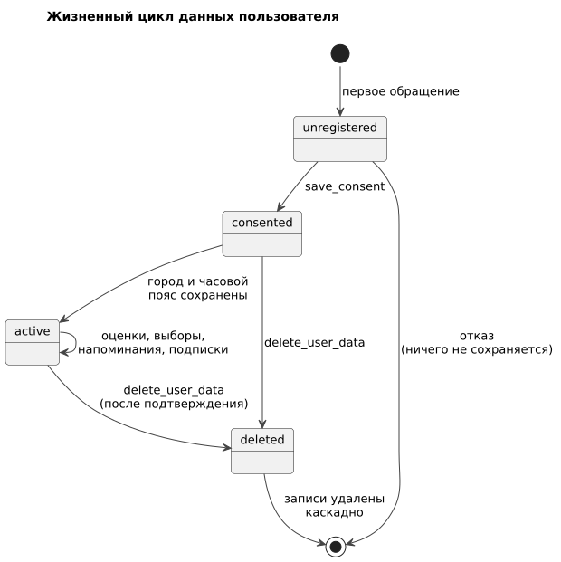

| Состояние | Описание | Переход |
|---|---|---|
| `unregistered` | Записи пользователя нет | `save_consent` → `consented`; отказ — запись не создаётся |
| `consented` | Есть запись с `consent_at`, настройки не заданы | Город и часовой пояс сохранены → `active` |
| `active` | Полноценная работа | `delete_user_data` → `deleted` |
| `deleted` | Все записи удалены каскадно | Повторное обращение начинается с `unregistered` |

**Жизненный цикл загрузки каталога**


| Статус | Описание | Переход |
|---|---|---|
| `running` | Загрузка выполняется | Все страницы → `completed`; прерывание → `partial`; ошибка 401 или БД → `failed` |
| `partial` | Часть страниц сохранена, `last_page` известен | Повторный запуск продолжает с `last_page + 1` |
| `completed`, `failed` | Конечные статусы | — |

**Хранение и удаление записей**

| Данные | Срок хранения | Механизм |
|---|---|---|
| Каталог | Бессрочно, обновляется повторной загрузкой | UPSERT по `tmdb_id` |
| Сессии | 24 часа без активности | Очистка при запуске и раз в сутки |
| Напоминания `done`, `expired`, `cancelled` | 30 дней | Очистка раз в сутки |
| Оценки, выборы, подписки, настройки | До удаления пользователем | `delete_user_data` |
| Журнал загрузок | Бессрочно | — |

### 060 — Use Cases

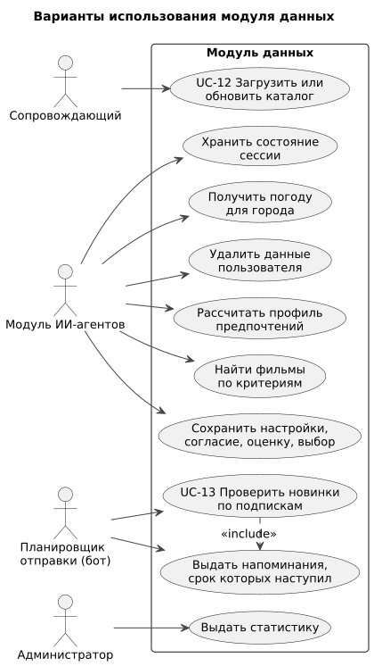

Модуль данных вводит два системных варианта использования. В пользовательских вариантах (UC-1…UC-11, [модуль агентов](agents.md#060--use-cases)) модуль выполняет хранение и поиск; его часть указана в таблице.

| ID | Вариант использования | Актор | Этап |
|---|---|---|---|
| UC-12 | Загрузить или обновить каталог | Сопровождающий | MVP |
| UC-13 | Проверить новинки по подпискам | Планировщик отправки | Дополнение |

| Пользовательский вариант | Роль модуля данных |
|---|---|
| UC-1 Соглашение | `save_consent` |
| UC-2 Город и часовой пояс | `resolve_city`, `save_user_settings` |
| UC-3 Рекомендация | `get_user_ratings`, `get_weather`, `get_user_profile`, `find_movies`, `get_movie_with_credits` |
| UC-4 Реакция на подборку | `find_movies` с исключениями, `save_choice`, `create_reminder` |
| UC-5, UC-6 Оценка | `get_pending_feedback`, `search_movie`, `save_rating`, `close_choice` |
| UC-7 Напоминание | `create_reminder`, `list_reminders`, `cancel_reminder` |
| UC-8 Подписка | `search_movie`, `search_series`, `subscribe` |
| UC-9 Удаление данных | `delete_user_data` |
| UC-11 Статистика | `get_admin_stats` |

#### UC-12. Загрузить или обновить каталог

| | |
|---|---|
| Актор | Сопровождающий |
| Предусловия | Ключ TMDB задан в `TMDB_API_KEY`; БД создана |
| Постусловия | Каталог содержит фильмы по заданным параметрам; запись в `catalog_loads` |
| Основной поток | 1. Сопровождающий запускает скрипт с параметрами (число страниц, фильтры). 2. Скрипт загружает справочник жанров. 3. Для каждой страницы `discover/movie` загружает детали фильмов с актёрами и возрастной маркировкой. 4. Порция записывается одной транзакцией. 5. Скрипт выводит отчёт: загружено, пропущено, длительность |
| Альтернативы | 3а. Ответ 429 — пауза с увеличением и повтор (не более 5 раз). 3б. Ответ 404 — фильм пропускается. 3в. Ответ 401 — остановка, статус `failed`, сообщение о неверном ключе. 3г. Прерывание (сеть, Ctrl+C) — статус `partial`; повторный запуск продолжает со следующей страницы |
| Связанные истории | US-15, US-16 |

#### UC-13. Проверить новинки по подпискам

| | |
|---|---|
| Актор | Планировщик отправки (раз в сутки) |
| Предусловия | Есть подписки, проверенные более 24 часов назад |
| Постусловия | Для каждой новинки создано напоминание `release` всем подписчикам |
| Основной поток | 1. Планировщик вызывает `check_releases`. 2. Для каждого уникального `tmdb_id` запрашиваются данные TMDB (сериал — последняя вышедшая серия; фильм — дата выхода в России). 3. Если значение отличается от `last_seen`, создаются напоминания и обновляется `last_seen`. 4. Обновляется `last_checked_at` |
| Альтернативы | 2а. TMDB недоступен — подписка проверяется в следующий запуск |
| Связанные истории | US-11 |

---

## Блок C. Требования и роли

### 070 — RBAC

**Роли пользователей.** Модуль данных не взаимодействует с людьми напрямую, кроме сопровождающего. Права пользователей и администратора определены в [документе модуля агентов](agents.md#070--rbac); модуль данных обеспечивает их на уровне данных: каждая пользовательская функция принимает `user_id` от кода вызывающего модуля и работает только с записями этого пользователя.

**Матрица «потребитель × данные»**

| Данные | Скрипт загрузки | Инструменты агентов | Оркестратор | Планировщик отправки | Администрирование |
|---|---|---|---|---|---|
| Каталог (`movies`, `genres`, `people`, связи) | CRUD | R | — | R | R (агрегаты) |
| `users` | — | R (город для погоды) | C, R, U, D | R (часовой пояс) | R (агрегаты) |
| `user_ratings` | — | C, R, U (только свои) | D | — | R (агрегаты) |
| `user_choices` | — | — | C, R, U, D | R | R (агрегаты) |
| `reminders` | — | C, R, U (только свои) | C, D | R, U | R (агрегаты) |
| `subscriptions` | — | C, R (только свои) | D | R, U | R (агрегаты) |
| `sessions` | — | — | C, R, U, D | — | — |
| `catalog_loads` | C, R, U | — | — | — | R |

C — создание, R — чтение, U — изменение, D — удаление.

**Доступ к файлу БД.** На сервере файл `database.db` и каталог резервных копий доступны только пользователю ОС, под которым работает бот (права `600`/`700`).

### 075 — NFR

| ID | Категория | Требование | Метрика и порог | Связь |
|---|---|---|---|---|
| NFR-DB-01 | Производительность | `find_movies` | ≤ 50 мс на каталоге до 100 000 фильмов | ADR-012 |
| NFR-DB-02 | Производительность | Остальные функции чтения пользовательских данных | ≤ 20 мс | ADR-012 |
| NFR-DB-03 | Производительность | Пакетная запись при загрузке | ≥ 500 записей/с в одной транзакции | ADR-012 |
| NFR-DB-04 | Производительность | `get_weather` | ≤ 3 с (таймаут); повторный запрос по тому же городу в течение 30 мин — из кэша | ADR-015 |
| NFR-DB-05 | Внешние ограничения | Частота запросов к TMDB | ≤ 40 запросов/с, интервал ≥ 25 мс; при 429 — пауза с увеличением | ADR-013 |
| NFR-DB-06 | Надёжность | Параллельный доступ | Консоль, бот и скрипт загрузки работают с одним файлом без ошибок блокировки (WAL, `busy_timeout` 5 с) | ADR-012 |
| NFR-DB-07 | Надёжность | Целостность | `PRAGMA foreign_keys = ON` для каждого подключения; запись — только в транзакциях | ADR-012 |
| NFR-DB-08 | Надёжность | Резервное копирование (сервер) | Ежедневная копия, хранятся 7 последних | 165 |
| NFR-DB-09 | Надёжность | Возобновление загрузки | Прерванная загрузка продолжается с последней сохранённой страницы | UC-12 |
| NFR-DB-10 | Приватность | Удаление данных | Все записи пользователя удаляются одной транзакцией | ADR-018 |
| NFR-DB-11 | Приватность | Журналы | В журналах нет текстов сообщений, городов и оценок пользователей — только `user_id` и тип операции | — |
| NFR-DB-12 | Безопасность | Параметры от моделей | Каждый параметр инструмента проверяется по типу и диапазону; SQL формируется только с подстановкой параметров | ADR-016 |
| NFR-DB-13 | Объём | Каталог MVP | 5 000–10 000 популярных фильмов; порог `vote_count` ≥ 100 (уточняется) | — |
| NFR-DB-14 | Лицензирование | Атрибуция TMDB | Источник данных и уведомление TMDB указаны в README и в справке бота | ADR-013 |
| NFR-DB-15 | Сопровождаемость | Изменения схемы | Только через пронумерованные файлы миграций; версия схемы хранится в `PRAGMA user_version` | — |

### 080 — User Stories

Истории пользователей, в которых участвует модуль данных, приведены в [документе модуля агентов](agents.md#080--user-stories) (US-01…US-14). Ниже — истории, специфичные для модуля.

**US-15.** Как сопровождающий, я хочу загрузить каталог одной командой, чтобы подготовить систему к работе. *(UC-12)*
- Given ключ TMDB задан, When сопровождающий запускает загрузку на 50 страниц, Then в БД появляется до 1 000 фильмов с жанрами, актёрами и возрастной маркировкой, а в конце выводится отчёт.
- Given ключ неверный, When запускается загрузка, Then она останавливается со статусом `failed` и понятным сообщением.

**US-16.** Как сопровождающий, я хочу безопасно перезапускать загрузку, чтобы обновлять каталог и продолжать прерванную загрузку. *(UC-12)*
- Given загрузка прервана на странице 20, When она запущена снова, Then продолжается со страницы 21.
- Given фильм уже есть в каталоге, When он загружается повторно, Then запись обновляется, дубликат не создаётся.

**US-17.** Как пользователь, я хочу не получать в рекомендациях фильмы, которые уже оценил, чтобы видеть новое. *(UC-3)*
- Given пользователь оценил фильм, When агент вызывает `find_movies`, Then этот фильм не возвращается, даже если подходит под критерии.

**US-18.** Как пользователь, я хочу, чтобы в подборку не попадали малоизвестные фильмы со случайно высоким рейтингом, чтобы доверять рекомендациям. *(UC-3)*
- Given фильм с рейтингом 9,5 и 12 голосами, When выполняется `find_movies`, Then фильм не возвращается.

**US-19.** Как пользователь Telegram, я хочу получать уведомление о новой серии в течение суток после её выхода, чтобы не пропускать сериал. *(UC-13)*
- Given подписка на сериал и в TMDB появилась новая серия, When выполняется ежедневная проверка, Then создаётся напоминание `release` со сроком «сейчас».
- Given на сериал подписаны три пользователя, When обнаружена новинка, Then запрос к TMDB выполняется один раз, напоминания создаются всем троим.

### 090 — Epics / Features

Эпики проекта определены в [документе модуля агентов](agents.md#090--epics--features). Модуль данных вводит эпик EP-9 и участвует в остальных.

| Эпик | Вклад модуля данных | Приоритет | Истории | Веха |
|---|---|---|---|---|
| EP-9 Каталог и загрузка данных | Схема БД, скрипт загрузки, поиск, возрастная маркировка | Must | US-15, US-16, US-17, US-18 | MVP, 15.11 |
| EP-1 Диалоговый подбор | `find_movies`, профиль, погода | Must | US-03, US-04 | MVP, 15.11 |
| EP-2 Оценки и профиль | Оценки, выборы, поиск по названию | Must | US-07, US-08 | MVP, 15.11 |
| EP-3 Персональные данные и настройки | Согласие, настройки, удаление | Must | US-01, US-02, US-13 | MVP, 15.11 |
| EP-5 Напоминания в Telegram | Хранение и выдача напоминаний | Should | US-06, US-10 | Telegram-бот, 29.11 |
| EP-6 Подписки | Подписки, проверка новинок | Could | US-11, US-19 | Заморозка, 06.12 |
| EP-7 Администрирование | Агрегированная статистика | Could | US-12 | Заморозка, 06.12 |

---

## Блок D. Верификация

### 095 — Traceability Matrix

**Функциональные требования модуля**

| ID | Требование | Источник |
|---|---|---|
| FR-DB-01 | Загрузка каталога из TMDB (`discover/movie`, детали, актёры, возрастная маркировка) на русском языке | Vision F-01…F-04 |
| FR-DB-02 | Повторная загрузка обновляет записи по `tmdb_id` без дубликатов и продолжает прерванную загрузку | Vision F-05 |
| FR-DB-03 | Обработка ошибок TMDB: 429 — повтор с паузой, 404 — пропуск, 401 — остановка | Vision F-06 |
| FR-DB-04 | `find_movies` по жанрам, годам, рейтингу, длительности с исключением показанных и оценённых, с порогом голосов, сортировкой по рейтингу | Vision F-08, ADR-003 |
| FR-DB-05 | `get_movie_with_credits`, `search_movie`, `search_series` | Vision F-09; решение 03.10 |
| FR-DB-06 | `get_user_ratings` и `get_user_profile` (расчёт весов из оценок, пустой профиль при холодном старте) | Vision F-10, F-11 |
| FR-DB-07 | Оценки 1–10 с признаком попадания в настроение и источником; закрытие ожидающего выбора | ADR-007 |
| FR-DB-08 | Хранение согласия, города с координатами и часового пояса; `resolve_city` | Решение 03.10 |
| FR-DB-09 | Сессии: чтение, сохранение с продлением срока, удаление; очистка просроченных | Vision F-13 |
| FR-DB-10 | Выборы и `get_pending_feedback` | Vision F-15 |
| FR-DB-11 | Напоминания: создание, список, отмена, выдача к отправке, отметка отправки, просрочка | Решение 03.10 |
| FR-DB-12 | Подписки и ежедневная проверка новинок с созданием напоминаний | Решение 03.10 |
| FR-DB-13 | `get_weather` с кэшем; `None` при недоступности сервиса | Vision F-07 |
| FR-DB-14 | `delete_user_data` — каскадное удаление всех данных пользователя одной транзакцией | Решение 03.10 |
| FR-DB-15 | `get_admin_stats` — агрегаты без персональных данных | Решение 03.10 |

**Тестовые сценарии** (ручная проверка; позже могут быть автоматизированы)

| ID | Проверка |
|---|---|
| TS-DB-01 | Загрузка 5 страниц на пустую БД; отчёт; число записей в таблицах |
| TS-DB-02 | Повторная загрузка тех же страниц — дубликатов нет, `updated_at` обновлён |
| TS-DB-03 | Прерывание загрузки и продолжение с `last_page + 1` |
| TS-DB-04 | Неверный ключ TMDB — статус `failed`; имитация 429 — повтор |
| TS-DB-05 | `find_movies`: фильтры, исключения, порог голосов, сортировка, некорректные параметры |
| TS-DB-06 | Время `find_movies` на каталоге 10 000 фильмов (NFR-DB-01) |
| TS-DB-07 | Профиль: пустой, после 5 оценок, изменение после новой оценки |
| TS-DB-08 | Оценка: шкала 1–10, повторная оценка того же фильма, закрытие выбора |
| TS-DB-09 | Сессии: сохранение, продление, удаление просроченных |
| TS-DB-10 | Напоминания: создание, выдача по сроку, отметка отправки, просрочка через 7 дней |
| TS-DB-11 | Проверка новинок: новая серия, без изменений, общий запрос для нескольких подписчиков |
| TS-DB-12 | Погода: известный город, неоднозначный город, недоступный сервис, кэш |
| TS-DB-13 | Удаление данных: все таблицы пользователя очищены, данные других пользователей не затронуты |
| TS-DB-14 | Одновременная работа консоли и скрипта загрузки (NFR-DB-06) |
| TS-DB-15 | Статистика не содержит персональных данных |

**Матрица трассировки**

| Требование | Тип | UC | История | Разделы | Проверка | Статус |
|---|---|---|---|---|---|---|
| FR-DB-01 | ФТ | UC-12 | US-15 | 120, 130, 146, 155 | TS-DB-01 | covered |
| FR-DB-02 | ФТ | UC-12 | US-16 | 050, 146 | TS-DB-02, TS-DB-03 | covered |
| FR-DB-03 | ФТ | UC-12 | US-15 | 146, 155 | TS-DB-04 | covered |
| FR-DB-04 | ФТ | UC-3, UC-4 | US-17, US-18 | 130, 146 | TS-DB-05, TS-DB-06 | covered |
| FR-DB-05 | ФТ | UC-3, UC-6, UC-8 | US-04, US-08 | 130 | TS-DB-05 | partial: правило выбора возрастной маркировки уточняется |
| FR-DB-06 | ФТ | UC-3 | US-03 | 130, 146 | TS-DB-07 | partial: формула весов предложена, не утверждена |
| FR-DB-07 | ФТ | UC-5, UC-6 | US-07, US-08 | 120, 130 | TS-DB-08 | covered |
| FR-DB-08 | ФТ | UC-1, UC-2 | US-01, US-13 | 120, 130 | TS-DB-12 | covered |
| FR-DB-09 | ФТ | все | — | 050, 130 | TS-DB-09 | covered |
| FR-DB-10 | ФТ | UC-4, UC-5 | US-06, US-07 | 120, 130 | TS-DB-08 | covered |
| FR-DB-11 | ФТ | UC-4, UC-7 | US-06, US-10 | 120, 130, 135 | TS-DB-10 | covered |
| FR-DB-12 | ФТ | UC-8, UC-13 | US-11, US-19 | 130, 155 | TS-DB-11 | partial: частота проверки и обработка сезонов уточняются |
| FR-DB-13 | ФТ | UC-3 | US-03 | 130 | TS-DB-12 | covered |
| FR-DB-14 | ФТ | UC-9 | US-02 | 120, 155 | TS-DB-13 | covered |
| FR-DB-15 | ФТ | UC-11 | US-12 | 130 | TS-DB-15 | partial: состав статистики не утверждён |
| NFR-DB-01…03 | НФТ | UC-3, UC-12 | — | 075, 120 | TS-DB-06, TS-DB-01 | covered |
| NFR-DB-06 | НФТ | все | — | 075, 145 | TS-DB-14 | covered |
| NFR-DB-10, NFR-DB-11 | НФТ | UC-9 | US-02 | 075, 155 | TS-DB-13 | covered |
| NFR-DB-12 | НФТ | все | US-09 | 075, 130 | TS-DB-05 | covered |

**Вывод.** Требования MVP покрыты. Открыты: формула профиля, правило выбора возрастной маркировки, параметры проверки новинок, состав статистики.

---

## Блок E. Проектирование интерфейсов

### 110 — UI/UX: интерфейс командной строки скрипта загрузки

Пользовательского интерфейса у модуля нет: экраны и сообщения проектирует [модуль интерфейса](ui.md), содержание диалога — [модуль агентов](agents.md#110--uiux-диалоговый-дизайн). Единственный интерфейс модуля данных — командная строка скрипта загрузки для сопровождающего.

```
python -m scripts.load_catalog [--pages N] [--from-year Y] [--min-votes V] [--resume] [--genres-only]
```

| Параметр | По умолчанию | Назначение |
|---|---|---|
| `--pages N` | 50 | Число страниц `discover/movie` (20 фильмов на странице) |
| `--from-year Y` | 1970 | Нижняя граница года выхода |
| `--min-votes V` | 100 | Минимальное число голосов при загрузке |
| `--resume` | выкл. | Продолжить последнюю незавершённую загрузку |
| `--genres-only` | выкл. | Обновить только справочник жанров |

Принципы: строка прогресса (страница N из M, загружено, пропущено); итоговый отчёт; при ошибке — понятное сообщение и код завершения, отличный от нуля; повторный запуск безопасен.

### 115 — Live-прототип

Не применяется: у модуля нет пользовательского интерфейса. Прототипы экранов — в [документе модуля интерфейса](ui.md), эталонные диалоги — в [документе модуля агентов](agents.md#115--live-прототип-сценарии-диалога).

---

## Блок F. Проектирование данных

### 120 — Data Model

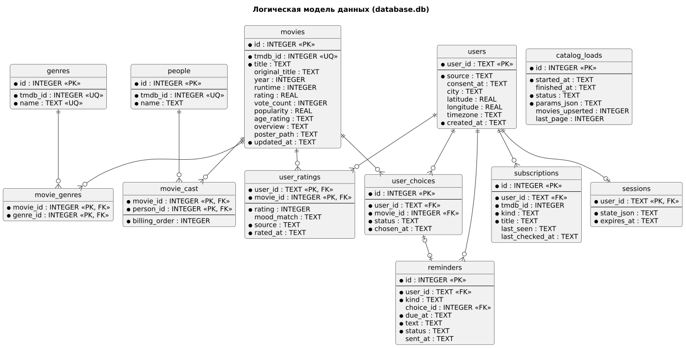

Все таблицы хранятся в одном файле `database.db`. Для каждого подключения выполняются `PRAGMA foreign_keys = ON`, `PRAGMA journal_mode = WAL`, `PRAGMA busy_timeout = 5000`. Даты хранятся в формате ISO 8601 с часовым поясом (UTC).

**movies** — каталог фильмов

| Столбец | Тип | Ограничения | Описание |
|---|---|---|---|
| `id` | INTEGER | PK | Внутренний идентификатор |
| `tmdb_id` | INTEGER | NOT NULL, UNIQUE | Идентификатор TMDB |
| `title` | TEXT | NOT NULL | Название на русском (или оригинальное, если перевода нет) |
| `original_title` | TEXT | | Оригинальное название |
| `year` | INTEGER | | Год выхода |
| `runtime` | INTEGER | CHECK (`runtime` > 0) | Длительность, мин |
| `rating` | REAL | CHECK 0–10 | Средняя оценка TMDB |
| `vote_count` | INTEGER | NOT NULL DEFAULT 0 | Число голосов |
| `popularity` | REAL | | Популярность TMDB |
| `age_rating` | TEXT | | Возрастная маркировка: `0+`, `6+`, `12+`, `16+`, `18+` или NULL |
| `overview` | TEXT | | Описание |
| `poster_path` | TEXT | | Путь к постеру TMDB |
| `updated_at` | TEXT | NOT NULL | Время последней загрузки |

**genres**, **movie_genres** — справочник жанров и связь «многие ко многим»: `genres(id PK, tmdb_id UNIQUE, name UNIQUE)`; `movie_genres(movie_id FK → movies ON DELETE CASCADE, genre_id FK → genres, PK(movie_id, genre_id))`.

**people**, **movie_cast** — актёры и связь с порядком в титрах: `people(id PK, tmdb_id UNIQUE, name)`; `movie_cast(movie_id FK → movies ON DELETE CASCADE, person_id FK → people, billing_order INTEGER NOT NULL, PK(movie_id, person_id))`.

**users** — пользователи и настройки

| Столбец | Тип | Ограничения | Описание |
|---|---|---|---|
| `user_id` | TEXT | PK | `tg:<Telegram ID>` или `cli:<локальный ID>` |
| `source` | TEXT | NOT NULL, CHECK IN (`cli`, `telegram`) | Интерфейс |
| `consent_at` | TEXT | | Время согласия; NULL — согласия нет |
| `city` | TEXT | | Название города |
| `latitude`, `longitude` | REAL | | Координаты из геокодинга |
| `timezone` | TEXT | | Часовой пояс IANA, выбранный пользователем (например, `Europe/Moscow`) |
| `created_at` | TEXT | NOT NULL | Время создания |

**user_ratings** — оценки

| Столбец | Тип | Ограничения | Описание |
|---|---|---|---|
| `user_id` | TEXT | PK, FK → users ON DELETE CASCADE | |
| `movie_id` | INTEGER | PK, FK → movies | |
| `rating` | INTEGER | NOT NULL, CHECK 1–10 | Оценка |
| `mood_match` | TEXT | CHECK IN (`yes`, `partly`, `no`) или NULL | Попал ли фильм в настроение |
| `source` | TEXT | NOT NULL, CHECK IN (`after_choice`, `manual`) | Как получена оценка |
| `rated_at` | TEXT | NOT NULL | Время оценки |

**user_choices** — выбранные фильмы

| Столбец | Тип | Ограничения | Описание |
|---|---|---|---|
| `id` | INTEGER | PK | |
| `user_id` | TEXT | NOT NULL, FK → users ON DELETE CASCADE | |
| `movie_id` | INTEGER | NOT NULL, FK → movies | |
| `status` | TEXT | NOT NULL, CHECK IN (`pending`, `rated`, `dismissed`) | `dismissed` — «не смотрел» или новый выбор |
| `chosen_at` | TEXT | NOT NULL | |

Частичный уникальный индекс `UNIQUE(user_id) WHERE status = 'pending'` гарантирует не более одного ожидающего выбора; при новом выборе прежний переводится в `dismissed`.

**reminders** — напоминания

| Столбец | Тип | Ограничения | Описание |
|---|---|---|---|
| `id` | INTEGER | PK | |
| `user_id` | TEXT | NOT NULL, FK → users ON DELETE CASCADE | |
| `kind` | TEXT | NOT NULL, CHECK IN (`rate_movie`, `custom`, `release`) | |
| `choice_id` | INTEGER | FK → user_choices ON DELETE CASCADE, NULL | Для `rate_movie` |
| `due_at` | TEXT | NOT NULL | Срок (UTC) |
| `text` | TEXT | NOT NULL, ≤ 200 символов | Текст напоминания |
| `status` | TEXT | NOT NULL, CHECK IN (`scheduled`, `sent`, `done`, `expired`, `cancelled`) | |
| `sent_at` | TEXT | | |

**subscriptions** — подписки

| Столбец | Тип | Ограничения | Описание |
|---|---|---|---|
| `id` | INTEGER | PK | |
| `user_id` | TEXT | NOT NULL, FK → users ON DELETE CASCADE | |
| `tmdb_id` | INTEGER | NOT NULL | Сериал или фильм TMDB (может отсутствовать в локальном каталоге) |
| `kind` | TEXT | NOT NULL, CHECK IN (`series`, `movie_release`) | |
| `title` | TEXT | NOT NULL | Название на момент подписки |
| `last_seen` | TEXT | | Последняя известная серия (`S02E05`) или дата выхода |
| `last_checked_at` | TEXT | | |

Ограничение `UNIQUE(user_id, tmdb_id, kind)`.

**sessions** — состояние диалога: `user_id PK, FK → users ON DELETE CASCADE`, `state_json TEXT NOT NULL` (структура — [модуль агентов, раздел 120](agents.md#120--data-model-структуры-модуля)), `expires_at TEXT NOT NULL`.

**catalog_loads** — журнал загрузок: `id PK`, `started_at`, `finished_at`, `status CHECK IN (running, completed, partial, failed)`, `params_json`, `movies_upserted`, `last_page`.

**Индексы**

| Индекс | Назначение |
|---|---|
| `movies(year)` | Фильтр по году (требование руководителя) |
| `movie_genres(genre_id, movie_id)` | Фильтр по жанру (требование руководителя) |
| `movies(rating DESC, vote_count)` | Сортировка выдачи и порог голосов |
| `movies(title)` | `search_movie` |
| `movie_cast(movie_id, billing_order)` | Актёры фильма по порядку |
| `user_ratings(user_id, rated_at DESC)` | История и профиль пользователя |
| `reminders(status, due_at)` | Выдача напоминаний к отправке |
| `subscriptions(tmdb_id)` | Проверка новинок |
| `sessions(expires_at)` | Очистка просроченных сессий |
| `user_choices(user_id) WHERE status = 'pending'` | Уникальность ожидающего выбора |

**Удаление данных пользователя.** Все пользовательские таблицы ссылаются на `users` с `ON DELETE CASCADE`, поэтому удаление строки пользователя удаляет его оценки, выборы, напоминания, подписки и сессию. Каталог не затрагивается.

DDL и миграции — в практической части отчёта и в каталоге `cinematch/data/migrations/`.

---

## Блок G. Контракты и события

### 130 — API Contracts

Модуль предоставляет функции Python, вызываемые в одном процессе; REST API отсутствует. Функции возвращают структуры (dataclass); ошибки проверки параметров возвращаются как `ToolError(code, message)`, чтобы модель агента могла исправить вызов. Версия контракта — `0.1.0` (semver).

**Инструменты** (вызываются моделями агентов; `user_id` и исключения подставляет код модуля агентов)

| Функция | Параметры | Результат | Ошибки |
|---|---|---|---|
| `get_user_ratings(user_id, limit=20)` | `limit` 1–50 | `[{movie_id, title, year, genres, rating, mood_match, rated_at}]` | `INVALID_PARAM` |
| `get_weather(user_id)` | — (город и координаты из настроек) | `{city, condition, temp_c, is_day}` или `None` | — (ошибки сервиса → `None`) |
| `get_user_profile(user_id)` | — | `{genre_weights: {жанр: −1…1}, actor_weights: {актёр: −1…1}, ratings_count}` | — |
| `find_movies(user_id, genres, year_from, year_to, min_rating, max_runtime, exclude_ids, limit=15)` | жанры из справочника; годы 1900–2030; рейтинг 0–10; длительность ≥ 30; `limit` 3–30 | `[MovieCard]` по убыванию рейтинга | `INVALID_PARAM`, `UNKNOWN_GENRE` |
| `get_movie_with_credits(movie_id)` | существующий `movie_id` | `MovieCard` + `actors[≤10]`, `overview` | `NOT_FOUND` |
| `search_movie(title, year=None)` | `title` 2–200 символов | до 5 совпадений `{movie_id, tmdb_id, title, year}` | `INVALID_PARAM` |
| `search_series(title)` | `title` 2–200 символов | до 5 совпадений `{tmdb_id, title, first_air_year}` (запрос к TMDB `search/tv`) | `INVALID_PARAM`, `SOURCE_UNAVAILABLE` |
| `save_rating(user_id, movie_id, rating, mood_match=None, source)` | `rating` 1–10 | `{saved: true, closed_choice_id}` | `INVALID_PARAM`, `NOT_FOUND` |
| `create_reminder(user_id, kind, due_at, text, choice_id=None)` | `due_at` в будущем (кроме `release`); `text` ≤ 200 | `{reminder_id}` | `INVALID_PARAM` |
| `list_reminders(user_id)` | — | активные напоминания | — |
| `cancel_reminder(user_id, reminder_id)` | напоминание пользователя | `{cancelled: true}` | `NOT_FOUND` |
| `subscribe(user_id, tmdb_id, kind, title)` | `kind` ∈ {`series`, `movie_release`} | `{subscription_id}` | `INVALID_PARAM`, `ALREADY_EXISTS` |

`MovieCard`: `{movie_id, tmdb_id, title, year, runtime, rating, vote_count, age_rating, genres, poster_path}`.

**Служебные функции**

| Функция | Вызывает | Назначение |
|---|---|---|
| `get_user(user_id)` | оркестратор | Настройки пользователя или `None` |
| `save_consent(user_id, source)` | оркестратор | Создать пользователя с `consent_at` |
| `resolve_city(name)` | оркестратор | До 5 вариантов `{name, region, country, latitude, longitude}` (Open-Meteo Geocoding) |
| `save_user_settings(user_id, city, latitude, longitude, timezone)` | оркестратор | Сохранить город и часовой пояс |
| `get_session_state(user_id)` / `save_session_state(user_id, state)` / `clear_session_state(user_id)` | оркестратор | Состояние диалога; сохранение продлевает `expires_at` на 24 ч |
| `save_choice(user_id, movie_id)` | оркестратор | Новый выбор; прежний ожидающий → `dismissed`; возвращает `choice_id` |
| `get_pending_feedback(user_id)` | оркестратор | Ожидающий выбор с карточкой фильма или `None` |
| `close_choice(choice_id, status)` | оркестратор | `dismissed` («не смотрел») |
| `delete_user_data(user_id)` | оркестратор | Удаление; возвращает `deleted_counts` |
| `get_due_reminders(now)` | планировщик отправки | Напоминания со статусом `scheduled` и `due_at ≤ now` с часовым поясом пользователя |
| `mark_reminder_sent(reminder_id)` / `mark_reminder_done(reminder_id)` | планировщик отправки, оркестратор | Смена статуса |
| `check_releases()` | планировщик отправки | Проверка новинок (UC-13); возвращает число созданных напоминаний |
| `purge_expired()` | планировщик отправки, запуск модуля | Удаление просроченных сессий, просрочка и очистка напоминаний |
| `get_admin_stats()` | администрирование | `{users, active_users_7d, ratings, avg_rating, choices, catalog_size, last_load}` |
| `ingest_movies(pages, from_year, min_votes, resume)` | скрипт загрузки | Загрузка каталога (UC-12) |

**Используемые запросы к внешним системам**

| Система | Запрос | Параметры |
|---|---|---|
| TMDB | `GET /3/genre/movie/list` | `language=ru-RU` |
| TMDB | `GET /3/discover/movie` | `language=ru-RU`, `sort_by=popularity.desc`, `vote_count.gte`, `primary_release_date.gte`, `page`, `include_adult=true` |
| TMDB | `GET /3/movie/{id}` | `language=ru-RU`, `append_to_response=credits,release_dates` |
| TMDB | `GET /3/search/tv`, `GET /3/tv/{id}` | `language=ru-RU`; поля `last_episode_to_air`, `next_episode_to_air` |
| Open-Meteo | `GET geocoding-api.open-meteo.com/v1/search` | `name`, `count=5`, `language=ru` |
| Open-Meteo | `GET api.open-meteo.com/v1/forecast` | `latitude`, `longitude`, `current=temperature_2m,weather_code,is_day` |

Пример ошибки инструмента, возвращаемой модели:

```json
{"error": {"code": "UNKNOWN_GENRE", "message": "Жанр 'киберпанк' отсутствует. Допустимые: боевик, комедия, драма, …"}}
```

### 135 — Event Catalog

Брокер сообщений не используется. События модуля данных — изменения записей в БД и строки журнала; асинхронность обеспечивает опрос таблицы `reminders` планировщиком отправки.

| Событие | Издатель | Подписчики | Триггер | Критичность |
|---|---|---|---|---|
| `CatalogLoadFinished` | Скрипт загрузки | Сопровождающий (отчёт), администрирование | Окончание загрузки | средняя |
| `ReminderCreated` | Модуль данных (по вызову оркестратора, агента-планировщика, проверки новинок) | Планировщик отправки | `create_reminder` | средняя |
| `ReminderExpired` | Очистка устаревших данных | Журнал | 7 дней в статусе `sent` | низкая |
| `ReleaseDetected` | Проверка новинок | Планировщик отправки (через созданные напоминания) | Новая серия или премьера | низкая |
| `RatingSaved` | Модуль данных (по вызову агента-компаньона) | Профиль (пересчёт при следующем чтении) | `save_rating` | высокая |
| `SessionExpired` | Очистка устаревших данных | — | 24 ч без активности | низкая |
| `UserDataDeleted` | Модуль данных (по вызову оркестратора) | Журнал | `delete_user_data` | высокая |

### 140 — Event Schema

Общие поля событий — в [документе модуля агентов](agents.md#140--event-schema). Поля `payload` событий модуля данных:

| Событие | Поля `payload` |
|---|---|
| `CatalogLoadFinished` | `load_id` (int), `status` (`completed`, `partial`, `failed`), `movies_upserted` (int), `skipped` (int), `duration_s` (int) |
| `ReminderCreated` | `reminder_id` (int), `kind` (string), `due_at` (datetime) |
| `ReminderExpired` | `reminder_id` (int) |
| `ReleaseDetected` | `tmdb_id` (int), `kind` (string), `release` (string: `S02E05` или дата), `subscribers` (int) |
| `SessionExpired` | — |
| `UserDataDeleted` | `deleted_counts` (object: таблица → число записей) |

Ключ разбиения не требуется (брокера нет). Совместимость — добавление полей с увеличением `schema_version`.

---

## Блок H. Архитектура и логика

### 145 — ADR

Номера решений сквозные по проекту; ADR-001…ADR-011 — в [документе модуля агентов](agents.md#145--adr).

**ADR-012. SQLite, один файл, режим WAL.** *Принято.*
Контекст: небольшая нагрузка, один сервер, команда без опыта администрирования СУБД. Решение: SQLite в одном файле `database.db`, WAL, `busy_timeout`, внешние ключи. Последствия: (+) нет отдельного сервера БД, простое резервное копирование, достаточная скорость (NFR-DB-01…03); (−) одна запись в момент времени — приемлемо при ожидаемой нагрузке; при росте потребуется переход на PostgreSQL.

**ADR-013. Каталог — TMDB API.** *Принято.*
Контекст: Кинопоиск и Netflix не предоставляют открытого API; нужны жанры, актёры, длительность, данные на русском. Решение: TMDB с бесплатным ключом; соблюдение условий использования и атрибуции. Последствия: (+) полные данные, русский язык, сериалы и даты выхода; (−) регистрация ключа, зависимость от доступности TMDB.

**ADR-014. Профиль рассчитывается при чтении.** *Принято.*
Контекст: профиль — производная от оценок. Решение: отдельной таблицы профиля нет; `get_user_profile` считает веса из `user_ratings`. Предлагаемая формула: вес жанра = среднее (`rating` − 5,5) / 4,5 по оценённым фильмам жанра, с учётом числа оценок; аналогично для актёров. Последствия: (+) нет рассинхронизации; (−) расчёт при каждом запросе — допустимо при сотнях оценок на пользователя.

**ADR-015. Погода — Open-Meteo, кэш 30 минут.** *Предложено.*
Контекст: в исходном задании учитывается погода. Решение: Open-Meteo без ключа; координаты города сохраняются при онбординге; ответ кэшируется в памяти на 30 минут. Последствия: (+) бесплатно, без регистрации; (−) сервис для некоммерческого использования.

**ADR-016. Проверка параметров инструментов в модуле данных.** *Принято.*
Контекст: параметры инструментов формирует модель и они могут быть некорректны. Решение: модуль данных проверяет типы и диапазоны и возвращает понятную ошибку; SQL — только с подстановкой параметров. Последствия: (+) защита от ошибок модели и внедрения SQL; (−) дублирование части проверок со схемами инструментов.

**ADR-017. Напоминания — таблица, опрашиваемая планировщиком.** *Принято.*
Контекст: брокера сообщений нет, нагрузка небольшая. Решение: напоминания хранятся в `reminders`, планировщик бота раз в минуту вызывает `get_due_reminders`. Последствия: (+) простота, напоминания переживают перезапуск бота; (−) задержка доставки до 1 минуты.

**ADR-018. Удаление данных через каскадные внешние ключи.** *Принято.*
Контекст: пользователь может потребовать удалить все данные. Решение: все пользовательские таблицы ссылаются на `users` с `ON DELETE CASCADE`. Последствия: (+) полное удаление одним запросом, нельзя «забыть» таблицу; (−) обязательно включать `foreign_keys` для каждого подключения.

**ADR-019. Идентификатор пользователя с префиксом источника.** *Принято.*
Контекст: пользователи консоли и Telegram хранятся в одной БД. Решение: `user_id` = `tg:<id>` или `cli:<id>`. Последствия: (+) нет пересечений идентификаторов, источник виден в данных; (−) один человек в консоли и в боте — разные пользователи (объединение не предусмотрено).

**ADR-020. Возрастная маркировка из TMDB `release_dates`.** *Предложено.*
Контекст: фильмы 18+ показываются с возрастной маркировкой. Решение: брать сертификацию для страны `RU`; при её отсутствии — преобразовать сертификацию `US` по таблице соответствия (G → 0+, PG → 6+, PG-13 → 12+, R → 16+, NC-17 → 18+); при отсутствии обеих — NULL, а при флаге `adult` — `18+`. Последствия: (+) маркировка у большинства фильмов; (−) преобразование US → RU приблизительно.

### 146 — Logic Scheme

**Загрузка каталога**


**Поиск кандидатов**

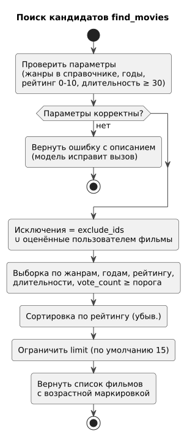

**Потоки данных.** Все вызовы модуля синхронные. Внешние запросы: TMDB — только из скрипта загрузки, `search_series` и проверки новинок (не во время подбора фильмов); Open-Meteo — при онбординге (`resolve_city`) и при подборе (`get_weather`, с кэшем). Асинхронный путь — напоминания: запись создаётся сразу, доставка — при следующем опросе планировщиком.

**Границы.** Вход — функции фасада и командная строка скрипта загрузки; выходы — файл БД, HTTPS-запросы к TMDB и Open-Meteo.

### 150 — Component Diagram

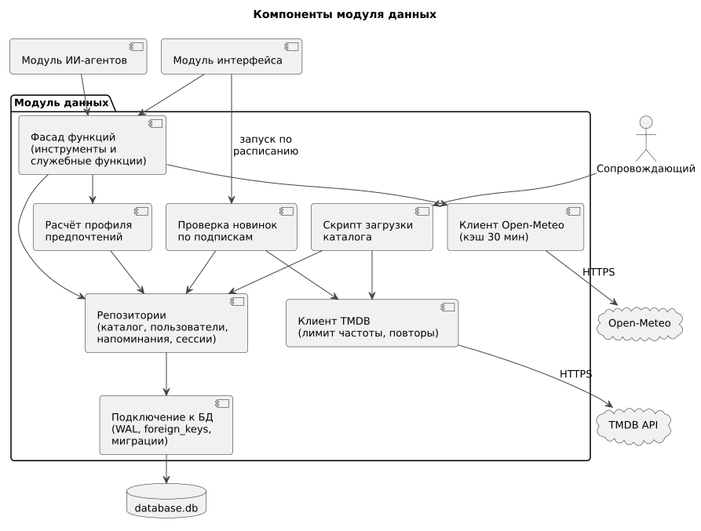

| Компонент | Технология | Ответственность |
|---|---|---|
| Фасад функций | Python | Публичные функции модуля (раздел 130), проверка параметров, преобразование в структуры |
| Репозитории | Python, `sqlite3` | SQL-запросы по группам таблиц: каталог, пользователи, напоминания, сессии |
| Расчёт профиля | Python | Веса жанров и актёров из оценок (ADR-014) |
| Скрипт загрузки каталога | Python, командная строка | UC-12 |
| Проверка новинок | Python | UC-13 |
| Клиент TMDB | Python, HTTP-клиент | Запросы, ограничение частоты, повторы, ключ из окружения |
| Клиент Open-Meteo | Python, HTTP-клиент | Геокодинг, погода, кэш 30 мин, таймаут 3 с |
| Подключение к БД | Python, `sqlite3` | Параметры подключения (WAL, внешние ключи, таймаут), миграции по `user_version` |

Связь с решениями: ADR-012…ADR-020.

---

## Блок I. Интеграции и развёртывание

### 155 — Sequence-диаграммы

**Загрузка каталога** (UC-12, US-15, US-16). Таймаут запроса к TMDB — 10 с; при 429 — пауза по заголовку `Retry-After` или 1, 2, 4… с, не более 5 повторов.

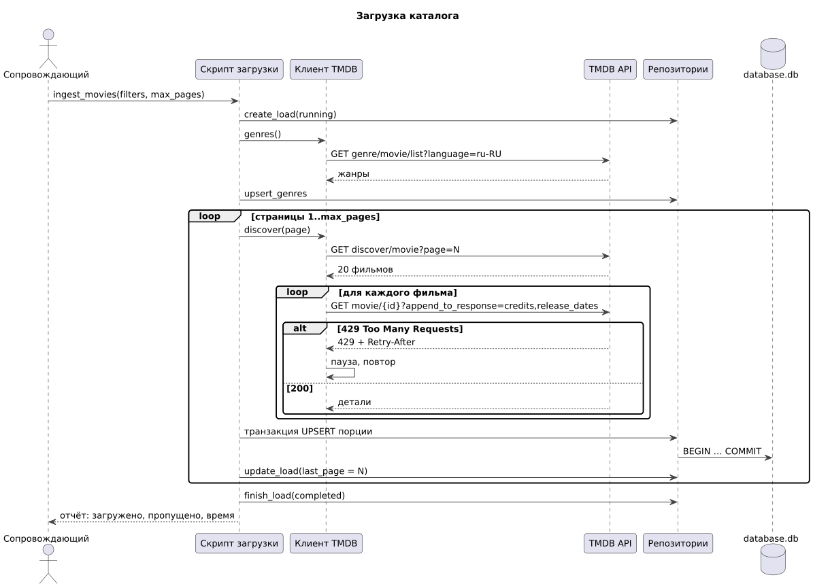

**Удаление данных пользователя** (UC-9, US-02).

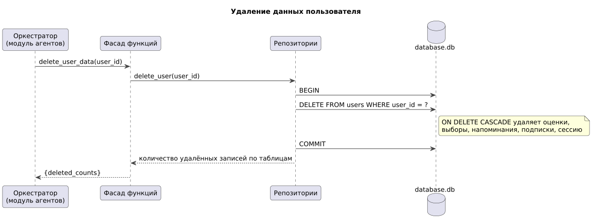

**Проверка новинок по подпискам** (UC-13, US-19).

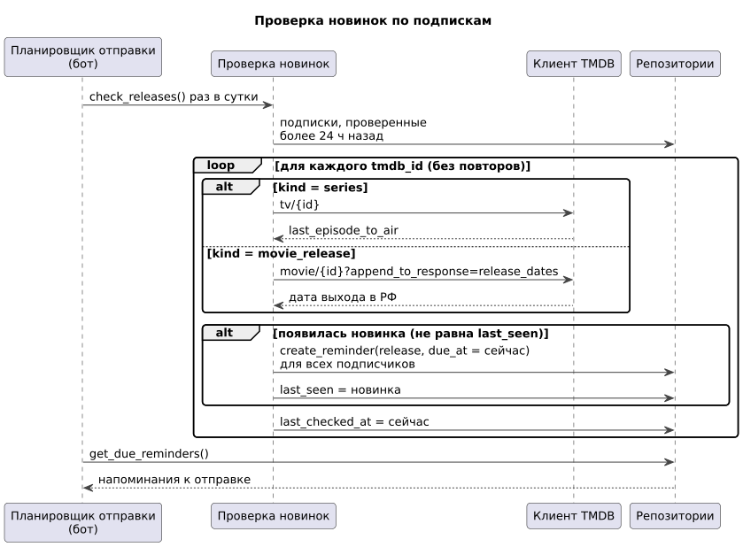

Поиск кандидатов в составе подбора показан в [документе модуля агентов](agents.md#155--sequence-диаграммы).

### 160 — Integration Plan

| № | Интеграция | С кем | Тип | Срок | Критерий готовности |
|---|---|---|---|---|---|
| 1 | Регистрация ключа TMDB | TMDB | — | неделя 6 | Тестовый запрос выполняется |
| 2 | Общие структуры (`MovieCard`, ошибки инструментов) в `cinematch/overall/` | все модули | код Python | неделя 7 (до 18.10) | PR одобрен всеми тремя |
| 3 | Схема БД и миграция 001 | — | SQLite | неделя 8 | БД создаётся с нуля одной командой |
| 4 | Заглушки функций с тестовыми фильмами | модуль агентов | вызов функций | неделя 8 (до 25.10) | Агенты проходят сценарий подбора на заглушках |
| 5 | Скрипт загрузки, реальный каталог | TMDB | HTTPS | неделя 9 | TS-DB-01…TS-DB-04 |
| 6 | Реальные инструменты и служебные функции | модуль агентов | вызов функций | недели 9–10 | TS-DB-05…TS-DB-09, TS-DB-13 |
| 7 | Погода и геокодинг | Open-Meteo | HTTPS | неделя 10 | TS-DB-12 |
| 8 | Демо MVP | все | — | 15.11 | Сквозной сценарий в консоли на реальных данных |
| 9 | Напоминания для бота | модуль интерфейса | вызов функций | недели 12–13 | TS-DB-10; напоминание доставляется ботом |
| 10 | Подписки и проверка новинок | модуль интерфейса, TMDB | вызов функций, HTTPS | неделя 14 | TS-DB-11 |

### 165 — Deployment Diagram

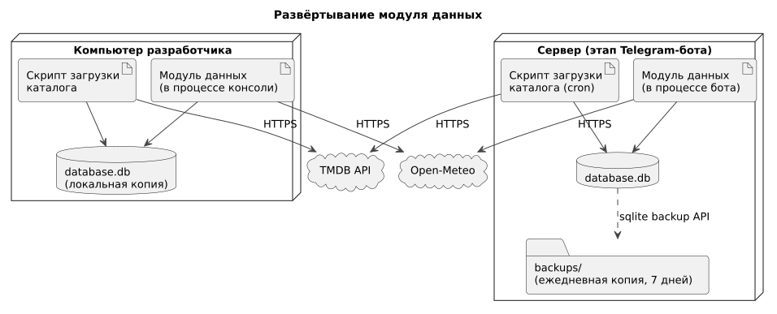

| Окружение | Где | Что работает | Особенности |
|---|---|---|---|
| Разработка | Компьютеры участников | Модуль в процессе консоли, скрипт загрузки, локальная `database.db` | У каждого своя БД; файл не коммитится (`storage/` в `.gitignore`) |
| Рабочее | Сервер (этап Telegram-бота) | Модуль в процессе бота, скрипт загрузки по расписанию (раз в неделю), `database.db`, резервные копии | Копия БД раз в сутки через `sqlite3` backup API, хранятся 7 последних |

**Требования модуля к серверу** (в дополнение к [требованиям модуля агентов](agents.md#165--deployment-diagram)): диск — 1 ГБ под БД и резервные копии при каталоге до 100 000 фильмов; исходящий HTTPS к `api.themoviedb.org`, `api.open-meteo.com`, `geocoding-api.open-meteo.com`.

---

## Допущения и открытые вопросы

| № | Вопрос | Текущее допущение | Кто решает |
|---|---|---|---|
| 1 | Объём каталога MVP и порог голосов | 5 000–10 000 фильмов, `vote_count` ≥ 100 | модуль данных |
| 2 | Формула весов профиля | ADR-014 | модуль данных, модуль агентов |
| 3 | Правило возрастной маркировки | ADR-020 | команда |
| 4 | Частота обновления каталога на сервере | Раз в неделю, последние 2 года выпуска + популярные | модуль данных |
| 5 | Частота проверки новинок | Раз в сутки | команда |
| 6 | Нужны ли сериалы в локальном каталоге | Нет: для подписок достаточно запросов к TMDB по `tmdb_id` | команда |
| 7 | Объединение пользователя консоли и Telegram | Не предусмотрено (ADR-019) | команда |
| 8 | Состав статистики администратора | `get_admin_stats` (раздел 130) | команда |

**Изменения, которые затрагивают другие модули:** новый инструмент `search_series` (добавить в набор агента-планировщика, [модуль агентов, раздел 070](agents.md#070--rbac)); служебные функции `resolve_city`, `close_choice`, `get_due_reminders`, `mark_reminder_sent`, `check_releases`, `purge_expired`, `get_admin_stats`; `get_weather` принимает `user_id` вместо названия города.
