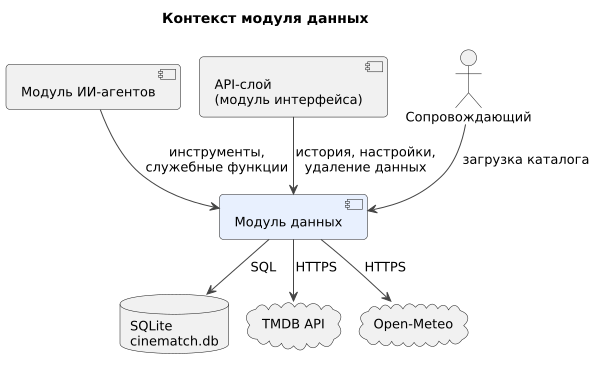

# 020 — System Context

*CineMatch. Модуль данных* | [оглавление модуля](README.md)

| Внешняя система | Роль | Тип интеграции |
|---|---|---|
| Модуль ИИ-агентов | Инструменты агента, служебные функции для оркестратора | Вызов функций Python в процессе backend |
| API-слой (модуль интерфейса) | История оценок, настройки, удаление данных | Вызов функций Python |
| Сопровождающий | Запуск загрузки каталога | Командная строка в контейнере backend |
| SQLite (`cinematch.db`) | Хранилище | Файл в томе Docker, доступ через SQLAlchemy 2.0 |
| TMDB API | Каталог фильмов | HTTPS, REST, ключ `TMDB_API_KEY` |
| Open-Meteo | Геокодинг и погода | HTTPS, REST, без ключа |

**Входит в модуль:** схема базы и миграции, функции чтения и записи, скрипт загрузки каталога, клиенты TMDB и Open-Meteo, расчёт профиля, очистка устаревших сессий.

**Не входит:** логика диалога и подбора, работа с языковой моделью, отображение данных.

### Будущий функционал

Проверка новинок по подпискам и подготовка подборки новинок — новые обращения к TMDB по расписанию.

---

[← 010 Глоссарий](010.glossary.md) | [Оглавление](README.md) | [030 Actors →](030.actors.md)
