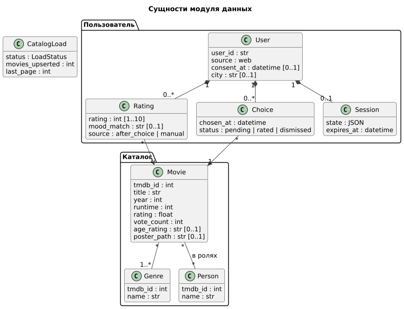
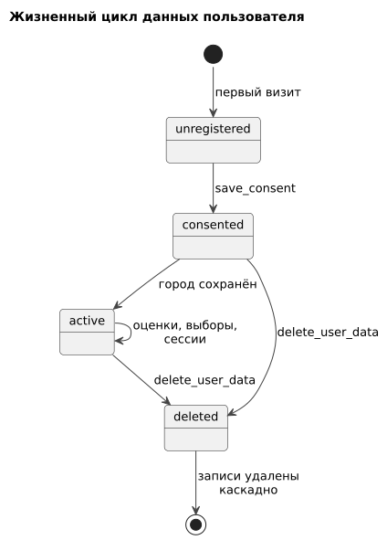
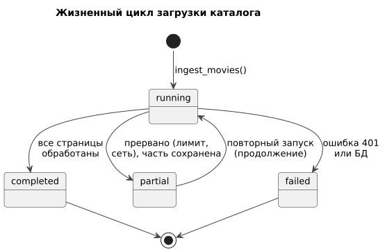

# 050 — Entities + Lifecycle

*CineMatch. Модуль данных* | [оглавление модуля](README.md)

| Сущность | Ключевые атрибуты | Ограничения |
|---|---|---|
| Movie | `tmdb_id`, `title`, `year`, `runtime`, `rating`, `vote_count`, `age_rating`, `poster_path` | `tmdb_id` уникален; записывает только скрипт загрузки |
| Genre | `tmdb_id`, `name` | Справочник TMDB на русском |
| Person | `tmdb_id`, `name` | Первые 10 актёров фильма |
| User | `user_id`, `source`, `consent_at`, `city`, координаты | `user_id` с префиксом источника: `web:local` |
| Rating | `rating` 1–10, `mood_match`, `source` | Одна на пару «пользователь — фильм» |
| Choice | `chosen_at`, `status` | Не более одного `pending` на пользователя |
| Session | `state`, `expires_at` | Удаляется через 24 часа без активности |
| CatalogLoad | `status`, `movies_upserted`, `last_page` | Журнал запусков загрузки |

**Жизненный цикл данных пользователя**

| Состояние | Описание | Переход |
|---|---|---|
| `unregistered` | Записи нет | Согласие → `consented` |
| `consented` | Есть `consent_at`, город не задан | Город сохранён → `active` |
| `active` | Полноценная работа | `delete_user_data` → `deleted` |
| `deleted` | Записи удалены каскадно | Следующий визит — снова `unregistered` |

**Жизненный цикл загрузки каталога**

| Статус | Переход |
|---|---|
| `running` | Все страницы → `completed`; прерывание → `partial`; ошибка ключа или базы → `failed` |
| `partial` | Повторный запуск продолжает с `last_page + 1` |

**Сроки хранения:** каталог — бессрочно (обновляется загрузкой); сессии — 24 часа без активности; оценки, выборы, настройки — до удаления пользователем; журнал загрузок — бессрочно.

### Будущий функционал

Сущности `Reminder`, `Subscription`; сериалы в каталоге.

---

[← 040 Event Storming](040.event-storming.md) | [Оглавление](README.md) | [060 Use Cases →](060.use-cases.md)
