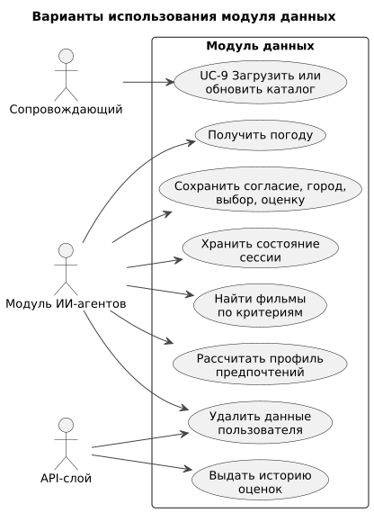

# 060 — Use Cases

*CineMatch. Модуль данных* | [оглавление модуля](README.md)

Модуль вводит UC-9; в остальных вариантах использования ([модуль агентов](../agents/060.use-cases.md), [модуль интерфейса](../ui/060.use-cases.md)) он хранит и ищет данные.

| Вариант использования | Функции модуля данных |
|---|---|
| UC-1 Соглашение | `save_consent` |
| UC-2 Город | `resolve_city`, `save_user_settings` |
| UC-3 Рекомендация | `get_user_ratings`, `get_weather`, `get_user_profile`, `find_movies`, `get_movie_with_credits` |
| UC-4 Реакция | `find_movies`, `save_choice` |
| UC-5, UC-6 Оценка | `get_pending_feedback`, `search_movie`, `save_rating`, `close_choice` |
| UC-7 Удаление данных | `delete_user_data` |
| UC-10 История | `get_history` |
| UC-11 Настройки | `get_user`, `resolve_city`, `save_user_settings` |

#### UC-9. Загрузить или обновить каталог

| | |
|---|---|
| Актор | Сопровождающий |
| Предусловия | Ключ `TMDB_API_KEY` в `.env`; контейнеры собраны |
| Постусловия | Каталог содержит фильмы по параметрам; запись в `catalog_loads` |
| Основной поток | 1. Сопровождающий запускает `docker compose run --rm backend python -m scripts.load_catalog`. 2. Загружается справочник жанров. 3. Для каждой страницы `discover/movie` загружаются детали фильмов с актёрами и возрастной маркировкой. 4. Порция записывается одной транзакцией. 5. Выводится отчёт: загружено, пропущено, длительность |
| Альтернативы | 3а. Ответ 429 — пауза с увеличением, до 5 повторов. 3б. Ответ 404 — фильм пропускается. 3в. Ответ 401 — остановка, статус `failed`. 3г. Прерывание — статус `partial`, повторный запуск продолжает |
| Истории | US-13, US-15 |

### Будущий функционал

UC-F2 «Подписаться на сериал или премьеру» и UC-F3 «Подборка новинок» — проверка TMDB по расписанию.

---

[← 050 Entities + Lifecycle](050.entities.md) | [Оглавление](README.md) | [070 RBAC →](070.role-matrix.md)
