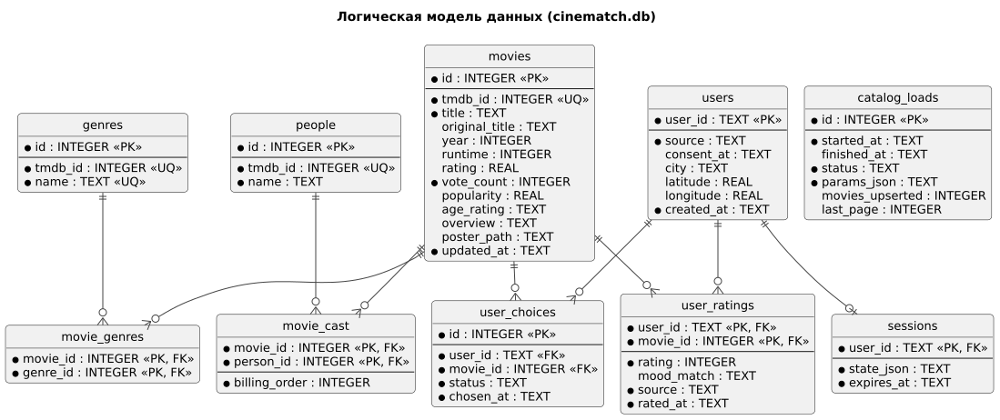

# 120 — Data Model

*CineMatch. Модуль данных* | [оглавление модуля](README.md)

Все таблицы — в одном файле `cinematch.db` в томе Docker. Для каждого подключения: `PRAGMA foreign_keys = ON`, `journal_mode = WAL`, `busy_timeout = 5000`. Даты — ISO 8601 в UTC.

**movies**

| Столбец | Тип | Ограничения | Описание |
|---|---|---|---|
| `id` | INTEGER | PK | |
| `tmdb_id` | INTEGER | NOT NULL, UNIQUE | Идентификатор TMDB |
| `title` | TEXT | NOT NULL | Название на русском |
| `original_title` | TEXT | | Оригинальное название |
| `year` | INTEGER | | Год выхода |
| `runtime` | INTEGER | CHECK > 0 | Длительность, мин |
| `rating` | REAL | CHECK 0–10 | Оценка TMDB |
| `vote_count` | INTEGER | NOT NULL DEFAULT 0 | Число голосов |
| `popularity` | REAL | | Популярность TMDB |
| `age_rating` | TEXT | | `0+`, `6+`, `12+`, `16+`, `18+` или NULL |
| `overview` | TEXT | | Описание |
| `poster_path` | TEXT | | Путь к постеру; полный адрес: `https://image.tmdb.org/t/p/w342{poster_path}` |
| `updated_at` | TEXT | NOT NULL | Время последней загрузки |

**genres, movie_genres:** `genres(id PK, tmdb_id UNIQUE, name UNIQUE)`; `movie_genres(movie_id FK → movies ON DELETE CASCADE, genre_id FK → genres, PK(movie_id, genre_id))`.

**people, movie_cast:** `people(id PK, tmdb_id UNIQUE, name)`; `movie_cast(movie_id FK → movies ON DELETE CASCADE, person_id FK → people, billing_order NOT NULL, PK(movie_id, person_id))`.

**users**

| Столбец | Тип | Ограничения | Описание |
|---|---|---|---|
| `user_id` | TEXT | PK | `web:local` в MVP |
| `source` | TEXT | NOT NULL | `web` |
| `consent_at` | TEXT | | Время согласия; NULL — нет согласия |
| `city` | TEXT | | Город |
| `latitude`, `longitude` | REAL | | Координаты из геокодинга |
| `created_at` | TEXT | NOT NULL | |

**user_ratings**

| Столбец | Тип | Ограничения | Описание |
|---|---|---|---|
| `user_id` | TEXT | PK, FK → users ON DELETE CASCADE | |
| `movie_id` | INTEGER | PK, FK → movies | |
| `rating` | INTEGER | NOT NULL, CHECK 1–10 | |
| `mood_match` | TEXT | CHECK IN (`yes`, `partly`, `no`) или NULL | |
| `source` | TEXT | NOT NULL, CHECK IN (`after_choice`, `manual`) | |
| `rated_at` | TEXT | NOT NULL | |

**user_choices:** `id PK`, `user_id FK → users ON DELETE CASCADE`, `movie_id FK → movies`, `status CHECK IN (pending, rated, dismissed)`, `chosen_at`. Частичный уникальный индекс `UNIQUE(user_id) WHERE status = 'pending'`; при новом выборе прежний переводится в `dismissed`.

**sessions:** `user_id PK, FK → users ON DELETE CASCADE`, `state_json NOT NULL` (структура — [120 модуля агентов](../agents/120.data-model.md)), `expires_at NOT NULL`.

**catalog_loads:** `id PK`, `started_at`, `finished_at`, `status CHECK IN (running, completed, partial, failed)`, `params_json`, `movies_upserted`, `last_page`.

**Индексы**

| Индекс | Назначение |
|---|---|
| `movies(year)` | Фильтр по году |
| `movie_genres(genre_id, movie_id)` | Фильтр по жанру |
| `movies(rating DESC, vote_count)` | Сортировка и порог голосов |
| `movies(title)` | `search_movie` |
| `movie_cast(movie_id, billing_order)` | Актёры фильма |
| `user_ratings(user_id, rated_at DESC)` | История и профиль |
| `sessions(expires_at)` | Очистка сессий |

**Удаление данных пользователя.** Все пользовательские таблицы ссылаются на `users` с `ON DELETE CASCADE`: удаление строки пользователя удаляет оценки, выборы и сессию; каталог не затрагивается.

### Будущий функционал

Таблицы `reminders`, `subscriptions`; сериалы (`series`, `episodes`).

---

[← 115 Live-прототип](115.live-prototype.md) | [Оглавление](README.md) | [130 API Contracts →](130.api-contracts.md)
