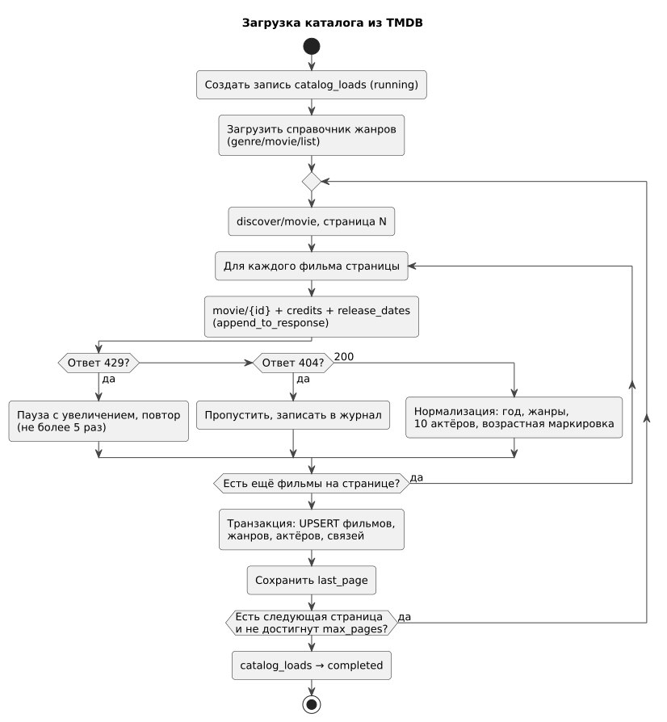

# 146 — Logic Scheme

*CineMatch. Модуль данных* | [оглавление модуля](README.md)

**Загрузка каталога**

**Поиск кандидатов**

**Потоки данных.** Все вызовы синхронные. TMDB вызывается только скриптом загрузки; Open-Meteo — при выборе города и при подборе (с кэшем). Постеры браузер загружает напрямую с `image.tmdb.org`.

### Будущий функционал

Периодическая проверка новинок — отдельный поток по расписанию.

---

[← 145 ADR](145.architecture-decisions.md) | [Оглавление](README.md) | [150 Component Diagram →](150.component-diagram.md)
