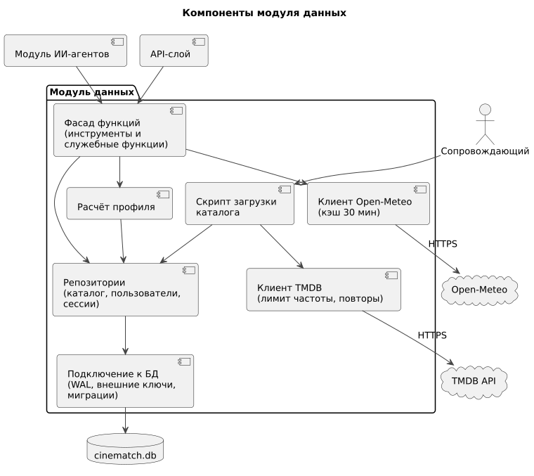

# 150 — Component Diagram

*CineMatch. Модуль данных* | [оглавление модуля](README.md)

| Компонент | Технология | Ответственность |
|---|---|---|
| Фасад функций | Python | Публичные функции ([130](130.api-contracts.md)), проверка параметров |
| Репозитории | Python, `sqlite3` | SQL по группам таблиц |
| Расчёт профиля | Python | ADR-013 |
| Скрипт загрузки | Python, командная строка | UC-9 |
| Клиент TMDB | Python, `httpx` | Запросы, ограничение частоты, повторы |
| Клиент Open-Meteo | Python, `httpx` | Геокодинг, погода, кэш, таймаут |
| Подключение к БД | Python, `sqlite3` | Параметры подключения, миграции |

### Будущий функционал

Компонент «Проверка новинок».

---

[← 146 Logic Scheme](146.logic-scheme.md) | [Оглавление](README.md) | [155 Sequence-диаграммы →](155.sequence-diagrams.md)
