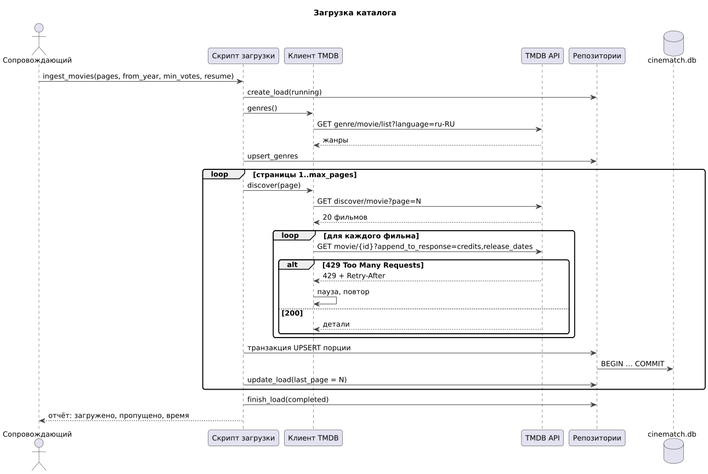
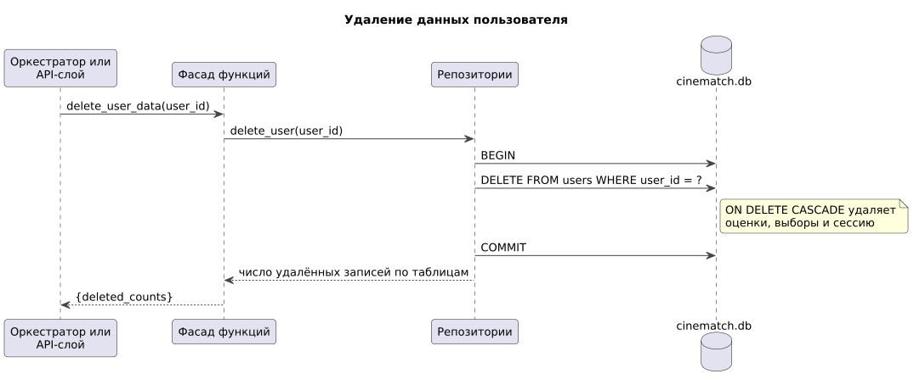

# 155 — Sequence-диаграммы

*CineMatch. Модуль данных* | [оглавление модуля](README.md)

**Загрузка каталога** (UC-9). Таймаут запроса к TMDB — 10 с; при 429 — пауза по `Retry-After` или 1, 2, 4… с, до 5 повторов.

**Удаление данных пользователя** (UC-7).

Поиск кандидатов в составе подбора — в [155 модуля агентов](../agents/155.sequence-diagrams.md).

### Будущий функционал

Диаграмма проверки новинок.

---

[← 150 Component Diagram](150.component-diagram.md) | [Оглавление](README.md) | [160 Integration Plan →](160.integration-plan.md)
