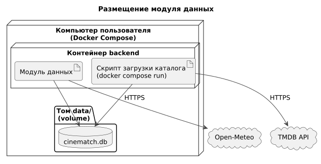

# 165 — Deployment Diagram

*CineMatch. Модуль данных* | [оглавление модуля](README.md)

| Параметр | Значение |
|---|---|
| Файл базы | `cinematch.db` в томе Docker `data`; сохраняется между перезапусками |
| Загрузка каталога | `docker compose run --rm backend python -m scripts.load_catalog` |
| Конфигурация | `TMDB_API_KEY`, `CINEMATCH_DB_PATH` в `.env` |
| Сеть | Исходящий HTTPS к `api.themoviedb.org`, `api.open-meteo.com`, `geocoding-api.open-meteo.com` |
| Диск | До 1 ГБ при каталоге до 100 000 фильмов |

Общая схема — в [165 модуля интерфейса](../ui/165.deployment-diagram.md).

### Будущий функционал

Резервное копирование и PostgreSQL при развёртывании на сервере.

---

[← 160 Integration Plan](160.integration-plan.md) | [Оглавление](README.md)
