# CineMatch — проектная документация модуля интерфейса

| | |
|---|---|
| Модуль | Интерфейс: консольное приложение, Telegram-бот, планировщик отправки напоминаний, администрирование бота |
| Ответственный | Участник проекта, реализующий модуль интерфейса |
| Версия документа | 0.1 (на согласовании) |
| Дата | 03.10.2026 |
| Связанные документы | [Состав документации](documents-composition.md), [vision проекта](../docs/vision/vision_project.md), [vision модуля](../docs/vision/vision_ui.md), [модуль ИИ-агентов](agents.md), [модуль данных](data.md) |
| Нотация диаграмм | UML 2.x, исходники PlantUML в [`diagrams/ui/`](diagrams/ui/) |
| Прототип | [`prototype/index.html`](prototype/index.html) |

Документ выполнен в соответствии с [составом проектной документации](documents-composition.md): блоки A–I, разделы 010–165. Разделы, неприменимые к модулю в типовом виде, сохранены с указанием, чем они заменены.

### Назначение и ключевые возможности модуля

Модуль интерфейса доставляет сообщения пользователя модулю ИИ-агентов и показывает ответы. Он не содержит логики подбора и не интерпретирует смысл сообщений: все решения принимают агенты.

1. **Консольное приложение** — первая точка входа (MVP): диалог в терминале, ответ номером варианта или свободным текстом, отладочный режим.
2. **Telegram-бот** — основной формат для пользователя: тот же сценарий в чате, кнопки-подсказки, индикатор «печатает».
3. **Единый контракт** — консоль и бот вызывают одну функцию `handle_user_turn` и отображают один формат ответа `AgentResponse`.
4. **Доставка напоминаний** — планировщик отправки в боте раз в минуту отправляет напоминания, срок которых наступил, и раз в сутки запускает проверку новинок.
5. **Команды бота** — `/start`, `/help`, `/new`, `/settings`, `/delete`; для администраторов — `/stats`.
6. **Устойчивость** — ошибки агентов и внешних сервисов не приводят к аварийному завершению; некорректный ввод отклоняется до вызова агентов.

---

## Блок A. Контекст и границы системы

### 010 — Глоссарий

| Термин | English | Определение | Где используется |
|---|---|---|---|
| Консольное приложение | CLI application | Программа, работающая в терминале; ведёт диалог с одним локальным пользователем | MVP |
| Telegram-бот | Telegram bot | Учётная запись Telegram, управляемая программой через Bot API | Этап 2 |
| Bot API | Telegram Bot API | HTTP-интерфейс Telegram для ботов | Бот |
| Long polling | Long polling | Способ получения обновлений: бот сам периодически запрашивает новые сообщения у Telegram; входящие соединения на сервер не нужны | Бот |
| Обновление | Update | Событие от Telegram: сообщение, нажатие кнопки, команда | Бот |
| Команда бота | Bot command | Сообщение, начинающееся с `/` (`/start`, `/help` и др.) | Бот |
| Встроенная кнопка | Inline button | Кнопка под сообщением бота; нажатие приходит как callback | Бот |
| Кнопка-подсказка | Suggested reply | Встроенная кнопка с заранее заданным текстом варианта; нажатие передаётся агентам как обычный текст | Бот, консоль (нумерованный список) |
| callback_data | Callback data | Строка до 64 байт, привязанная к встроенной кнопке и возвращаемая при её нажатии | Бот |
| Индикатор ожидания | Typing indicator | Статус «печатает…» в Telegram или строка ожидания в консоли, пока агенты готовят ответ | Консоль, бот |
| Карточка фильма | Movie card | Представление фильма: название, год, длительность, возрастная маркировка, рейтинг, жанры, объяснение выбора | Консоль, бот |
| Рендерер | Renderer | Компонент, преобразующий `AgentResponse` в вывод конкретного интерфейса | Консоль, бот |
| Транспортная проверка ввода | Input validation | Проверка формы сообщения (пустое, слишком длинное, не текст) без анализа смысла | Консоль, бот |
| Планировщик отправки | Reminder dispatcher | Компонент бота, по таймеру отправляющий напоминания, срок которых наступил | Бот |
| Отладочный режим | Debug mode | Режим консоли, в котором дополнительно выводится полный `AgentResponse` | Консоль |
| Список администраторов | Admin list | Перечень Telegram ID администраторов в конфигурации `TELEGRAM_ADMIN_IDS` | Бот |

Термины агентного слоя и данных — в глоссариях [модуля агентов](agents.md#010--глоссарий) и [модуля данных](data.md#010--глоссарий).

### 020 — System Context

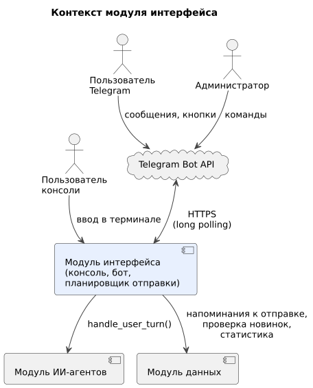

| Внешняя система | Роль по отношению к модулю | Тип интеграции |
|---|---|---|
| Модуль ИИ-агентов | Обрабатывает каждое сообщение пользователя и возвращает ответ | Синхронный вызов функции `handle_user_turn` в одном процессе Python |
| Модуль данных | Источник напоминаний к отправке и статистики; выполняет проверку новинок | Синхронные вызовы служебных функций |
| Telegram Bot API | Канал связи с пользователями Telegram | HTTPS, long polling; токен бота в `TELEGRAM_BOT_TOKEN` |
| Терминал ОС | Канал связи с пользователем консоли | Стандартный ввод и вывод, UTF-8 |

**Входит в модуль:** консольное приложение, обработчики Telegram-бота, отображение ответов, клавиатуры, команды, планировщик отправки, команды администратора, конфигурация запуска.
**Не входит:** интерпретация сообщений и выбор ответа (модуль агентов), хранение данных (модуль данных), формулировки вопросов агентов.

### 030 — Actors

Системные акторы определены в [документе модуля агентов](agents.md#030--actors). Для модуля интерфейса:

| Актор | Тип | Описание | Цели |
|---|---|---|---|
| Пользователь консоли | Человек | Запускает приложение в терминале на своём компьютере | Подобрать и оценить фильм без установки Telegram-бота |
| Пользователь Telegram | Человек | Пишет боту в личном чате | Подобрать фильм, получать напоминания, подписываться на новинки |
| Администратор | Человек | Участник команды, Telegram ID в `TELEGRAM_ADMIN_IDS` | Смотреть статистику |
| Таймер | Внутренний | Срабатывает раз в минуту в процессе бота | Запустить доставку напоминаний |
| Telegram Bot API | Внешняя система | HTTPS | Доставить обновления боту и сообщения пользователю |
| Модуль ИИ-агентов | Внутренняя система | `handle_user_turn` | Вернуть ответ на сообщение |
| Модуль данных | Внутренняя система | Служебные функции | Выдать напоминания и статистику |

---

## Блок B. Анализ предметной области

### 040 — Event Storming

| № | Команда (инициатор) | Доменное событие | Агрегат | Обработчик |
|---|---|---|---|---|
| 1 | Запустить консоль (пользователь) | Консоль запущена `CliStarted` | Консольная сессия | CliApp |
| 2 | Запустить бота (сопровождающий) | Бот запущен `BotStarted` | Процесс бота | Dispatcher |
| 3 | Отправить сообщение (пользователь) | Сообщение получено `MessageReceived` | Сообщение | CliApp, BotHandlers |
| 4 | — (некорректная форма ввода) | Ввод отклонён `InputRejected` | Сообщение | CliApp, BotHandlers |
| 5 | Нажать кнопку (пользователь) | Кнопка нажата `SuggestionPressed` | Сообщение бота | BotHandlers |
| 6 | — (кнопка из старого сообщения) | Нажатие устаревшей кнопки `StaleButtonPressed` | Сообщение бота | BotHandlers |
| 7 | — (получен `AgentResponse`) | Ответ показан `ResponseRendered` | Сообщение | Рендерер |
| 8 | — (ошибка агентов или таймаут) | Показана ошибка `ErrorShown` | Сообщение | Рендерер |
| 9 | — (такт таймера) | Напоминание доставлено `ReminderDelivered` | Напоминание | ReminderDispatcher |
| 10 | — (пользователь заблокировал бота) | Доставка невозможна `ReminderDeliveryFailed` | Напоминание | ReminderDispatcher |
| 11 | `/stats` (администратор) | Статистика выдана `AdminStatsShown` | — | AdminCommands |

### 050 — Entities + Lifecycle

Модуль не хранит собственных данных; его сущности — программные классы, обеспечивающие отображение и доставку.

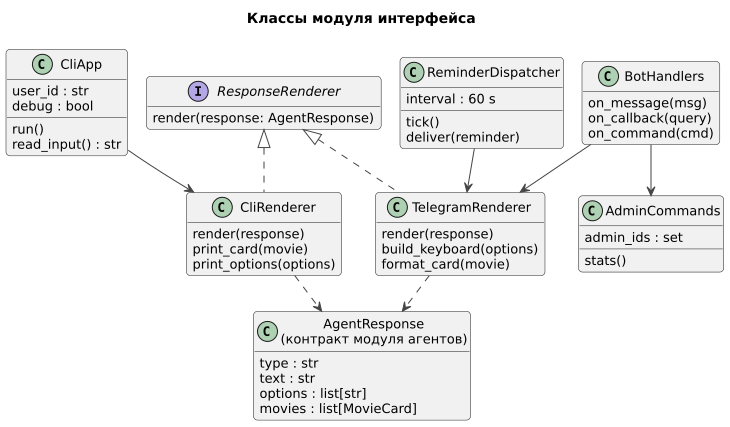

| Класс | Ответственность | Связи |
|---|---|---|
| `ResponseRenderer` | Интерфейс отображения `AgentResponse` | Реализуется `CliRenderer`, `TelegramRenderer` |
| `CliApp` | Цикл ввода, аргументы запуска, отладочный режим | Использует `CliRenderer`, вызывает модуль агентов |
| `CliRenderer` | Вывод текста, карточек и нумерованных вариантов в терминал | — |
| `BotHandlers` | Обработка сообщений, нажатий кнопок, команд | Использует `TelegramRenderer`, `AdminCommands` |
| `TelegramRenderer` | Форматирование сообщений и клавиатур | — |
| `ReminderDispatcher` | Такт раз в минуту: доставка напоминаний, ежедневные задачи | Модуль данных, `TelegramRenderer` |
| `AdminCommands` | Команды администратора | Модуль данных |

**Жизненный цикл консольного приложения**

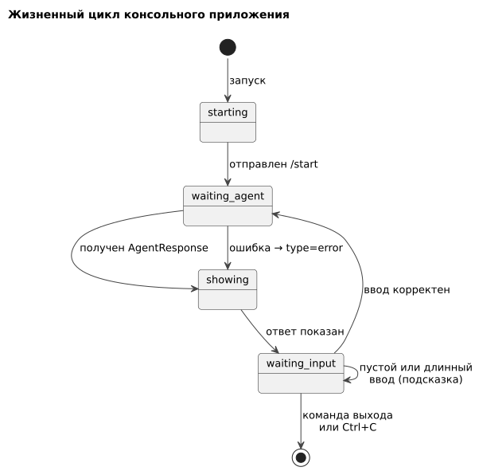

| Состояние | Описание | Переход |
|---|---|---|
| `starting` | Чтение конфигурации, проверка ключей | Отправлен `/start` → `waiting_agent` |
| `waiting_agent` | Индикатор ожидания, вызов агентов | Ответ или ошибка → `showing` |
| `showing` | Вывод ответа | → `waiting_input` |
| `waiting_input` | Приглашение к вводу | Корректный ввод → `waiting_agent`; некорректный — подсказка; выход → завершение |

**Жизненный цикл сообщения бота с кнопками**

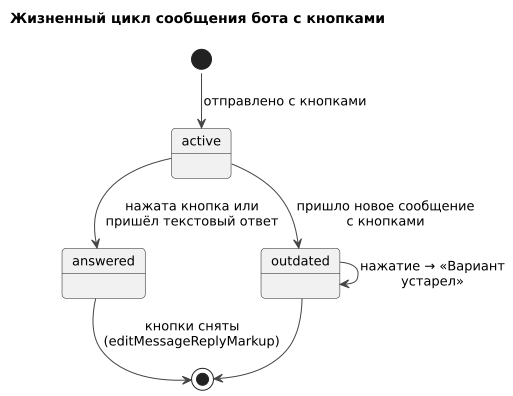

| Состояние | Описание | Переход |
|---|---|---|
| `active` | Последнее сообщение бота с кнопками | Нажатие или текстовый ответ → `answered`; новое сообщение с кнопками → `outdated` |
| `answered` | Кнопки сняты, чтобы не нажать повторно | — |
| `outdated` | Кнопки остались, но неактуальны | Нажатие → всплывающее «Вариант устарел», агенты не вызываются |

### 060 — Use Cases

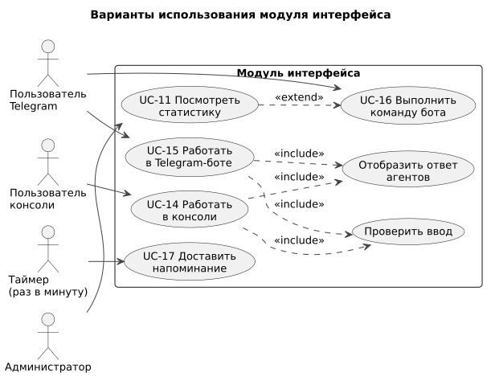

Модуль интерфейса вводит четыре варианта использования. В пользовательских вариантах UC-1…UC-11 ([модуль агентов](agents.md#060--use-cases)) интерфейс передаёт сообщения и отображает ответы.

| ID | Вариант использования | Актор | Этап |
|---|---|---|---|
| UC-14 | Работать в консоли | Пользователь консоли | MVP |
| UC-15 | Работать в Telegram-боте | Пользователь Telegram | Telegram-бот |
| UC-16 | Выполнить команду бота | Пользователь Telegram, администратор | Telegram-бот |
| UC-17 | Доставить напоминание | Таймер | Telegram-бот |

#### UC-14. Работать в консоли

| | |
|---|---|
| Актор | Пользователь консоли |
| Предусловия | Установлены зависимости, заданы ключи в `.env`, каталог загружен |
| Постусловия | Диалог проведён; данные сохранены модулями агентов и данных |
| Основной поток | 1. Пользователь запускает `cinematch`. 2. Приложение отправляет агентам `/start` и показывает ответ. 3. Пользователь вводит номер варианта или текст. 4. Приложение проверяет ввод; номер заменяется текстом варианта. 5. Показывается индикатор ожидания, вызываются агенты. 6. Ответ отображается по типу. 7. Шаги 3–6 повторяются до выхода |
| Альтернативы | 4а. Пустой ввод или более 1000 символов — подсказка без вызова агентов. 5а. Исключение или ожидание более 60 с — сообщение об ошибке, ввод можно повторить. 7а. `выход`, `exit` или Ctrl+C — корректное завершение |
| Связанные истории | US-20, US-24, US-25 |

#### UC-15. Работать в Telegram-боте

| | |
|---|---|
| Актор | Пользователь Telegram |
| Предусловия | Бот запущен на сервере; пользователь открыл личный чат с ботом |
| Постусловия | Аналогично UC-14 |
| Основной поток | 1. Пользователь пишет текст или нажимает кнопку-подсказку. 2. Для кнопки текст берётся из самой кнопки, кнопки сообщения снимаются. 3. Бот показывает «печатает…». 4. Вызывается `handle_user_turn` с `user_id = tg:<Telegram ID>`. 5. Ответ отображается: текст, карточки, кнопки-подсказки |
| Альтернативы | 1а. Стикер, фото, голосовое — подсказка «отправьте текст». 1б. Групповой чат — сообщения игнорируются. 2а. Устаревшая кнопка — всплывающее «Вариант устарел». 4а. Ошибка — сообщение с кнопкой «Повторить» |
| Связанные истории | US-21, US-22, US-24 |

#### UC-16. Выполнить команду бота

| Команда | Кто | Действие |
|---|---|---|
| `/start` | все | Передаётся агентам как сообщение; агенты начинают с согласия, онбординга или вопроса об оценке |
| `/help` | все | Справка формируется интерфейсом: что умеет бот, примеры фраз, список команд, атрибуция TMDB |
| `/new` | все | Передаётся агентам: начать подбор заново |
| `/settings` | все | Передаётся агентам: изменить город или часовой пояс |
| `/delete` | все | Передаётся агентам: удаление данных с подтверждением |
| `/stats` | администраторы | Интерфейс запрашивает `get_admin_stats` и показывает агрегаты; для остальных команда неизвестна |

Список команд регистрируется в Telegram (`setMyCommands`) без `/stats`. Связанные истории: US-26, US-12.

#### UC-17. Доставить напоминание

| | |
|---|---|
| Актор | Таймер (раз в минуту) |
| Предусловия | Бот запущен |
| Постусловия | Напоминания со сроком ≤ текущего времени отправлены и отмечены |
| Основной поток | 1. Планировщик вызывает `get_due_reminders(now)`. 2. Для каждого напоминания формируется сообщение по виду (оценить фильм, пользовательское, новинка) с кнопками-подсказками. 3. Сообщение отправляется. 4. Вызывается `mark_reminder_sent`. 5. Раз в сутки в 10:00 UTC вызываются `check_releases` и `purge_expired` |
| Альтернативы | 3а. Ответ 403 (бот заблокирован) — `cancel_reminder`. 3б. Сетевая ошибка или 429 — напоминание остаётся, повтор в следующем такте |
| Связанные истории | US-23 |

---

## Блок C. Требования и роли

### 070 — RBAC

| Действие | Пользователь консоли | Пользователь Telegram | Администратор |
|---|---|---|---|
| Диалог с агентами | ✅ | ✅ | ✅ |
| `/start`, `/help`, `/new`, `/settings`, `/delete` | аналоги в консоли: `помощь`, `выход` | ✅ | ✅ |
| Получение напоминаний | ❌ (только системное при запуске) | ✅ | ✅ |
| `/stats` | ❌ | ❌ (команда неизвестна) | ✅ |
| Работа в групповых чатах | — | ❌ (игнорируются) | ❌ |

**Определение роли.** Администратор — пользователь, чей Telegram ID указан в переменной `TELEGRAM_ADMIN_IDS` (через запятую). Список читается при запуске бота. В консоли роли нет: работает один локальный пользователь с `user_id = cli:<CLI_USER_ID>`.

**Видимость элементов.** Команда `/stats` не регистрируется в меню команд и не упоминается в `/help` для обычных пользователей. В консоли не показываются функции, требующие отправки сообщений по расписанию; при попытке их использовать агенты отвечают, что функция доступна в боте.

### 075 — NFR

| ID | Категория | Требование | Метрика и порог | Связь |
|---|---|---|---|---|
| NFR-UI-01 | Отзывчивость | Индикатор ожидания | Показывается не позднее 1 с после ввода | ADR-022 |
| NFR-UI-02 | Отзывчивость | Независимость пользователей бота | Обработка сообщения одного пользователя не задерживает других: вызов агентов — в отдельном потоке | ADR-022 |
| NFR-UI-03 | Ограничения Telegram | Длина сообщения | ≤ 4096 символов; длиннее — разбивка на несколько сообщений | ADR-021 |
| NFR-UI-04 | Ограничения Telegram | `callback_data` | ≤ 64 байт; передаётся только индекс варианта (`opt:<n>`) | ADR-023 |
| NFR-UI-05 | Ограничения Telegram | Частота отправки | ≤ 25 сообщений/с всего и ≤ 1 сообщения/с в один чат при рассылке напоминаний | ADR-025 |
| NFR-UI-06 | Своевременность | Доставка напоминаний | Не позже 1 мин после `due_at` при работающем боте | ADR-025 |
| NFR-UI-07 | Надёжность | Ошибки | Исключения агентов и сети перехватываются; процесс бота перезапускается системой при аварии (systemd `Restart=always`) | 165 |
| NFR-UI-08 | Надёжность | Перезапуск бота | После перезапуска недоставленные напоминания доставляются в первом такте | ADR-025 |
| NFR-UI-09 | Таймауты | Ожидание ответа агентов | 60 с, затем сообщение об ошибке | — |
| NFR-UI-10 | Безопасность | Токен бота и список администраторов | Только в `.env`; не выводятся в журнал | — |
| NFR-UI-11 | Приватность | Журналы | Без текстов сообщений; только `user_id`, тип события, длительность | — |
| NFR-UI-12 | Совместимость | Консоль | Работает в терминалах macOS, Linux, Windows с UTF-8; ширина от 80 символов | ADR-024 |
| NFR-UI-13 | Доступность | Смысл без оформления | Информация не передаётся только цветом или эмодзи; карточки читаемы без форматирования | 110 |
| NFR-UI-14 | Сопровождаемость | Независимость от логики | Модуль не содержит ветвлений по смыслу сообщений; добавление нового типа ответа затрагивает только рендереры | ADR-022 |

### 080 — User Stories

Истории, в которых участвует интерфейс, приведены в [документе модуля агентов](agents.md#080--user-stories). Ниже — истории модуля интерфейса.

**US-20.** Как пользователь консоли, я хочу отвечать номером варианта или своими словами, чтобы не печатать длинные ответы. *(UC-14)*
- Given показаны варианты `[1] Смотрю первый [2] Покажи другие [3] В другой раз`, When пользователь вводит `2`, Then агентам передаётся текст «Покажи другие».
- Given показаны варианты, When пользователь вводит «давай что-то посмешнее», Then агентам передаётся введённый текст без изменений.

**US-21.** Как пользователь Telegram, я хочу нажимать кнопки-подсказки, чтобы отвечать одним касанием. *(UC-15)*
- Given сообщение с кнопками, When пользователь нажимает кнопку, Then кнопки исчезают, а агенты получают текст кнопки.
- Given пользователь нажал кнопку в старом сообщении, When пришло нажатие, Then показывается «Вариант устарел», агенты не вызываются.

**US-22.** Как пользователь, я хочу видеть, что бот думает, чтобы не отправлять сообщение повторно. *(UC-14, UC-15)*
- Given отправлено сообщение, When агенты готовят ответ, Then в течение 1 с появляется «печатает…» (Telegram) или «Подбираю…» (консоль).

**US-23.** Как пользователь Telegram, я хочу получать напоминания вовремя, даже если бот перезапускался. *(UC-17)*
- Given напоминание на 21:45, When наступает 21:45, Then сообщение приходит не позже 21:46.
- Given бот был остановлен с 21:30 до 22:00, When он запущен, Then напоминание на 21:45 приходит в первую минуту после запуска.

**US-24.** Как пользователь, я хочу понятное сообщение при ошибке, чтобы знать, что делать дальше. *(UC-14, UC-15)*
- Given сервис моделей недоступен, When агенты возвращают `type = error`, Then показывается текст ошибки и вариант «Повторить», приложение продолжает работу.

**US-25.** Как разработчик, я хочу запускать консоль в отладочном режиме, чтобы видеть, что вернули агенты. *(UC-14)*
- Given запуск `cinematch --debug`, When приходит ответ, Then после обычного вывода печатается полный `AgentResponse` в формате JSON.

**US-26.** Как пользователь Telegram, я хочу открыть справку, чтобы узнать, что умеет бот. *(UC-16)*
- Given любой этап диалога, When пользователь отправляет `/help`, Then получает описание возможностей, примеры фраз, список команд и указание источника данных TMDB; этап диалога не меняется.

**US-27.** Как пользователь Telegram, я хочу, чтобы бот отвечал на стикер или голосовое понятной подсказкой, а не молчал. *(UC-15)*
- Given пользователь отправил стикер, When бот обрабатывает обновление, Then отвечает «Я понимаю только текст» без вызова агентов.

### 090 — Epics / Features

Эпики проекта — в [документе модуля агентов](agents.md#090--epics--features). Модуль интерфейса вводит EP-10 и EP-11 и участвует в EP-5…EP-7.

| Эпик | Вклад модуля интерфейса | Приоритет | Истории | Веха |
|---|---|---|---|---|
| EP-10 Консольный интерфейс | Консольное приложение, рендерер, отладочный режим | Must | US-20, US-22, US-24, US-25 | MVP, 15.11 |
| EP-11 Telegram-бот | Обработчики, кнопки-подсказки, команды, справка | Should | US-21, US-22, US-24, US-26, US-27 | Telegram-бот, 29.11 |
| EP-5 Напоминания в Telegram | Планировщик отправки | Should | US-23 | Telegram-бот, 29.11 |
| EP-6 Подписки | Ежедневный запуск проверки новинок, отображение уведомлений | Could | US-11, US-19 | Заморозка, 06.12 |
| EP-7 Администрирование | Команда `/stats` | Could | US-12 | Заморозка, 06.12 |

---

## Блок D. Верификация

### 095 — Traceability Matrix

**Функциональные требования модуля**

| ID | Требование | Источник |
|---|---|---|
| FR-UI-01 | Консоль и бот передают любой ввод в `handle_user_turn`; нажатие кнопки передаётся как текст варианта | Vision F-01, F-02; ADR-011 |
| FR-UI-02 | Отображение `AgentResponse` по типам `consent`, `question`, `recommendations`, `feedback_question`, `confirmation`, `message`, `error` | Vision F-03; [агенты, раздел 110](agents.md#110--uiux-диалоговый-дизайн) |
| FR-UI-03 | Карточка фильма: название, год, длительность, возрастная маркировка, рейтинг, жанры, объяснение | Vision F-04 |
| FR-UI-04 | Варианты: в Telegram — встроенные кнопки, в консоли — нумерованный список с вводом номера или текста | Vision F-05 |
| FR-UI-05 | Команды бота `/start`, `/help`, `/new`, `/settings`, `/delete`, `/stats` (только администраторы) | Vision F-06; решение 03.10 |
| FR-UI-06 | Идентификация: `tg:<Telegram ID>` в боте, `cli:<CLI_USER_ID>` в консоли | Vision F-07; ADR-019 |
| FR-UI-07 | Транспортная проверка ввода без вызова агентов | Vision F-08 |
| FR-UI-08 | Индикатор ожидания | Vision F-09 |
| FR-UI-09 | Отладочный режим консоли | Vision F-10 |
| FR-UI-10 | Снятие кнопок после ответа и обработка устаревших кнопок | ADR-023 |
| FR-UI-11 | Доставка напоминаний раз в минуту; ежедневный запуск проверки новинок и очистки | Vision F-11; решение 03.10 |
| FR-UI-12 | Бот работает только в личных чатах | ADR-027 |

**Тестовые сценарии** (ручная проверка)

| ID | Проверка |
|---|---|
| TS-UI-01 | Консоль: полный подбор с ответами номерами и текстом |
| TS-UI-02 | Консоль: пустой ввод, 1500 символов, Ctrl+C, команда выхода |
| TS-UI-03 | Консоль: недоступный сервис моделей — сообщение об ошибке, продолжение работы |
| TS-UI-04 | Консоль: `--debug` выводит `AgentResponse` |
| TS-UI-05 | Бот: полный подбор с кнопками и свободным текстом |
| TS-UI-06 | Бот: устаревшая кнопка, повторное нажатие, снятие кнопок |
| TS-UI-07 | Бот: стикер, фото, голосовое; групповой чат |
| TS-UI-08 | Бот: все команды; `/stats` администратором и обычным пользователем |
| TS-UI-09 | Бот: ответ длиннее 4096 символов разбивается |
| TS-UI-10 | Бот: два пользователя одновременно — ответ одному не задерживает другого |
| TS-UI-11 | Напоминания: доставка в срок, после перезапуска бота, при блокировке бота пользователем |
| TS-UI-12 | Отображение во всех типах ответа на примерах из прототипа |

**Матрица трассировки**

| Требование | Тип | UC | История | Разделы | Проверка | Статус |
|---|---|---|---|---|---|---|
| FR-UI-01 | ФТ | UC-14, UC-15 | US-20, US-21 | 130, 146, 155 | TS-UI-01, TS-UI-05 | covered |
| FR-UI-02 | ФТ | UC-14, UC-15 | — | 110, 115 | TS-UI-12 | covered |
| FR-UI-03 | ФТ | UC-3 | US-04 | 110 | TS-UI-12 | partial: возрастная маркировка зависит от модуля данных |
| FR-UI-04 | ФТ | UC-14, UC-15 | US-20, US-21 | 110, 155 | TS-UI-01, TS-UI-05 | covered |
| FR-UI-05 | ФТ | UC-16 | US-26, US-12 | 060, 070 | TS-UI-08 | covered |
| FR-UI-06 | ФТ | UC-14, UC-15 | — | 070, 130 | TS-UI-01, TS-UI-05 | covered |
| FR-UI-07 | ФТ | UC-14, UC-15 | US-27 | 146 | TS-UI-02, TS-UI-07 | covered |
| FR-UI-08 | ФТ | UC-14, UC-15 | US-22 | 110, 155 | TS-UI-01, TS-UI-05 | covered |
| FR-UI-09 | ФТ | UC-14 | US-25 | 110 | TS-UI-04 | covered |
| FR-UI-10 | ФТ | UC-15 | US-21 | 050, 146 | TS-UI-06 | covered |
| FR-UI-11 | ФТ | UC-17 | US-23 | 146, 155 | TS-UI-11 | covered |
| FR-UI-12 | ФТ | UC-15 | — | 070, 146 | TS-UI-07 | covered |
| NFR-UI-02 | НФТ | UC-15 | US-22 | 145 | TS-UI-10 | covered |
| NFR-UI-03…05 | НФТ | UC-15, UC-17 | — | 075, 130 | TS-UI-09, TS-UI-11 | covered |
| NFR-UI-06, NFR-UI-08 | НФТ | UC-17 | US-23 | 075, 145 | TS-UI-11 | covered |

**Вывод.** Требования покрыты. Зависимость: возрастная маркировка в карточке (модуль данных, ADR-020). Открыт вопрос о постерах (раздел «Допущения»).

---

## Блок E. Проектирование интерфейсов

### 110 — UI/UX

**Принципы**

| Принцип | Как применяется |
|---|---|
| Диалог вместо меню | Нет многоуровневых меню; любой ввод — сообщение агентам |
| Подсказки, а не обязательный выбор | Кнопки и номера ускоряют ответ, но свободный текст всегда принимается |
| Обратная связь | На каждый ввод — индикатор ожидания, затем ответ; действия с данными подтверждаются агентами |
| Предсказуемость | Одинаковые формулировки и порядок элементов в консоли и боте |
| Минимум нагрузки | Карточка — 3 строки; одно сообщение — один вопрос |
| Не терять контекст | В Telegram кнопки снимаются после ответа; устаревшие кнопки не срабатывают |
| Доступность | Смысл передаётся текстом; цвет и эмодзи — только дополнение |

**Отображение типов ответа**

| `type` | Консоль | Telegram |
|---|---|---|
| `consent` | Текст правил, варианты `[1] Согласен [2] Не согласен` | Сообщение и две кнопки |
| `question` | Вопрос, нумерованные варианты, приглашение «Введите номер или ответ своими словами» | Сообщение с кнопками (до 3 в ряд) |
| `recommendations` | Текст, три карточки, варианты | Одно сообщение: текст и три карточки, кнопки-подсказки |
| `feedback_question` | Как `question` | Как `question`; оценка 1–10 — кнопки в два ряда |
| `confirmation` | Текст; для удаления — варианты подтверждения | Сообщение; для удаления — кнопки «Удалить» / «Отмена» |
| `message` | Текст | Сообщение |
| `error` | Текст выделен цветом, вариант «Повторить» | Сообщение с кнопкой «Повторить» |

**Карточка фильма**

```
1. Тихий дом у моря (2014)   1 ч 38 мин · 12+ · ★ 7,8 · драма, комедия
   Спокойная и тёплая история — для дождливого вечера после пар.
```

В Telegram название выделяется жирным (разметка HTML), вторая строка — обычным текстом, третья — объяснение. Если возрастная маркировка неизвестна, она не выводится.

**Экран консоли**

```
CineMatch · подбор фильма                       (Ctrl+C — выход)
───────────────────────────────────────────────────────────────
CineMatch: Какое сейчас настроение?
           [1] Спокойное  [2] Весёлое  [3] Грустное  [4] Устал(а)  [5] Напряжённое
           Введите номер или ответ своими словами
› устал после пар
  Подбираю…
```

**Состояния**

| Состояние | Консоль | Telegram |
|---|---|---|
| Ожидание ответа | Строка «Подбираю…» | «печатает…» (`sendChatAction`, повтор каждые 4 с) |
| Пустой результат | Текст агентов («не нашёл подходящих…») с вариантами | То же |
| Ошибка | Сообщение и «Повторить» | Сообщение и кнопка «Повторить» |
| Некорректный ввод | Подсказка | Подсказка |
| Устаревшая кнопка | — | Всплывающее уведомление «Вариант устарел» |

**Навигация.** Переходов между экранами нет: диалог линейный, сценарий определяют агенты. Команды `/new`, `/settings`, `/delete`, `/help` доступны на любом этапе.

**Привязка к сценариям:** экраны консоли — UC-14; сообщения бота — UC-15; команды — UC-16; напоминания — UC-17; содержание вопросов и ответов — UC-1…UC-11 ([модуль агентов](agents.md#060--use-cases)).

**Подтверждение необратимых действий.** Удаление данных — только после явного подтверждения (кнопка «Удалить» или ввод номера); формулировку и логику подтверждения задают агенты.

### 115 — Live-прототип

Интерактивный прототип: [`prototype/index.html`](prototype/index.html) — один файл без внешних зависимостей. Открывается в браузере после скачивания репозитория (GitHub показывает HTML-файлы как исходный текст; для просмотра по ссылке можно включить GitHub Pages).

Прототип показывает один и тот же сценарий одновременно в виде чата Telegram и окна терминала, с пошаговым переходом.

| Сценарий | Варианты использования |
|---|---|
| 1. Первый запуск: согласие и онбординг | UC-1, UC-2 |
| 2. Подбор фильма и реакция | UC-3, UC-4 |
| 3. Оценка выбранного фильма | UC-5, UC-17 |
| 4. Самостоятельная отметка просмотра | UC-6 |
| 5. Пользовательское напоминание (и ответ консоли) | UC-7 |
| 6. Сообщение не по теме и нетекстовое сообщение | UC-10, UC-15 |

Данные о фильмах в прототипе условные.

---

## Блок F. Проектирование данных

### 120 — Data Model

Модуль интерфейса не хранит данных пользователей. Состояние диалога хранит модуль агентов, остальные данные — модуль данных.

| Данные | Где | Время жизни |
|---|---|---|
| Варианты ответа для кнопок | Тексты самих кнопок в сообщении Telegram (`reply_markup`) | Пока существует сообщение |
| Последние варианты в консоли | Память процесса | До следующего ответа |
| Конфигурация | Переменные окружения из `.env` | Постоянно |

**Конфигурация**

| Переменная | Обязательна | Описание |
|---|---|---|
| `TELEGRAM_BOT_TOKEN` | для бота | Токен от @BotFather |
| `TELEGRAM_ADMIN_IDS` | нет | Telegram ID администраторов через запятую |
| `CLI_USER_ID` | нет (по умолчанию `local`) | Локальный идентификатор пользователя консоли |
| `REMINDER_INTERVAL_S` | нет (по умолчанию 60) | Период такта планировщика |
| `AGENT_TIMEOUT_S` | нет (по умолчанию 60) | Ожидание ответа агентов |

---

## Блок G. Контракты и события

### 130 — API Contracts

Модуль не предоставляет API другим модулям; он потребляет контракты модулей агентов и данных и Telegram Bot API. Версия контракта модуля — `0.1.0` (semver).

**Потребляемые функции**

| Функция | Модуль | Использование |
|---|---|---|
| `handle_user_turn(user_id, source, message) -> AgentResponse` | агенты | Каждое сообщение пользователя ([контракт](agents.md#130--api-contracts)) |
| `get_due_reminders(now)` | данные | Такт планировщика |
| `mark_reminder_sent(reminder_id)`, `cancel_reminder(user_id, reminder_id)` | данные | Результат доставки |
| `check_releases()`, `purge_expired()` | данные | Раз в сутки |
| `get_admin_stats()` | данные | `/stats` |

**Аргументы консольного приложения**

```
cinematch [--debug] [--user ID]
```

| Аргумент | Описание |
|---|---|
| `--debug` | Отладочный режим: печать полного `AgentResponse` |
| `--user ID` | Локальный идентификатор пользователя (по умолчанию из `CLI_USER_ID`); позволяет проверить сценарии нескольких пользователей |

**Telegram Bot API**

| Метод | Назначение |
|---|---|
| `getUpdates` (через aiogram, long polling) | Получение обновлений |
| `sendMessage` (`parse_mode=HTML`, `reply_markup`) | Ответы и напоминания |
| `editMessageReplyMarkup` | Снятие кнопок после ответа |
| `answerCallbackQuery` | Подтверждение нажатия, «Вариант устарел» |
| `sendChatAction` (`typing`) | Индикатор ожидания |
| `setMyCommands` | Меню команд |

**Формат `callback_data`:** `opt:<n>`, где `n` — индекс варианта (0–9). Текст варианта берётся из кнопки с этим индексом в `reply_markup` сообщения, к которому относится нажатие.

**Ошибки Telegram:** 403 — пользователь заблокировал бота (напоминание отменяется); 429 — превышена частота (пауза по `retry_after`); 400 «message is not modified» — игнорируется.

### 135 — Event Catalog

Брокер сообщений не используется; события модуля интерфейса — вызовы функций и строки журнала.

| Событие | Издатель | Подписчики | Триггер | Критичность |
|---|---|---|---|---|
| `MessageReceived` | CliApp, BotHandlers | Модуль агентов (вызов `handle_user_turn`) | Ввод пользователя | высокая |
| `InputRejected` | CliApp, BotHandlers | Журнал | Пустой, длинный, нетекстовый ввод | низкая |
| `StaleButtonPressed` | BotHandlers | Журнал | Нажатие устаревшей кнопки | низкая |
| `ErrorShown` | Рендереры | Журнал | `type = error` или таймаут | средняя |
| `ReminderDelivered` | ReminderDispatcher | Модуль данных (`mark_reminder_sent`) | Успешная отправка | средняя |
| `ReminderDeliveryFailed` | ReminderDispatcher | Модуль данных (`cancel_reminder` при 403) | Ошибка отправки | средняя |
| `AdminStatsShown` | AdminCommands | Журнал | `/stats` | низкая |

### 140 — Event Schema

Общие поля — в [документе модуля агентов](agents.md#140--event-schema). Поля `payload`:

| Событие | Поля `payload` |
|---|---|
| `MessageReceived` | `source` (`cli`, `telegram`), `kind` (`text`, `button`, `command`), `length` (int) — без текста сообщения |
| `InputRejected` | `reason` (`empty`, `too_long`, `non_text`, `group_chat`) |
| `StaleButtonPressed` | `message_age_s` (int) |
| `ErrorShown` | `error_code` (string), `source` |
| `ReminderDelivered` | `reminder_id` (int), `kind`, `delay_s` (int) — задержка относительно `due_at` |
| `ReminderDeliveryFailed` | `reminder_id` (int), `http_status` (int), `action` (`cancelled`, `retry`) |
| `AdminStatsShown` | — |

Ключ разбиения не требуется. Совместимость — добавление полей с увеличением `schema_version`.

---

## Блок H. Архитектура и логика

### 145 — ADR

Номера сквозные по проекту; ADR-001…ADR-011 — [модуль агентов](agents.md#145--adr), ADR-012…ADR-020 — [модуль данных](data.md#145--adr).

**ADR-021. Бот на aiogram 3.** *Предложено.*
Контекст: нужен асинхронный фреймворк для Telegram на Python с поддержкой встроенных кнопок и команд. Решение: aiogram 3. Последствия: (+) асинхронность, активное сообщество, документация на русском; (−) асинхронная модель требует аккуратного вызова синхронного кода агентов (ADR-022).

**ADR-022. Тонкий интерфейс, вызов агентов в отдельном потоке.** *Принято.*
Контекст: вся логика — в модуле агентов; ответ агентов занимает несколько секунд. Решение: интерфейс не содержит логики по смыслу сообщений; в боте `handle_user_turn` вызывается через `asyncio.to_thread`, чтобы не блокировать обработку других пользователей. Последствия: (+) консоль и бот ведут себя одинаково, смена интерфейса не затрагивает логику; (−) все особенности поведения нужно реализовывать в агентах.

**ADR-023. Кнопки без хранения состояния.** *Принято.*
Контекст: `callback_data` ограничен 64 байтами, русский текст варианта может не поместиться; хранение соответствия «кнопка — текст» требует памяти и теряется при перезапуске. Решение: в `callback_data` — только индекс; текст берётся из самой кнопки в сообщении. Последствия: (+) работает после перезапуска бота, нет хранилища; (−) текст кнопки должен совпадать с вариантом, который ожидают агенты (не сокращать при отображении).

**ADR-024. Консоль на `rich` и `argparse`.** *Предложено.*
Контекст: нужен читаемый вывод карточек и вариантов в терминале. Решение: библиотека `rich` для оформления, `argparse` для аргументов. Последствия: (+) цвет, отступы, переносы без ручной работы; (−) дополнительная зависимость; без поддержки цвета вывод остаётся читаемым.

**ADR-025. Планировщик отправки в процессе бота, такт 60 секунд.** *Принято.*
Контекст: напоминания хранятся в таблице (ADR-017); доставлять их может только бот. Решение: асинхронная задача в процессе бота раз в 60 с вызывает `get_due_reminders`; ежедневные задачи — в том же такте в 10:00 UTC. Последствия: (+) один процесс, напоминания переживают перезапуск; (−) задержка до 1 минуты; при остановке бота напоминания доставляются после запуска.

**ADR-026. Long polling вместо webhook.** *Принято.*
Контекст: у сервера может не быть домена и TLS-сертификата. Решение: получение обновлений методом long polling. Последствия: (+) не нужны входящие соединения, домен и сертификат; работает и на компьютере разработчика; (−) чуть больше задержка и постоянное исходящее соединение.

**ADR-027. Только личные чаты.** *Принято.*
Контекст: диалог и данные персональны. Решение: обновления из групп и каналов игнорируются. Последствия: (+) нет смешения диалогов разных людей; (−) нельзя выбрать фильм компанией в общем чате (возможное развитие).

### 146 — Logic Scheme

**Обработка обновления Telegram**

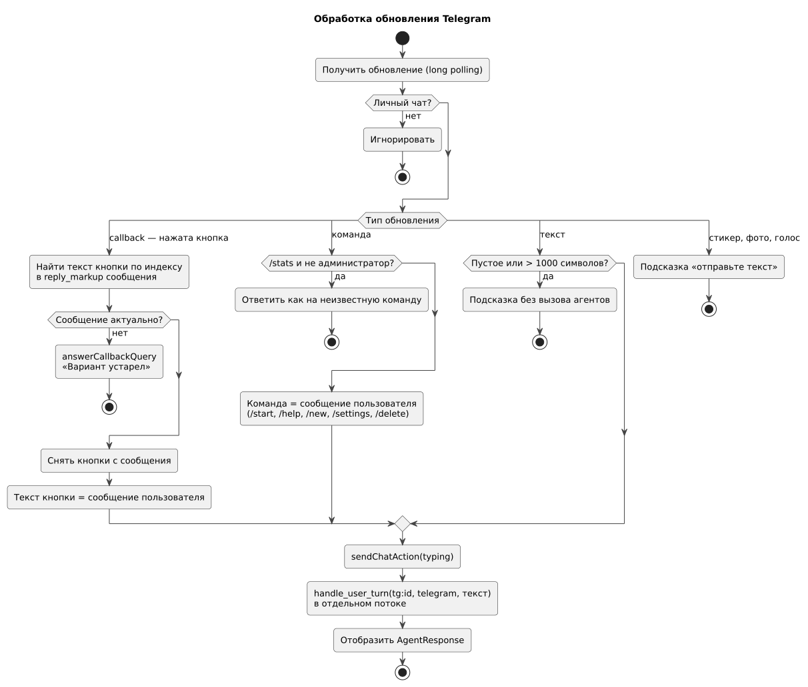

**Такт планировщика отправки**

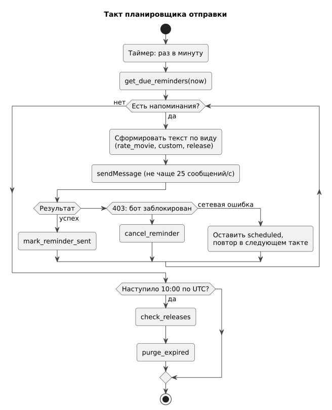

**Потоки данных.** Входящий поток: терминал или Telegram → проверка ввода → `handle_user_turn` → рендерер → пользователь; синхронный для каждого сообщения, параллельный между пользователями бота. Исходящий поток по таймеру: модуль данных → планировщик → Telegram; асинхронный относительно действий пользователя.

**Границы.** Вход — терминал и Telegram Bot API; выход — вызовы модулей агентов и данных, Telegram Bot API.

### 150 — Component Diagram

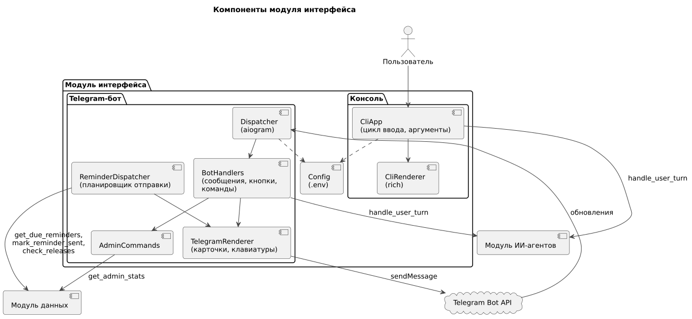

| Компонент | Технология | Ответственность |
|---|---|---|
| CliApp | Python, `argparse` | Запуск, цикл ввода, замена номера на текст варианта, таймаут |
| CliRenderer | Python, `rich` | Вывод ответов, карточек, вариантов, индикатора |
| Dispatcher | aiogram 3 | Получение обновлений, маршрутизация к обработчикам |
| BotHandlers | aiogram 3 | Сообщения, нажатия, команды, проверка ввода, вызов агентов |
| TelegramRenderer | aiogram 3 | Форматирование HTML, клавиатуры, разбивка длинных сообщений |
| AdminCommands | aiogram 3 | `/stats`, проверка списка администраторов |
| ReminderDispatcher | asyncio | Такт доставки и ежедневные задачи |
| Config | `python-dotenv` | Загрузка `.env`, проверка обязательных переменных |

Связь с решениями: ADR-021…ADR-027.

---

## Блок I. Интеграции и развёртывание

### 155 — Sequence-диаграммы

**Ход диалога в консоли** (UC-14, US-20, US-22, US-24). Таймаут ожидания агентов — 60 с.

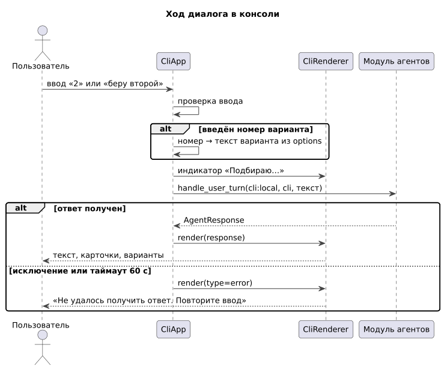

**Нажатие кнопки-подсказки в Telegram** (UC-15, US-21).

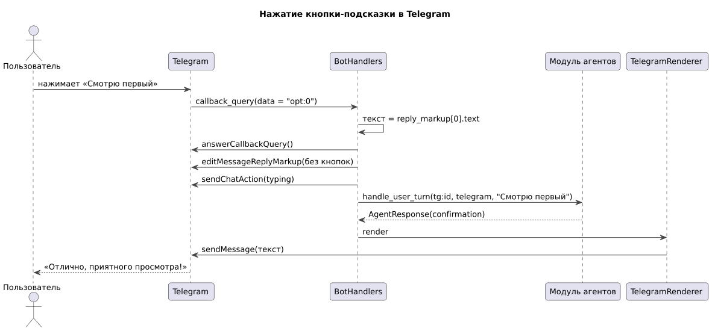

**Доставка напоминания** (UC-17, US-23).

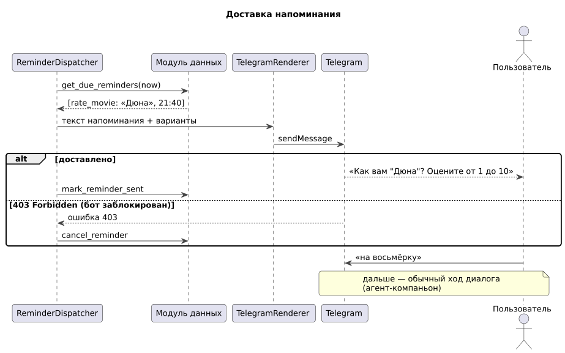

### 160 — Integration Plan

| № | Интеграция | С кем | Тип | Срок | Критерий готовности |
|---|---|---|---|---|---|
| 1 | Общий контракт `AgentResponse` в `cinematch/overall/` | все модули | код Python | неделя 7 (до 18.10) | PR одобрен всеми тремя |
| 2 | Консоль на заглушке агентов (фиксированные ответы всех типов) | модуль агентов | вызов функции | неделя 8 (до 25.10) | TS-UI-02, TS-UI-12 на заглушке |
| 3 | Консоль ↔ реальный `handle_user_turn` | модуль агентов | вызов функции | недели 9–10 | TS-UI-01, TS-UI-03, TS-UI-04 |
| 4 | Демо MVP | все | — | 15.11 | Сквозной сценарий в консоли |
| 5 | Регистрация бота в @BotFather, токен в `.env` | Telegram | — | неделя 11 | Бот отвечает в тестовом режиме |
| 6 | Бот ↔ `handle_user_turn` | модуль агентов | вызов функции | неделя 12 | TS-UI-05…TS-UI-10 |
| 7 | Планировщик ↔ напоминания | модуль данных | вызов функций | недели 12–13 | TS-UI-11 |
| 8 | Развёртывание на сервере | сервер | systemd | неделя 13 | Бот работает после перезагрузки сервера |
| 9 | Демо Telegram-бота | все | — | 29.11 | Сквозной сценарий с напоминанием |
| 10 | `/stats`, проверка новинок | модуль данных | вызов функций | неделя 14 | TS-UI-08, US-19 |

### 165 — Deployment Diagram

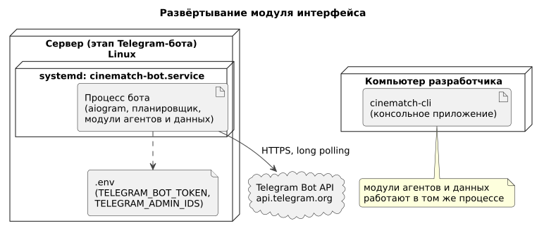

| Окружение | Где | Что работает | Запуск |
|---|---|---|---|
| Разработка | Компьютеры участников | Консольное приложение; бот в тестовом режиме с отдельным тестовым токеном | Вручную |
| Рабочее | Сервер (этап Telegram-бота) | Один процесс бота: обработчики, планировщик, модули агентов и данных | Служба systemd `cinematch-bot.service`, `Restart=always` |

Используются два бота: тестовый (для разработки) и основной (на сервере), чтобы разработка не мешала работе бота.

**Требования модуля к серверу** (в дополнение к требованиям [модуля агентов](agents.md#165--deployment-diagram) и [модуля данных](data.md#165--deployment-diagram)): исходящий HTTPS к `api.telegram.org`; входящие соединения не требуются; системное время синхронизировано (NTP) — от него зависит своевременность напоминаний.

---

## Допущения и открытые вопросы

| № | Вопрос | Текущее допущение | Кто решает |
|---|---|---|---|
| 1 | Постеры в Telegram | Не показываются в MVP бота; при добавлении — `sendPhoto` с подписью до 1024 символов и `poster_path` в карточке | команда |
| 2 | Формат карточек | Три карточки в одном сообщении | модуль интерфейса |
| 3 | Список часовых поясов в онбординге | Часовые пояса России + «Другой» (ввод UTC±N); формирует модуль агентов | модуль агентов, интерфейса |
| 4 | Время ежедневных задач | 10:00 UTC | команда |
| 5 | Сервер | Аренда или университет — после MVP | команда |
| 6 | Выбор фильма компанией в групповом чате | Не поддерживается (ADR-027) | команда |

**Изменения, которые затрагивают другие модули:** `AgentResponse` должен содержать варианты в `options` в точности в том виде, в каком они отображаются на кнопках (ADR-023); агентам нужно обрабатывать `/new`, `/settings`, `/delete` как сообщения; `/help` и `/stats` обрабатывает интерфейс.
