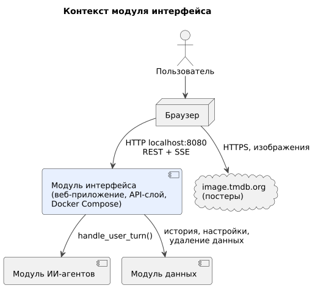

# 020 — System Context

*CineMatch. Модуль интерфейса* | [оглавление модуля](README.md)

| Внешняя система | Роль | Тип интеграции |
|---|---|---|
| Браузер пользователя | Отображает веб-приложение | HTTP `localhost:8080`, REST, SSE |
| Модуль ИИ-агентов | Обрабатывает сообщения | Вызов `handle_user_turn` в процессе backend |
| Модуль данных | История, настройки, удаление данных | Вызов функций Python |
| image.tmdb.org | Постеры фильмов | Браузер загружает изображения напрямую |

**Входит в модуль:** веб-приложение, API-слой, определение текущего пользователя, потоковая передача ответа, Dockerfile и `docker-compose.yml`.

**Не входит:** содержание вопросов и ответов (модуль агентов), хранение данных (модуль данных).

### Будущий функционал

Telegram-бот как второй клиент API; развёртывание на сервере с доменом и HTTPS.

---

[← 010 Глоссарий](010.glossary.md) | [Оглавление](README.md) | [030 Actors →](030.actors.md)
