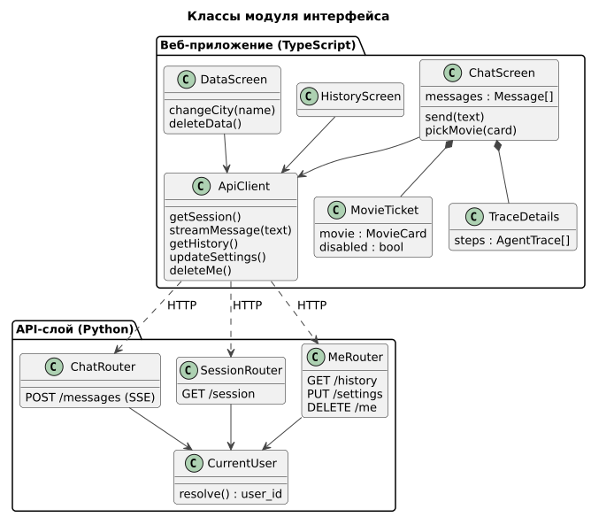
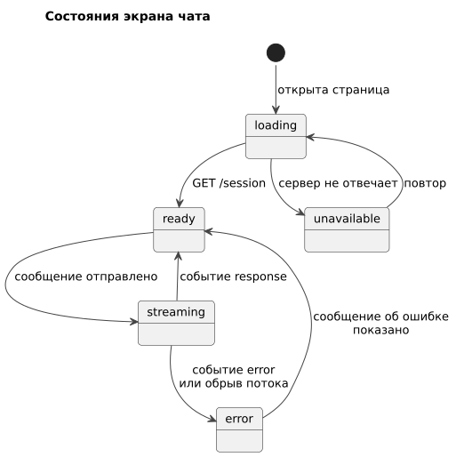

# 050 — Entities + Lifecycle

*CineMatch. Модуль интерфейса* | [оглавление модуля](README.md)

Модуль не хранит данных; его сущности — компоненты веб-приложения и API-слоя.

| Класс | Ответственность |
|---|---|
| `ChatScreen` | Лента сообщений, поле ввода, отправка, выбор карточкой |
| `MovieTicket` | Карточка-билет фильма |
| `TraceDetails` | Раскрываемый блок «Как агент выбирал» |
| `HistoryScreen` | Экран «История и оценки» |
| `DataScreen` | Экран «Мои данные»: город, удаление данных |
| `ApiClient` | Запросы к API, чтение потока SSE |
| `ChatRouter`, `SessionRouter`, `MeRouter` | Эндпоинты API-слоя |
| `CurrentUser` | Определение `user_id` для каждого запроса |

**Состояния экрана чата**

| Состояние | Описание | Переход |
|---|---|---|
| `loading` | Загрузка состояния сессии | Ответ → `ready`; нет ответа → `unavailable` |
| `ready` | Можно писать | Отправка → `streaming` |
| `streaming` | Показ хода работы, отправка заблокирована | `response` → `ready`; `error` → `error` |
| `error` | Сообщение об ошибке в ленте | → `ready` |
| `unavailable` | Сервер не отвечает: подсказка запустить приложение | Повтор → `loading` |

**Карточки после ответа.** После реакции на подборку карточки этой подборки становятся неактивными; выбранная отмечается.

### Будущий функционал

Состояния экрана входа и списка профилей.

---

[← 040 Event Storming](040.event-storming.md) | [Оглавление](README.md) | [060 Use Cases →](060.use-cases.md)
