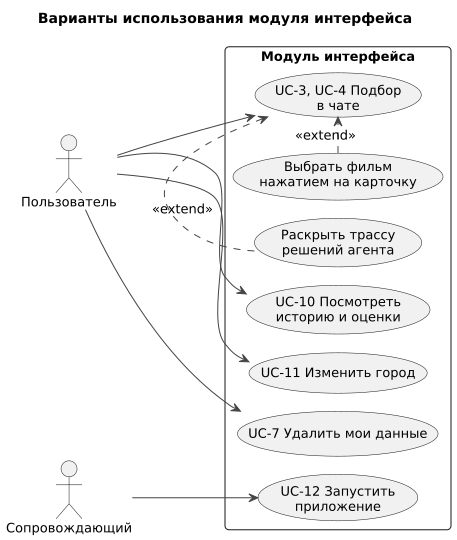

# 060 — Use Cases

*CineMatch. Модуль интерфейса* | [оглавление модуля](README.md)

Модуль вводит UC-10…UC-12; в сценариях UC-1…UC-8 ([модуль агентов](../agents/060.use-cases.md)) он передаёт сообщения и отображает ответы.

| ID | Вариант использования | Актор |
|---|---|---|
| UC-10 | Посмотреть историю и оценки | Пользователь |
| UC-11 | Изменить город | Пользователь |
| UC-12 | Запустить приложение | Сопровождающий |

#### UC-10. Посмотреть историю и оценки

| | |
|---|---|
| Основной поток | 1. Пользователь открывает «История и оценки». 2. Веб-приложение запрашивает `GET /api/v1/history`. 3. Показывается список: постер, название, год, оценка, откуда оценка (по подборке или отмечено вручную), дата |
| Альтернативы | 3а. Оценок нет — экран с приглашением подобрать фильм |
| Истории | US-19 |

#### UC-11. Изменить город

| | |
|---|---|
| Основной поток | 1. Пользователь открывает «Мои данные» и вводит город. 2. `GET /api/v1/cities?query=…` показывает варианты. 3. Пользователь выбирает вариант, `PUT /api/v1/settings` сохраняет |
| Альтернативы | 2а. Ничего не найдено — подсказка. Изменить город можно и в чате фразой «я теперь в Казани» |
| Истории | US-20 |

#### UC-12. Запустить приложение

| | |
|---|---|
| Предусловия | Установлен Docker; `.env` заполнен по `.env.example` |
| Основной поток | 1. `docker compose up --build`. 2. Собираются контейнеры frontend и backend, применяются миграции. 3. Первый раз — `docker compose run --rm backend python -m scripts.load_catalog`. 4. Приложение доступно на `http://localhost:8080` |
| Альтернативы | 2а. Не задан ключ — backend завершается с сообщением, какой переменной не хватает. 4а. Каталог пуст — API возвращает 503 `CATALOG_EMPTY`, интерфейс сообщает, что нужно загрузить каталог |
| Истории | US-22 |

**Выбор фильма карточкой** (расширение UC-4): нажатие на карточку добавляет в ленту сообщение «Выбираю «…»» и отправляет его с `movie_id`; остальные карточки становятся неактивными. Удаление данных (UC-7) доступно и на экране «Мои данные» с подтверждением.

### Будущий функционал

Вход и выбор профиля; работа через Telegram-бота.

---

[← 050 Entities + Lifecycle](050.entities.md) | [Оглавление](README.md) | [070 RBAC →](070.role-matrix.md)
