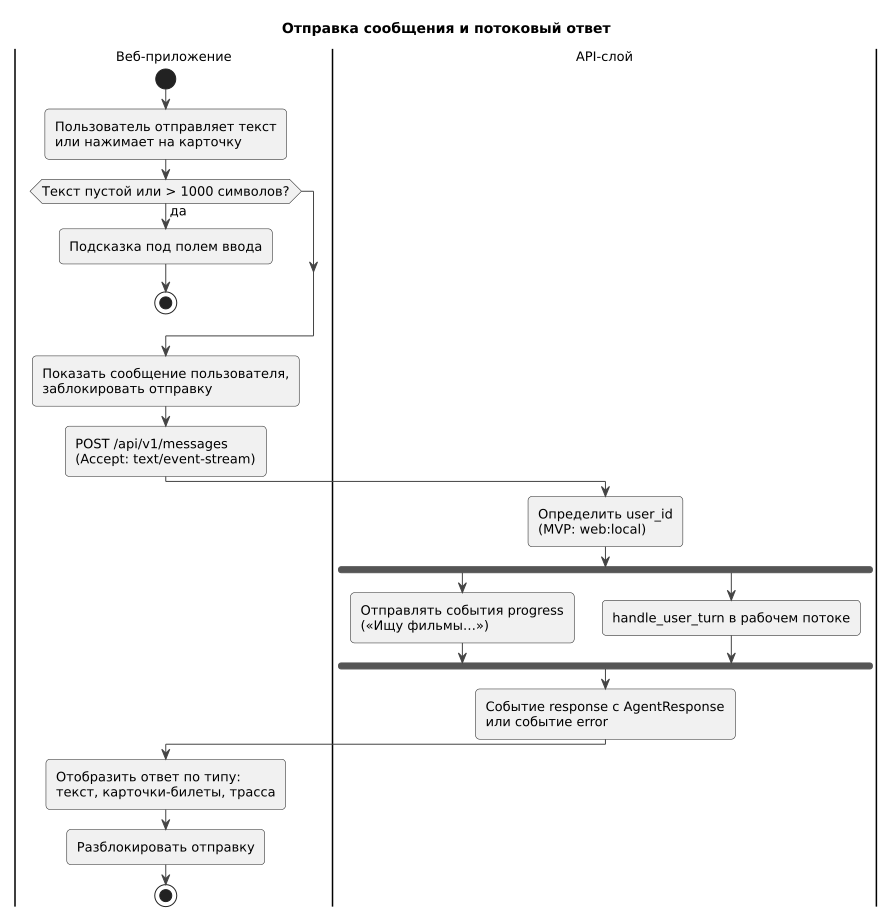

# 146 — Logic Scheme

*CineMatch. Модуль интерфейса* | [оглавление модуля](README.md)

**Потоки данных.** Браузер → nginx → API-слой → модуль агентов: синхронно для одного сообщения, с промежуточными событиями хода работы. История, настройки и удаление — прямые запросы к модулю данных через API-слой. Постеры — браузер напрямую с `image.tmdb.org`.

### Будущий функционал

Поток уведомлений от сервера к пользователю.

---

[← 145 ADR](145.architecture-decisions.md) | [Оглавление](README.md) | [150 Component Diagram →](150.component-diagram.md)
