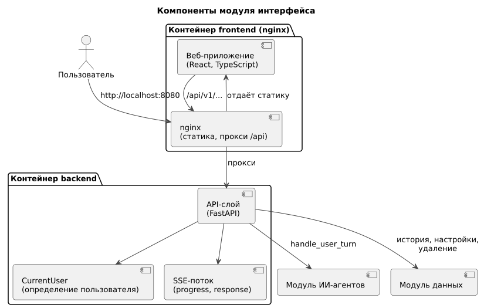

# 150 — Component Diagram

*CineMatch. Модуль интерфейса* | [оглавление модуля](README.md)

| Компонент | Технология | Ответственность |
|---|---|---|
| Веб-приложение | React, TypeScript, Vite | Экраны, карточки, трасса, чтение потока |
| nginx | nginx:alpine | Статика, прокси `/api` |
| API-слой | FastAPI, Uvicorn | Эндпоинты, SSE, проверка ввода |
| CurrentUser | FastAPI dependency | Определение `user_id` |
| SSE-поток | `sse-starlette` или `StreamingResponse` | События `progress`, `response`, `error` |

### Будущий функционал

Компонент Telegram-бота как второго клиента API.

---

[← 146 Logic Scheme](146.logic-scheme.md) | [Оглавление](README.md) | [155 Sequence-диаграммы →](155.sequence-diagrams.md)
