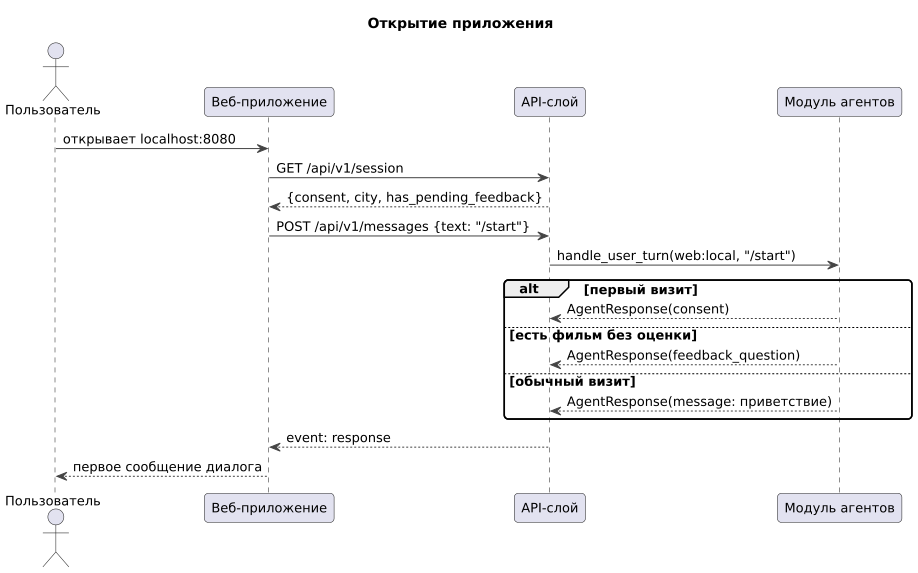
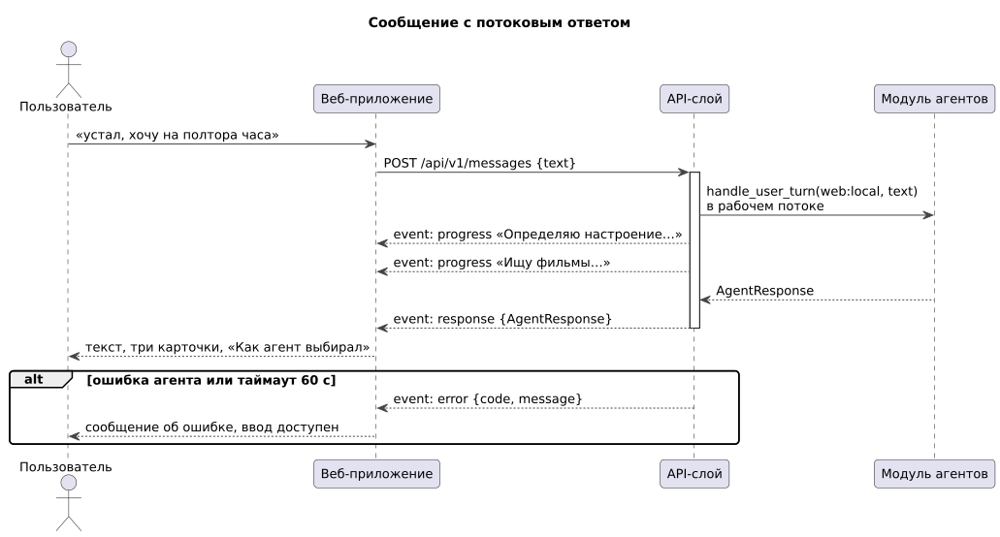
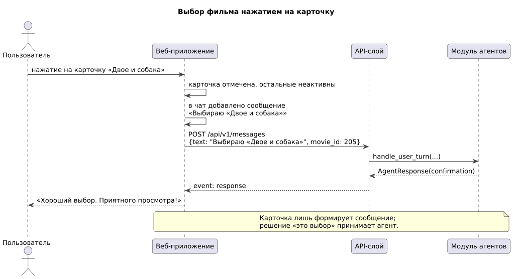

# 155 — Sequence-диаграммы

*CineMatch. Модуль интерфейса* | [оглавление модуля](README.md)

**Открытие приложения** (UC-1, UC-5).

**Сообщение с потоковым ответом** (UC-3). Таймаут — 60 с.

**Выбор фильма карточкой** (UC-4).

### Будущий функционал

Доставка уведомления Telegram-ботом.

---

[← 150 Component Diagram](150.component-diagram.md) | [Оглавление](README.md) | [160 Integration Plan →](160.integration-plan.md)
