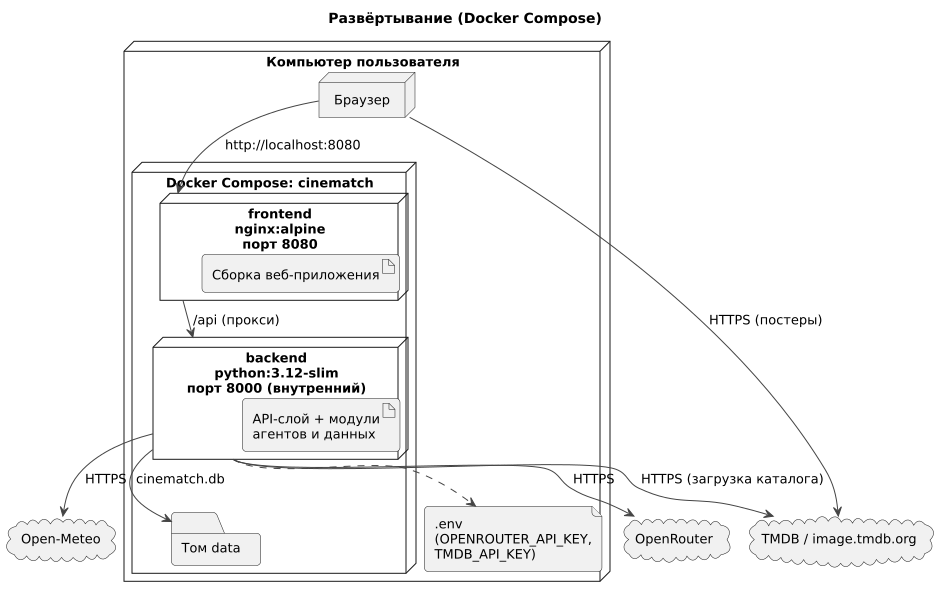

# 165 — Deployment Diagram

*CineMatch. Модуль интерфейса* | [оглавление модуля](README.md)



| Контейнер | Образ | Порт | Содержимое |
|---|---|---|---|
| `frontend` | `nginx:alpine` | 8080 (наружу) | Сборка веб-приложения, прокси `/api` → `backend:8000` |
| `backend` | `python:3.12-slim` | 8000 (только внутри) | API-слой, модули агентов и данных |
| том `data` | — | — | `cinematch.db` |

**Запуск**

```bash
cp .env.example .env          # заполнить ключи
docker compose up --build -d
docker compose run --rm backend python -m scripts.load_catalog   # один раз
# открыть http://localhost:8080
```

Требования к компьютеру: Docker Desktop или Docker Engine с Compose; 2 ГБ свободной памяти; доступ в интернет (OpenRouter, TMDB, Open-Meteo).

### Будущий функционал

Развёртывание на сервере: домен, HTTPS, процесс Telegram-бота, резервное копирование.

---

[← 160 Integration Plan](160.integration-plan.md) | [Оглавление](README.md)
